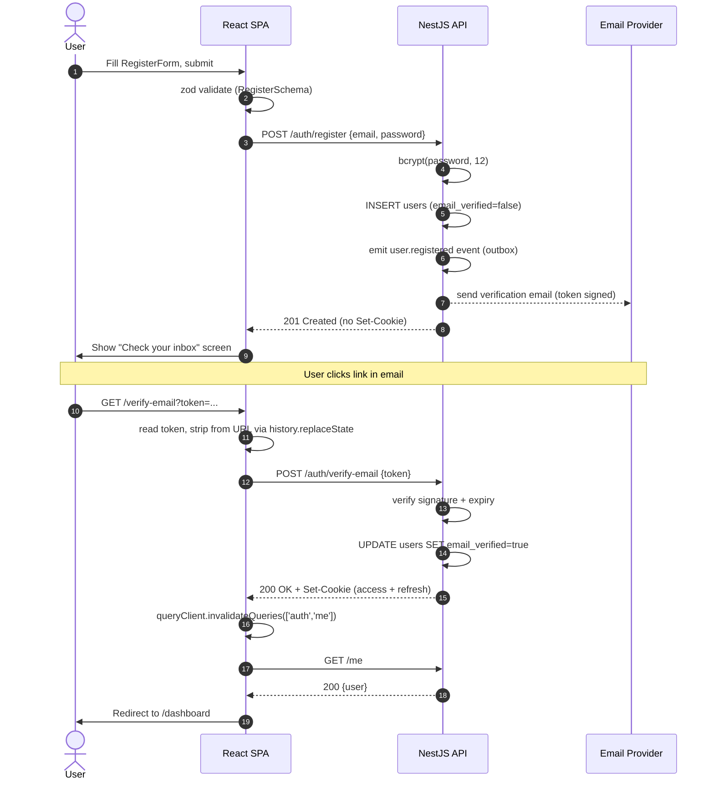
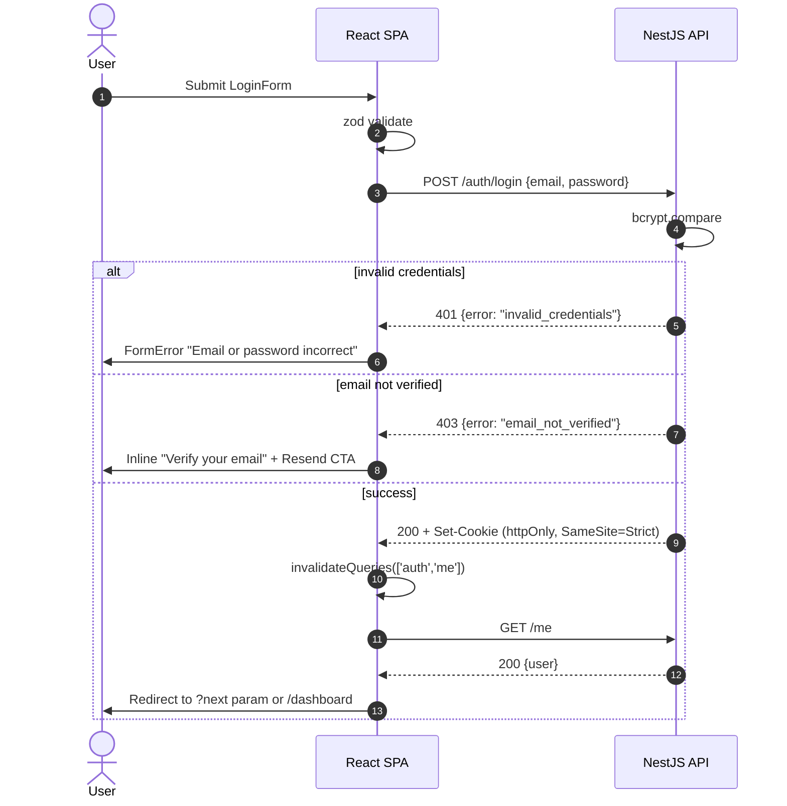
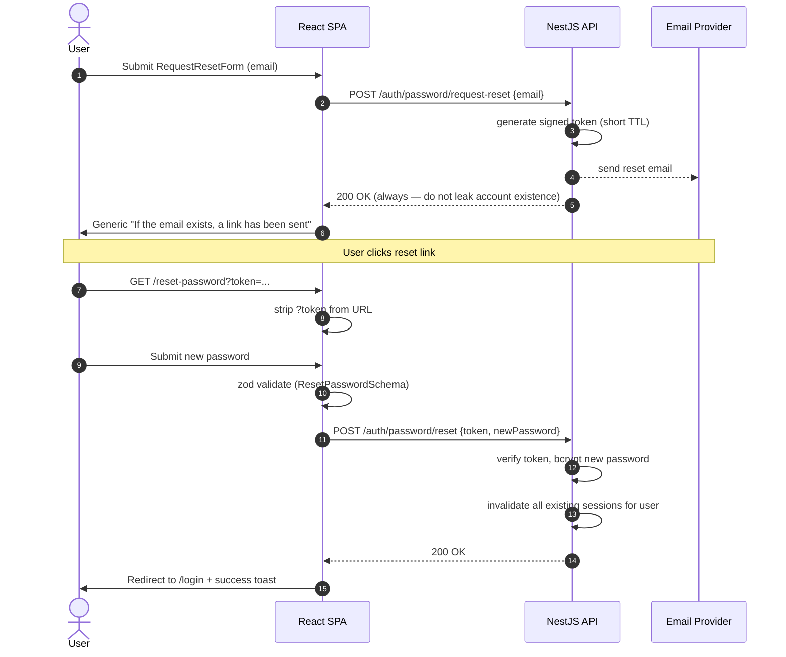

# WP2 — Authentication Flow: Frontend Architectural Plan

**Status:** Draft v1
**Owner:** Frontend (Lead Architect: Claude)
**Backend status:** WP2 done — endpoints, JWT-in-httpOnly-cookie, bcrypt, email verification, refresh, password reset all live.
**Scope:** Client-side architecture for register, email verification, login, logout, refresh, and password reset. No implementation code in this document.

> Read this together with `CLAUDE.md` (architectural non-negotiables 1, 6, 7, 8) and `docs/HabitLab_AI_Analysis_Report.docx` §6.1 (auth endpoints) and §7.4 (auth sequence diagrams).

---

## 1. Goals & Constraints

**Functional goals**

- Implement screens for registration, email verification, login, logout, password-reset request, password-reset confirm.
- Persist login across reloads using only the backend-set httpOnly cookie — the SPA never touches the JWT directly.
- Silently refresh expired access tokens without surfacing 401s to the user.
- Wire authentication state into route guards so unauthenticated users cannot reach `/dashboard`, `/habits`, `/analytics`, etc.
- Surface server-side error states (invalid credentials, expired verification token, weak password, rate limit) with precise, recoverable UI messaging.
- Be ready to render A/B variant copy on auth screens (WP8) without re-architecting.

**Hard constraints (from CLAUDE.md)**

- **NN-6 / NN-7:** No `localStorage`, `sessionStorage`, or in-memory token stash. Cookie is the only token medium. The frontend treats auth as "ask the server who I am" via `GET /me`, never as "decode a JWT I hold."
- **NN-8:** All request/response types come from the OpenAPI spec generated by `@nestjs/swagger`. Hand-written DTOs are forbidden where a generated one exists.
- **No `any` / no `@ts-ignore`** (project conventions).
- **Strict CSP & SameSite=Strict cookie:** all auth API calls must be same-origin or use a configured proxy in dev; the frontend bundle and backend share an eTLD+1 in prod.

---

## 2. Folder Structure

The auth feature is a vertical slice. Cross-cutting infrastructure lives in `src/api`, `src/lib`, `src/router`. Pages compose feature components.

```
frontend/src/
├── api/
│   ├── client.ts                 fetch wrapper: same-origin, credentials:"include", JSON, error normalization
│   ├── refresh-mutex.ts          single-flight refresh queue (see §6.3)
│   ├── query-keys.ts             centralized React Query key factory (auth.me, auth.csrf, ...)
│   └── generated/                auto-generated from openapi.json — DO NOT EDIT
│       └── auth.types.ts
│
├── features/
│   └── auth/
│       ├── api/
│       │   ├── use-current-user.ts        useQuery(['auth','me'])
│       │   ├── use-login.ts               useMutation
│       │   ├── use-register.ts            useMutation
│       │   ├── use-logout.ts              useMutation + clearAuthCache()
│       │   ├── use-verify-email.ts        useMutation (token from URL)
│       │   ├── use-request-reset.ts       useMutation
│       │   └── use-reset-password.ts      useMutation
│       ├── components/
│       │   ├── AuthLayout.tsx             shared shell (logo, gradient, panel)
│       │   ├── AuthCard.tsx               panel container
│       │   ├── EmailField.tsx             RHF-wired input with autocomplete=email
│       │   ├── PasswordField.tsx          show/hide toggle, strength meter (register only)
│       │   ├── SubmitButton.tsx           handles isPending + disabled states
│       │   ├── FormError.tsx              maps ApiError → field-level + form-level errors
│       │   ├── AuthFooter.tsx             "Need an account?" / "Forgot password?" links
│       │   └── VariantSlot.tsx            renders WP8 variant copy (default = control)
│       ├── pages/
│       │   ├── LoginPage.tsx
│       │   ├── RegisterPage.tsx
│       │   ├── VerifyEmailPage.tsx        consumes ?token=
│       │   ├── ForgotPasswordPage.tsx
│       │   ├── ResetPasswordPage.tsx      consumes ?token=
│       │   └── LogoutPage.tsx             POST /auth/logout then redirect
│       ├── schema/
│       │   ├── login.schema.ts            zod
│       │   ├── register.schema.ts         zod (password rules)
│       │   ├── request-reset.schema.ts    zod
│       │   └── reset-password.schema.ts   zod
│       ├── lib/
│       │   ├── error-mapper.ts            ApiError → user-facing message
│       │   ├── password-strength.ts       client heuristic, not auth-decisive
│       │   └── url-token.ts               read+strip ?token from history
│       └── index.ts                       barrel — only AuthLayout, hooks, ProtectedRoute exposed
│
├── router/
│   ├── routes.tsx                         createBrowserRouter
│   ├── ProtectedRoute.tsx                 gate by useCurrentUser()
│   └── PublicOnlyRoute.tsx                redirect away from /login if already authed
│
├── lib/
│   ├── broadcast.ts                       BroadcastChannel('habitlab-auth') for multi-tab sync
│   └── env.ts
│
└── App.tsx                                <QueryClientProvider> + <RouterProvider>
```

**Why a feature folder, not a pages-flat layout.** Auth is the most cross-cutting feature in the app — every other feature consumes `useCurrentUser`. Co-locating hooks, schemas, components, and page wrappers under `features/auth/` lets us export a single barrel that other features import without leaking auth internals.

---

## 3. Component Hierarchy

```
<App>
└─ <QueryClientProvider>
   └─ <BroadcastChannelProvider>
      └─ <RouterProvider>
         ├─ <PublicOnlyRoute>
         │   └─ <AuthLayout>
         │       ├─ <LoginPage>            → <AuthCard><LoginForm /></AuthCard>
         │       ├─ <RegisterPage>         → <AuthCard><RegisterForm /></AuthCard>
         │       ├─ <VerifyEmailPage>      → <AuthCard><VerificationStatus /></AuthCard>
         │       ├─ <ForgotPasswordPage>   → <AuthCard><RequestResetForm /></AuthCard>
         │       └─ <ResetPasswordPage>    → <AuthCard><ResetPasswordForm /></AuthCard>
         │
         └─ <ProtectedRoute>
             └─ <AppShell>
                 ├─ <Dashboard>            (WP3)
                 ├─ <Habits>               (WP3)
                 ├─ <Analytics>            (WP5)
                 └─ <LogoutPage>           POST /auth/logout, then redirect
```

**Key composition rules**

- `AuthLayout` is presentation-only. It does not call hooks that talk to the network. It renders `<Outlet />` so React Router controls the page that mounts inside it.
- Forms (`LoginForm`, `RegisterForm`, etc.) live one level below the page wrapper so each page can layer page-level concerns (analytics events, A/B variant resolution, post-submit redirects) without bloating form components.
- `<VariantSlot id="auth.login.headline">…</VariantSlot>` is a thin wrapper that consults the WP8 assignment cache for the experiment key and falls back to the children (control copy) when no experiment is running. This decouples auth from A/B testing — the auth feature does not import the experiments feature directly; it imports the slot primitive only.
- `<ProtectedRoute>` and `<PublicOnlyRoute>` consume `useCurrentUser()`. Neither owns auth state.

---

## 4. State Management Strategy

The fundamental rule: **the server is the source of truth for "am I logged in," and that truth is fetched via `GET /me`.** The frontend never decides authentication — it asks.

### 4.1 The three layers

| Layer | Library | What lives here | Lifetime |
|---|---|---|---|
| **Server state** | TanStack Query | `auth.me` query, all auth mutations | Cache; invalidated on logout / 401 |
| **Form state** | react-hook-form + zod | Field values, validation, dirty/submitting flags | Component lifetime |
| **UI state** | Zustand (`useUiStore`) | Theme, sidebar, toasts | App lifetime, persisted (non-auth fields only) |

Auth state **does not live in Zustand.** Putting `user` in a global store creates a second source of truth that drifts from React Query and forces synchronization code. The single hook `useCurrentUser()` returning `{ user, isPending, isAuthenticated }` is enough.

### 4.2 The `auth.me` query

```
queryKey: ['auth', 'me']
queryFn:  GET /me  (credentials: 'include')
staleTime: 60_000
gcTime: 5 * 60_000
retry: false                  // 401 must not retry, that's not a transient error
refetchOnWindowFocus: true    // tab regains focus → re-validate
```

`useCurrentUser()` is the **only** hook outside the auth feature that other features call. Everything that needs to know "is the user authed" derives from it.

### 4.3 Invalidation rules (data flow)

| Trigger | Action |
|---|---|
| `useLogin` mutation success | `queryClient.invalidateQueries({ queryKey: ['auth', 'me'] })` then `navigate('/dashboard')` |
| `useLogout` mutation success | `queryClient.setQueryData(['auth','me'], null)` then `queryClient.removeQueries()` to drop all per-user caches; broadcast `LOGOUT` on `BroadcastChannel`; navigate `/login` |
| `useRegister` mutation success | Show "Check your email" screen — **do not** invalidate `auth.me`. Registration does not log in until verification. |
| `useVerifyEmail` mutation success | Invalidate `auth.me`. Backend may set the cookie after verification (TBD in §6.1) |
| `useResetPassword` mutation success | Backend invalidates all sessions; frontend navigates to `/login` and shows success toast |
| Any 401 from a protected request | `refresh-mutex` attempts `POST /auth/refresh` once. On failure: `setQueryData(['auth','me'], null)`, broadcast `SESSION_EXPIRED`, `navigate('/login?reason=expired')` |
| `BroadcastChannel` receives `LOGOUT` from another tab | `removeQueries()` and `navigate('/login')` |

### 4.4 Why a refresh mutex (single-flight)

Multiple in-flight requests can each get a 401 simultaneously (e.g. dashboard mounts and fires three queries). Without coordination they will all attempt `POST /auth/refresh` in parallel — the second and third will race the first's rotation and one of them will fail, causing a spurious logout. The mutex in `api/refresh-mutex.ts` ensures: first 401 starts a refresh promise, all subsequent 401s `await` the same promise, then retry exactly once. If the refresh itself 401s, every awaiting caller resolves with a hard logout signal.

---

## 5. Core TypeScript Types

These are the contracts the auth feature exposes. Generated types from OpenAPI are in `api/generated/auth.types.ts`; **everything below is the hand-written layer that wraps them**.

### 5.1 Domain (re-exported from generated)

```ts
// Re-exports from generated/auth.types.ts. Source of truth = backend OpenAPI.
export type AuthUser = components['schemas']['AuthUser'];
export type LoginRequest = components['schemas']['LoginRequest'];
export type LoginResponse = components['schemas']['LoginResponse'];
export type RegisterRequest = components['schemas']['RegisterRequest'];
export type VerifyEmailRequest = components['schemas']['VerifyEmailRequest'];
export type RequestPasswordResetRequest = components['schemas']['RequestPasswordResetRequest'];
export type ResetPasswordRequest = components['schemas']['ResetPasswordRequest'];
```

> **Constraint reminder:** if the backend OpenAPI schema for any of these shapes is unknown at the time of implementation, mark the field with `// MOCK: confirm in §6.1 of the analysis report` and proceed with a plausible shape — do not block.

### 5.2 Hand-written contracts

```ts
// Discriminated union — every fetch-wrapper rejection narrows to one of these.
export type ApiError =
  | { kind: 'network' }                                       // offline / DNS / CORS preflight
  | { kind: 'unauthorized' }                                  // 401 after refresh attempt
  | { kind: 'forbidden' }                                     // 403
  | { kind: 'validation'; fields: Record<string, string[]> }  // 422 from Nest validation pipe
  | { kind: 'rate_limited'; retryAfterSec: number }           // 429
  | { kind: 'conflict'; message: string }                     // 409 (email already in use, etc.)
  | { kind: 'server'; status: number };                       // 5xx

// Hook surface — what other features consume.
export interface CurrentUserState {
  readonly user: AuthUser | null;
  readonly isAuthenticated: boolean;
  readonly isPending: boolean;       // initial /me has not resolved yet
  readonly isError: boolean;
}

// Login mutation surface.
export interface LoginInput {
  readonly email: string;
  readonly password: string;
  readonly rememberMe?: boolean;     // backend may map this to refresh-token max-age
}

// Verification & reset use signed tokens lifted from the URL (?token=...).
export interface UrlToken {
  readonly value: string;
  readonly source: 'query' | 'fragment';
}

// React Query key factory — single import site for all auth keys.
export const authKeys = {
  all: ['auth'] as const,
  me: () => [...authKeys.all, 'me'] as const,
  csrf: () => [...authKeys.all, 'csrf'] as const,
};

// Zustand UI slice (non-auth fields only).
export interface UiState {
  theme: 'light' | 'dark' | 'system';
  setTheme: (t: UiState['theme']) => void;
}
```

### 5.3 Form schemas (zod-inferred)

```ts
// register.schema.ts
export const RegisterSchema = z.object({
  email: z.string().email().max(254),
  password: z
    .string()
    .min(12, 'Password must be at least 12 characters')
    .regex(/[A-Z]/, 'Add an uppercase letter')
    .regex(/[a-z]/, 'Add a lowercase letter')
    .regex(/[0-9]/, 'Add a digit'),
  passwordConfirm: z.string(),
  acceptTos: z.literal(true, { errorMap: () => ({ message: 'Required' }) }),
}).refine((v) => v.password === v.passwordConfirm, {
  path: ['passwordConfirm'],
  message: 'Passwords do not match',
});

export type RegisterValues = z.infer<typeof RegisterSchema>;
```

The same pattern applies for `LoginSchema`, `RequestResetSchema`, `ResetPasswordSchema`. Schemas live in `features/auth/schema/`; the inferred type is what the form uses, the API request type is what the mutation accepts. Mapping between them happens in the mutation hook, never in the component.

### 5.4 Route-guard contract

```ts
// router/ProtectedRoute.tsx
interface ProtectedRouteProps {
  readonly children: React.ReactNode;
  readonly requireVerified?: boolean;  // gate routes that need verified email (e.g. /habits)
}
```

---

## 6. Sequence Diagrams

These describe the runtime behavior of the four critical flows. They reference §7.4 of the analysis report — confirm any divergence there.

### 6.1 Registration + Email Verification



**Notes on this flow**

- The 201 from `/auth/register` does **not** carry a session cookie. The user must verify before a session is granted.
- Stripping `?token` from the URL via `history.replaceState` (step 7) is mandatory — it prevents the token from leaking to analytics, third-party scripts, or the `Referer` header.
- If verification fails (`410 Gone` for expired, `404` for unknown), the page renders a "Request a new link" CTA that calls `/auth/resend-verification`.

### 6.2 Login



### 6.3 Silent Token Refresh (single-flight)

```mermaid
sequenceDiagram
  autonumber
  participant Q1 as React Query #1 (Dashboard)
  participant Q2 as React Query #2 (Habits)
  participant FE as fetch wrapper
  participant Mtx as refresh-mutex
  participant API as NestJS API

  par concurrent loads
    Q1->>FE: GET /dashboard
    Q2->>FE: GET /habits
  end
  FE->>API: GET /dashboard
  FE->>API: GET /habits
  API-->>FE: 401 (expired access token)
  API-->>FE: 401 (expired access token)

  FE->>Mtx: refreshOnce()
  Mtx->>Mtx: lock; create promise
  Mtx->>API: POST /auth/refresh (refresh cookie)
  API-->>Mtx: 200 + new Set-Cookie
  Mtx-->>FE: resolve()
  FE->>FE: retry both originals once
  FE->>API: GET /dashboard (retry)
  FE->>API: GET /habits (retry)
  API-->>FE: 200
  API-->>FE: 200
  FE-->>Q1: data
  FE-->>Q2: data
```

If the refresh itself returns 401, the mutex rejects all awaiters, the wrapper short-circuits to a `{ kind: 'unauthorized' }` `ApiError`, the `auth.me` cache is set to `null`, and the router redirects to `/login?reason=expired`.

### 6.4 Password Reset



**Notes**

- The request-reset response is intentionally identical for "email exists" and "email does not exist" — the UI never branches on the difference. This is enforced by both backend (constant-time response) and frontend (single success message).
- After reset, the frontend does **not** auto-login. The user re-enters credentials. This is a deliberate friction trade — auto-login after reset weakens the recovery flow if the link is intercepted.

---

## 7. Edge Cases & Architectural Bottlenecks

Listed in priority order. Each item names the mitigation and where it lives in the structure.

### 7.1 Authentication-correctness edge cases

1. **Initial-load flicker.** On hard reload, `useCurrentUser` is `isPending` for ~50–200ms before `/me` resolves. Without gating, the router renders `<LoginPage>` then snaps to `<Dashboard>`. **Mitigation:** in `App.tsx`, render a minimal splash (`<AuthBootstrap>`) until the first `/me` resolves. Other queries do not start until `isPending=false`.

2. **Refresh stampede.** Covered in §6.3. Without `refresh-mutex`, parallel 401s log the user out spuriously. **Mitigation:** single-flight refresh promise.

3. **Cross-tab logout drift.** Tab A logs out; Tab B keeps showing data because its `auth.me` is still cached. **Mitigation:** `BroadcastChannel('habitlab-auth')` — Tab A posts `LOGOUT`, Tab B clears caches and redirects.

4. **Cross-tab login drift.** Tab A logs in; Tab B still on `/login`. Lower priority. **Mitigation:** same `BroadcastChannel` posts `LOGIN`; Tab B invalidates `auth.me` and the router naturally redirects via `<PublicOnlyRoute>`.

5. **Verification token leakage.** Tokens in `?token=` are visible in browser history, `Referer`, and may be captured by analytics scripts. **Mitigation:** `lib/url-token.ts` reads the token then `history.replaceState` strips it. Done before any third-party script can observe.

6. **Stale `next` redirect.** `/login?next=/admin/users` could be exploited to phish if `next` is unvalidated. **Mitigation:** `PublicOnlyRoute` only honors `next` if it begins with `/` and does not contain `://` or `\\`.

7. **Password autofill vs. controlled input.** Some browsers populate password fields without firing `change`, leaving react-hook-form blind. **Mitigation:** use react-hook-form's `register` with `setValueAs`, and call `trigger()` on `onAnimationStart` (Chrome's autofill animation hack) to revalidate.

8. **Backspace bfcache bug.** Safari restores the page with the form filled but React Query cache empty. **Mitigation:** `refetchOnWindowFocus: true` on `auth.me` and `refetchOnReconnect: 'always'`.

9. **CSRF.** SameSite=Strict cookies block third-party-context attacks but not all subdomain takeover scenarios. **Mitigation:** for non-GET auth endpoints, backend issues a double-submit CSRF token (header `X-CSRF-Token`, mirrored to a non-HttpOnly cookie). Frontend reads the cookie via `document.cookie` and echoes it on POST. **Confirm with backend whether this is already implemented in WP2** — the analysis report §6.1 should specify.

10. **Rate limiting on login & request-reset.** A 429 response should not spam the user with retries. **Mitigation:** error mapper extracts `Retry-After`, the form disables submit and shows a countdown. Mutations do not auto-retry (`retry: false`).

11. **User mid-action when session expires.** User is editing a habit; refresh fails. Without care, their unsaved state vanishes when redirected to `/login`. **Mitigation:** `?next` carries the current pathname so they return to the same route. Form-level draft persistence (e.g. via Zustand) is **out of scope for WP2** — flag for WP3.

### 7.2 Architectural bottlenecks (decoupling concerns)

1. **Don't let auth become a god feature.** Other features must depend only on the public surface (`useCurrentUser`, `<ProtectedRoute>`, `authKeys`). Internals like `refresh-mutex`, `error-mapper`, and form schemas must not be imported outside `features/auth/`. **Enforcement:** an ESLint `no-restricted-imports` rule on `features/auth/!(index)` from sibling features.

2. **A/B variant injection without coupling.** The auth screens must be able to swap copy/layout based on a WP8 assignment, but `features/auth` must not import `features/experiments`. **Mitigation:** a thin `<VariantSlot id="...">` primitive in `features/experiments` reads the assignment and renders either the variant component (registered in a side-table) or the slot's `children` (control). Auth imports the primitive only.

3. **OpenAPI drift.** If the backend changes a DTO and the frontend regenerates types, `useLogin` will fail to type-check — good. But if regeneration is skipped, the frontend will silently send wrong shapes. **Mitigation:** CI step that runs `pnpm generate:openapi`, diffs against the committed `frontend/src/api/generated/`, and fails on drift. Already mandated by `CLAUDE.md` NN-8.

4. **Cookie domain coupling in dev.** SameSite=Strict + httpOnly works only when frontend and API share an origin (or when Vite is configured with a proxy). **Mitigation:** `vite.config.ts` proxies `/api/*` to `http://localhost:3000` in dev. Production deploy must serve both from the same eTLD+1; document in `frontend/README.md`.

5. **Service worker caching auth pages.** A PWA service worker that caches `/login` aggressively will serve stale HTML to logged-in users (or vice versa). **Mitigation:** the service worker (WP9) uses NetworkFirst for HTML and never caches API responses under `/api/auth/*`. Spelled out in the WP9 plan, but flagged here so the auth feature does not regress when WP9 ships.

6. **PII in error logs.** A naive `error-mapper` could include emails or password-strength complaints in console logs that get shipped to a remote logger. **Mitigation:** error mapper has two modes — a user-facing string and a sanitized log payload. Only the latter goes to the logger.

7. **Form schemas duplicated across pages.** Don't let `register.schema.ts` and `reset-password.schema.ts` each redefine the password rule. **Mitigation:** a `passwordSchema` primitive in `features/auth/schema/_password.ts` that both compose.

8. **Test seam for `/me`.** Every component test that mounts a protected route needs to mock `useCurrentUser`. **Mitigation:** export a `MockAuthProvider` from `features/auth/testing/` that pre-seeds the React Query cache with a test user.

---

## 8. Open Questions for Backend / Spec

These need confirmation before implementation begins. None are blockers for scaffolding.

1. **§6.1 confirm:** does `/auth/verify-email` return a session cookie, or must the user log in afterward? §6.1 of the analysis report should specify; if it doesn't, propose returning a cookie to reduce friction.
2. **CSRF strategy:** is the double-submit token implemented in WP2, or is the team relying on SameSite=Strict alone? Affects §7.1 #9.
3. **Refresh endpoint shape:** does `POST /auth/refresh` rotate the refresh token (recommended) or only the access token? Affects multi-tab synchronization.
4. **Rate-limit signaling:** does the backend send `Retry-After` in seconds or as an HTTP date? Affects §7.1 #10.
5. **Resend verification:** is `POST /auth/resend-verification` already in WP2 or is it implicit?

---

## 9. Acceptance Criteria for the WP2 Frontend Slice

The auth feature is "done" when:

- All five pages render and pass zod validation locally.
- `useCurrentUser` is the only auth-state hook other features import.
- `pnpm test` covers: login happy path, login wrong password, refresh single-flight, multi-tab logout, verification token strip-from-URL, request-reset constant response.
- `pnpm build` produces a bundle with no `localStorage`/`sessionStorage` references in `features/auth/` (`grep` check in CI).
- The OpenAPI drift check passes.
- Manual smoke test: register → verify → login → reload (still logged in) → wait for access-token expiry → make a request (silently refreshes) → logout → reload (logged out).

---

*End of plan. Implementation kickoff awaits sign-off on this document and resolution of §8.*
