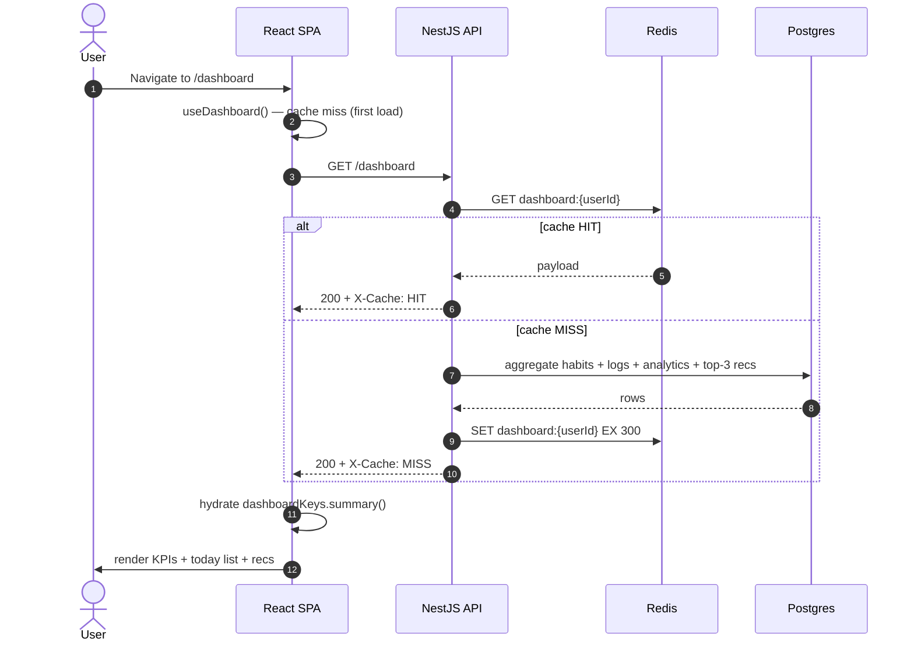
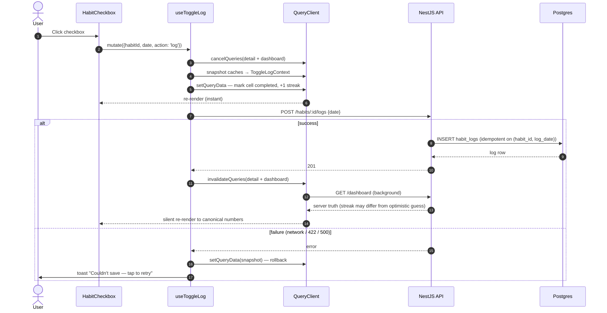
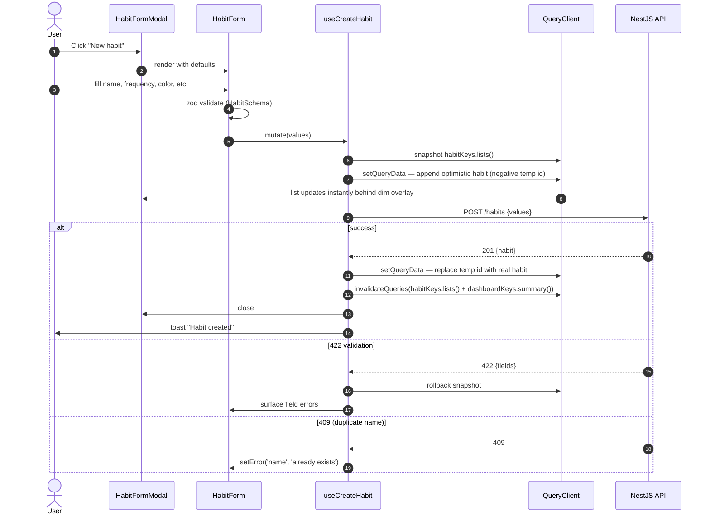
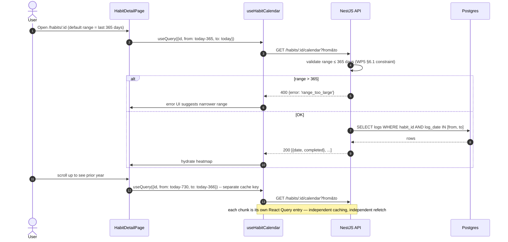

# WP3 — Habits, Daily Tracking & Dashboard: Frontend Architectural Plan

**Status:** Draft v1
**Owner:** Frontend (Lead Architect: Claude)
**Backend status:** WP3 done (habit CRUD + tracking + dashboard with synchronous aggregation), reinforced by WP5 (Redis cache, per-habit analytics, calendar endpoint) and surfaced upon by WP6 (top-3 active recommendations on dashboard).
**Scope:** Client-side architecture for the three sub-features WP3 collapses into one slice: **Habits CRUD** (create/edit/archive/delete), **Daily Tracking** (the user's single most-frequent interaction — checking habits off), and the **Dashboard** (the post-login landing page).

> Read this together with `CLAUDE.md` (architectural non-negotiables, WP3 + WP5 + WP6 implementation notes), `auth-plan.md` (the auth slice this builds on), and `docs/HabitLab_AI_Analysis_Report.docx` §5.1 (data model), §6.1 (API), §7.2 (use cases), and §7.4 (sequence diagrams).

---

## 1. Goals & Constraints

**Functional goals**

- Provide a Dashboard at `/dashboard` showing today's habits, streak summaries, completion rates, and the top 3 active WP6 recommendations.
- Provide a Habits index at `/habits` — list/grid of all the user's habits with quick-toggle for today.
- Provide habit detail at `/habits/:id` — calendar heatmap (WP5 endpoint), streak, completion by weekday/hour, archive/delete.
- Provide Create / Edit forms for habits (modal or dedicated page; see §3.3).
- Provide a Tracker view at `/track` — multi-habit grid for the past N days, the use case "I forgot to log yesterday."
- Make the **toggle interaction feel instant** under all conditions — optimistic update with rollback on error, debounced rapid clicks coalesced into a single network call.
- Honor frequency types (`daily` / `weekly` / `custom`) so that "today's habits" only includes habits that are actually due today.
- Re-use the WP2 query infrastructure: same fetch wrapper, same refresh-mutex, same `useCurrentUser` gating.

**Hard constraints (from CLAUDE.md)**

- **NN-6:** every API request flows through the WP2 fetch wrapper. No bare `fetch()` calls. The wrapper handles cookies, refresh, and the `ApiError` discriminated union.
- **NN-8:** `Habit`, `HabitLog`, `DashboardSummary`, `HabitAnalytics`, `CalendarDay` types come from the OpenAPI generator, not from hand-written DTOs.
- **WP3 backend reality (CLAUDE.md):** streak denominator for `completionRate30d` is always 30; weekly/custom streak still uses the day-level algorithm in WP3 (TODO scheduled for WP6 backend). The frontend must not "fix" this client-side — display what the backend returns.
- **WP5 cache reality:** `GET /dashboard` is now Redis-cached (`dashboard:{userId}`, TTL 300s) and emits `X-Cache: HIT|MISS`. The frontend's React Query `staleTime` must coordinate with this: shorter than the server TTL is wasted; equal or slightly longer is correct.
- **WP6 reality:** `GET /dashboard` already includes the top 3 active recommendations. The Dashboard does **not** call a separate `/recommendations` endpoint to render them. Accepting/dismissing a recommendation is what triggers a fresh `/dashboard` fetch.
- **No row leaves without `user_id` filter** is a backend invariant (NN-6). Frontend mirror: never include `userId` in any request body or query param. The cookie identifies the user.

**Non-goals for WP3**

- Habit reordering (drag-and-drop). Defer to a future polish WP.
- Custom recurrence rules (e.g. "every Mon/Wed/Fri"). The `custom` frequency exists in the schema but the form will only expose `daily` and `weekly` in WP3.
- Habit categories / tags. Defer.
- Bulk operations (delete N habits at once). Defer.
- Offline tracking. Service worker arrives in WP9; offline log queue is a stretch goal there.

---

## 2. Folder Structure

WP3 introduces two parallel feature folders that share a common `useHabit*` query layer. The dashboard is **not** its own feature — it's a page that composes hooks from `features/habits` and `features/recommendations`. This avoids creating a third source of habit truth.

```
frontend/src/
├── api/
│   └── (WP2 client.ts, refresh-mutex.ts, query-keys.ts already in place)
│
├── features/
│   ├── auth/                                    (WP2, untouched)
│   │
│   ├── habits/
│   │   ├── api/
│   │   │   ├── use-habits.ts                    list — useQuery
│   │   │   ├── use-habit.ts                     detail — useQuery
│   │   │   ├── use-habit-calendar.ts            useQuery, paginated by date range
│   │   │   ├── use-create-habit.ts              useMutation, optimistic insert
│   │   │   ├── use-update-habit.ts              useMutation, optimistic patch
│   │   │   ├── use-archive-habit.ts             useMutation
│   │   │   ├── use-delete-habit.ts              useMutation, optimistic remove
│   │   │   ├── use-toggle-log.ts                useMutation, optimistic toggle (the hot path)
│   │   │   └── use-tracker-grid.ts              composite: hits /habits + N days of logs
│   │   ├── components/
│   │   │   ├── HabitCard.tsx                    name, streak, today's check, color/icon
│   │   │   ├── HabitCheckbox.tsx                the optimistic toggle button
│   │   │   ├── HabitForm.tsx                    RHF + zod, used by create + edit
│   │   │   ├── HabitFormModal.tsx               <Dialog> wrapper around HabitForm
│   │   │   ├── HabitDeleteDialog.tsx            confirm + reason ("archive" vs "delete")
│   │   │   ├── HabitGrid.tsx                    responsive grid of HabitCards
│   │   │   ├── HabitEmptyState.tsx              "Create your first habit"
│   │   │   ├── HabitCalendarHeatmap.tsx         GitHub-style 365-day heatmap
│   │   │   ├── FrequencyPicker.tsx              daily / weekly radio
│   │   │   ├── PreferredTimePicker.tsx          time + tz hint (read user.timezone)
│   │   │   ├── DifficultyPicker.tsx             1–5 scale
│   │   │   └── ColorPicker.tsx                  6 preset colors
│   │   ├── pages/
│   │   │   ├── HabitsPage.tsx                   list view at /habits
│   │   │   ├── HabitDetailPage.tsx              /habits/:id
│   │   │   ├── HabitCreatePage.tsx              /habits/new (mobile fallback for modal)
│   │   │   └── HabitEditPage.tsx                /habits/:id/edit (mobile fallback)
│   │   ├── schema/
│   │   │   ├── habit.schema.ts                  zod for create + update
│   │   │   └── _frequency.ts                    shared FrequencyType enum / labels
│   │   ├── lib/
│   │   │   ├── streak.ts                        helpers: formatStreak("12-day streak"), pluralize
│   │   │   ├── today.ts                         resolveToday(userTimezone) → ISO date string
│   │   │   ├── due-today.ts                     is a habit due on a given local date?
│   │   │   ├── log-coalesce.ts                  rapid-click debounce (see §7.1 #1)
│   │   │   └── habit-color.ts                   color → tailwind class map
│   │   ├── store/
│   │   │   └── habits-ui-store.ts               Zustand: viewMode, sortKey, filterArchived
│   │   ├── testing/
│   │   │   └── fixtures.ts                      makeHabit(), makeLog(), makeDashboard()
│   │   └── index.ts                             barrel — public surface only
│   │
│   ├── tracking/
│   │   ├── components/
│   │   │   ├── TrackerGrid.tsx                  matrix: rows=habits, cols=last N days
│   │   │   ├── TrackerCell.tsx                  single (habit, date) cell, optimistic toggle
│   │   │   └── TrackerHeader.tsx                date columns with weekday letters
│   │   ├── pages/
│   │   │   └── TrackerPage.tsx                  /track
│   │   ├── lib/
│   │   │   └── grid-virtualization.ts           react-window wrapper for >30 habits
│   │   └── index.ts
│   │
│   ├── dashboard/
│   │   ├── api/
│   │   │   └── use-dashboard.ts                 useQuery(['dashboard']), staleTime 5min
│   │   ├── components/
│   │   │   ├── DashboardGreeting.tsx            "Good morning, Alp"
│   │   │   ├── DashboardSummary.tsx             KPI tiles: today's habits, streak, rate30d
│   │   │   ├── TodayList.tsx                    today's due habits, quick toggle
│   │   │   ├── DashboardRecommendations.tsx     top 3 from /dashboard payload (WP6)
│   │   │   └── DashboardSkeleton.tsx            shimmer for cache MISS (~200ms)
│   │   ├── pages/
│   │   │   └── DashboardPage.tsx                /dashboard
│   │   └── index.ts
│   │
│   └── recommendations/
│       ├── api/
│       │   ├── use-accept-recommendation.ts     useMutation
│       │   └── use-dismiss-recommendation.ts    useMutation
│       └── components/
│           └── RecommendationCard.tsx           used by dashboard, also by WP6/7 page
│
├── components/                                  cross-feature primitives
│   ├── ui/                                      shadcn primitives (Dialog, Toast, Sheet)
│   ├── DataState.tsx                            <DataState query={...} > → handles isPending/isError/empty
│   └── PageHeader.tsx                           shared title + breadcrumb
│
├── hooks/
│   └── use-toast.ts                             notification toaster (success/error)
│
└── router/
    └── routes.tsx                               (extended; new route entries listed in §7)
```

**Why split `habits` from `tracking` and `dashboard`.** The Habits feature owns the data model (CRUD). The Dashboard is a *view* that aggregates habits + recommendations. The Tracker is a *view* that aggregates habits + many days of logs. Keeping them separate means the dashboard can be redesigned without touching habit logic, and the tracker grid (which has its own performance concerns — see §7.1 #4) does not pollute `features/habits/components/`. All three import the same hooks; only `features/habits` defines them.

---

## 3. Component Hierarchy

### 3.1 Dashboard route

```
<ProtectedRoute requireVerified>
  <AppShell>
    <DashboardPage>
      <PageHeader title="Today" />
      <DataState query={dashboardQuery}>
        <DashboardGreeting />
        <DashboardSummary>
          <KpiTile label="Active streak" />
          <KpiTile label="30-day rate" />
          <KpiTile label="Habits today" />
        </DashboardSummary>
        <TodayList>
          {todayHabits.map(h => <HabitCard variant="compact" />)}
        </TodayList>
        <DashboardRecommendations>
          {recs.slice(0,3).map(r => <RecommendationCard />)}
        </DashboardRecommendations>
      </DataState>
    </DashboardPage>
  </AppShell>
</ProtectedRoute>
```

### 3.2 Habits index route

```
<HabitsPage>
  <PageHeader title="Habits" actions={<Button onClick=newHabit>New habit</Button>} />
  <HabitsToolbar>
    <FilterChips value={filter} />        // all / active / archived
    <SortMenu value={sortKey} />          // name / created / streak
    <ViewModeToggle value={viewMode} />   // grid / list
  </HabitsToolbar>
  <DataState query={habitsQuery} empty={<HabitEmptyState />}>
    <HabitGrid viewMode={viewMode}>
      {habits.map(h => <HabitCard onToggle={...} onEdit={...} />)}
    </HabitGrid>
  </DataState>
  <HabitFormModal open={modalOpen} habit={editing} />
  <HabitDeleteDialog open={confirmOpen} habit={deleting} />
</HabitsPage>
```

### 3.3 Habit form: modal vs page

**Decision:** Modal on desktop (`min-width: 768px`), full-page on mobile via routes `/habits/new` and `/habits/:id/edit`. Both render `<HabitForm />`. The modal is preferred because it preserves the user's place in the list — but on small viewports a modal overlay is hostile UX. React Router's `useMatches` + a `useMediaQuery` hook decides which to render.

### 3.4 Habit detail route

```
<HabitDetailPage>
  <PageHeader title={habit.name} actions={<HabitMenu />} />
  <DataState query={habitQuery}>
    <HabitDetailHeader />              // streak, rate30d, frequency
    <HabitCalendarHeatmap year={2026} />
    <HabitMiniAnalytics />             // best_weekday + best_hour from WP5
  </DataState>
</HabitDetailPage>
```

### 3.5 Tracker route

```
<TrackerPage>
  <PageHeader title="Tracker" />
  <TrackerControls>
    <DateRangePicker value={range} max=90days />
  </TrackerControls>
  <DataState query={trackerQuery}>
    <TrackerGrid>
      <TrackerHeader dates={range} />
      {habits.map(h => (
        <TrackerRow habit={h}>
          {dates.map(d => <TrackerCell habit={h} date={d} />)}
        </TrackerRow>
      ))}
    </TrackerGrid>
  </DataState>
</TrackerPage>
```

**Composition rules**

- `<DataState>` is a tiny wrapper that consumes a React Query result and renders one of: skeleton (`isPending`), error banner (`isError`), empty state (custom), or children. Every page uses it. It eliminates ~30 lines of `if (isPending) return ...` boilerplate per page.
- `<HabitCard>` has variants: `default` (full card on `/habits`), `compact` (tile on dashboard), `row` (single line in list view). One component, three layouts via a `variant` prop. This avoids three near-identical components.
- `<HabitCheckbox>` is the only place that calls `useToggleLog`. `HabitCard`, `TrackerCell`, and `TodayList` all render it. **There is one optimistic toggle path in the codebase.**
- `<RecommendationCard>` is owned by `features/recommendations` even though the dashboard renders it. The dashboard does not redefine recommendation UI.

---

## 4. State Management Strategy

The same three-layer model as auth, with the addition of **optimistic updates** as a first-class concern because tracking is the highest-frequency interaction in the product.

### 4.1 Query keys (extends WP2's `authKeys`)

```ts
export const habitKeys = {
  all: ['habits'] as const,
  lists: () => [...habitKeys.all, 'list'] as const,
  list: (filters: HabitListFilters) => [...habitKeys.lists(), filters] as const,
  details: () => [...habitKeys.all, 'detail'] as const,
  detail: (id: string) => [...habitKeys.details(), id] as const,
  calendar: (id: string, from: string, to: string) =>
    [...habitKeys.detail(id), 'calendar', { from, to }] as const,
  tracker: (from: string, to: string) =>
    [...habitKeys.all, 'tracker', { from, to }] as const,
};

export const dashboardKeys = {
  all: ['dashboard'] as const,
  summary: () => [...dashboardKeys.all, 'summary'] as const,
};
```

The factory pattern matters: every cache invalidation reads from the same source of truth for what a key looks like. Hand-built array literals scattered across hooks are forbidden.

### 4.2 Query configuration

| Query | staleTime | gcTime | refetchOnWindowFocus | Notes |
|---|---|---|---|---|
| `dashboardKeys.summary()` | **5 min** | 10 min | yes | matches server cache TTL (`dashboard:{userId}` 300s) |
| `habitKeys.list(filters)` | 30 sec | 5 min | yes | list churns frequently after creates/toggles |
| `habitKeys.detail(id)` | 30 sec | 5 min | yes | mirrored to dashboard via invalidation |
| `habitKeys.calendar(id, from, to)` | 5 min | 30 min | no | expensive; backend explicitly does not cache, so we compensate |
| `habitKeys.tracker(from, to)` | 30 sec | 5 min | yes | aggregates list + N days of logs |

`retry: false` for all mutations. `retry: 1` for queries — handle transient 5xx but do not amplify load on persistent failure.

### 4.3 Mutation invalidation matrix

The single most error-prone part of the slice. Get this wrong and the dashboard shows yesterday's streak after a successful toggle. Encode the rules in **one place** (`features/habits/api/_invalidation.ts`) so future hooks can't drift.

| Mutation | Optimistic? | Invalidate after success |
|---|---|---|
| `useCreateHabit` | yes (insert into list) | `habitKeys.lists()`, `dashboardKeys.summary()` |
| `useUpdateHabit` | yes (patch detail + list entry) | `habitKeys.detail(id)`, `habitKeys.lists()`, `dashboardKeys.summary()` |
| `useArchiveHabit` | yes (move out of active list) | `habitKeys.lists()`, `dashboardKeys.summary()` |
| `useDeleteHabit` | yes (remove from list) | `habitKeys.all`, `dashboardKeys.summary()` |
| `useToggleLog` | yes (flip cell, recompute streak locally) | `habitKeys.detail(id)`, `habitKeys.calendar(id, ...)`, `dashboardKeys.summary()` |
| `useAcceptRecommendation` | no (rec disappears, refetch shows truth) | `dashboardKeys.summary()` and (because `accept` may patch a habit's `preferred_time` per WP6) `habitKeys.detail(habitId)` |
| `useDismissRecommendation` | yes (remove rec from list) | `dashboardKeys.summary()` |

### 4.4 Optimistic update mechanics for `useToggleLog`

This is the hot path; users will toggle hundreds of times a week. The interaction must feel local-first. Pattern, in shape:

1. `onMutate`: cancel in-flight `dashboardKeys.summary()` and `habitKeys.detail(id)` queries to prevent races. Snapshot previous data. Apply optimistic patch:
   - Add or remove a log entry for `{habitId, date}` in the detail cache.
   - Recompute `currentStreak` locally using `lib/streak.ts` (must mirror backend day-level algorithm — see §7.2 #2).
   - Update `dashboardKeys.summary()` cache the same way.
2. `onError`: rollback to snapshot. Surface a toast: "Couldn't save — try again." Do not auto-retry.
3. `onSettled`: invalidate `dashboardKeys.summary()` and `habitKeys.detail(id)` to reconcile with server truth. The streak we computed locally is a *guess*; the server's number is canonical and will replace ours.

### 4.5 What does NOT live in Zustand

- The user's habits list. It's server state. React Query.
- The currently editing habit. It's URL state (`/habits/:id/edit`) or modal-local state.
- Streaks, completion rates, calendar data. Server state.

### 4.6 What DOES live in Zustand (`habits-ui-store.ts`)

- View mode preference (grid vs list).
- Sort key + direction.
- Filter chip state ("active" vs "archived").
- Tracker date range last selected.

These persist via `persist` middleware to `localStorage`. **Confirm:** auth tokens are forbidden in localStorage (NN-7), but UI prefs are fine — no sensitive data leaks via a sort preference.

---

## 5. Core TypeScript Types

### 5.1 Domain (re-exported from generated)

```ts
// All from api/generated.ts (OpenAPI). Source of truth = backend.
export type Habit = components['schemas']['Habit'];
export type HabitLog = components['schemas']['HabitLog'];
export type DashboardSummary = components['schemas']['DashboardSummary'];
export type HabitCalendarDay = components['schemas']['HabitCalendarDay'];
export type HabitAnalytics = components['schemas']['HabitAnalytics'];
export type Recommendation = components['schemas']['Recommendation'];

export type CreateHabitRequest = components['schemas']['CreateHabitRequest'];
export type UpdateHabitRequest = components['schemas']['UpdateHabitRequest'];
export type LogHabitRequest = components['schemas']['LogHabitRequest'];
```

> **MOCK marker convention:** for any field whose presence in the OpenAPI spec is uncertain at scaffold time, leave a `// MOCK: confirm against §6.1` comment in the consuming hook. Do not block scaffolding on backend type drift; the OpenAPI CI gate will surface mismatches.

### 5.2 Hand-written contracts

```ts
// Frequency — narrow union, even if backend stores as TEXT.
export type FrequencyType = 'daily' | 'weekly' | 'custom';

// Difficulty — narrow union for the picker.
export type Difficulty = 1 | 2 | 3 | 4 | 5;

// What HabitCard shows, regardless of variant.
export interface HabitCardModel {
  readonly id: string;
  readonly name: string;
  readonly color: HabitColor;       // mapped client-side via lib/habit-color.ts
  readonly currentStreak: number;
  readonly completionRate30d: number;
  readonly isCompletedToday: boolean;
  readonly isDueToday: boolean;
  readonly frequency: FrequencyType;
  readonly preferredTime: string | null;  // "HH:MM"
}

// Tracker grid cell — the unit the optimistic toggle operates on.
export interface TrackerCellModel {
  readonly habitId: string;
  readonly date: string;            // YYYY-MM-DD in user timezone
  readonly status: 'completed' | 'missed' | 'not-due' | 'pending';
  readonly logId: string | null;    // present iff status === 'completed'
}

// Mutation context for optimistic toggle — passed onMutate → onError.
export interface ToggleLogContext {
  readonly snapshot: {
    readonly detail: Habit | undefined;
    readonly dashboard: DashboardSummary | undefined;
  };
  readonly action: 'log' | 'unlog';
  readonly date: string;
}

// Filters & UI state.
export interface HabitListFilters {
  readonly status: 'all' | 'active' | 'archived';
  readonly sort: 'name-asc' | 'name-desc' | 'created-desc' | 'streak-desc';
}

// Color palette — finite, mapped to Tailwind classes via habit-color.ts.
export type HabitColor =
  | 'slate' | 'blue' | 'emerald' | 'amber' | 'rose' | 'violet';

// Form values (zod-inferred).
export type HabitFormValues = z.infer<typeof HabitSchema>;
```

### 5.3 Zod schemas

```ts
// habit.schema.ts
export const HabitSchema = z.object({
  name: z.string().trim().min(1, 'Name required').max(80, 'Max 80 characters'),
  description: z.string().trim().max(500).optional().nullable(),
  frequency: z.enum(['daily', 'weekly']),       // 'custom' deferred per §1
  preferredTime: z
    .string()
    .regex(/^([01]\d|2[0-3]):[0-5]\d$/, 'HH:MM in 24h')
    .optional()
    .nullable(),
  difficulty: z.union([z.literal(1), z.literal(2), z.literal(3), z.literal(4), z.literal(5)]),
  color: z.enum(['slate', 'blue', 'emerald', 'amber', 'rose', 'violet']),
});
```

`UpdateHabitSchema = HabitSchema.partial()` — partial updates supported by backend `PATCH /habits/:id`.

### 5.4 Page-level prop contracts

```ts
interface HabitDetailPageParams {
  readonly id: string;              // from useParams<{id: string}>()
}

interface HabitFormProps {
  readonly mode: 'create' | 'edit';
  readonly habit?: Habit;            // present when mode === 'edit'
  readonly onSuccess?: () => void;   // for modal close on desktop
}
```

---

## 6. Sequence Diagrams

The four flows that determine whether this slice feels solid in production.

### 6.1 Dashboard load (with WP5 cache)



**Notes**

- The frontend does not branch on `X-Cache` — but tests assert that a second mount within 5 minutes produces `HIT`. This is a smoke check that the WP5 cache is wired.
- If the WP5 cache is bypassed (e.g. `BROKER_ADAPTER=stub` in test, where `NullCacheAdapter` is active per CLAUDE.md WP5 notes), the test still passes — it just sees `MISS` twice. The frontend is unaffected.

### 6.2 Optimistic habit toggle (the hot path)



**Coalesced rapid clicks.** A user double-toggles by accident. Without protection, the SPA fires `POST` then `DELETE` back-to-back; the network may deliver them out of order; the final server state diverges from what the user sees. Mitigation in `lib/log-coalesce.ts`: a 200ms debounce window keyed by `(habitId, date)`. If the user toggles twice within 200ms, the net effect is "no change" and no request is sent. If they toggle three times, the third intent wins.

### 6.3 Create habit (modal flow)



### 6.4 Calendar fetch with date-range pagination



**Why chunked.** A 365-day range is the backend cap. Two-year heatmaps are common (the GitHub-contribution pattern). Splitting into two queries is cleaner than client-side window-shifting, and each chunk caches independently. Backend WP5 explicitly does not cache this endpoint, so the frontend's 5-minute `staleTime` is the only thing standing between users and unnecessary load.

---

## 7. Edge Cases & Architectural Bottlenecks

### 7.1 Correctness / UX edge cases

1. **Rapid toggle race.** §6.2 covers this — debounce + optimistic rollback. Tests must include the "click 3 times in 250ms" scenario.

2. **Streak math drift between optimistic and server.** The optimistic update guesses the new streak by incrementing or decrementing locally. The server's day-level streak algorithm (per CLAUDE.md WP3 notes) handles edge cases the client cannot easily replicate (gap tolerance, retroactive logging windows). **Mitigation:** treat the optimistic streak as visual-only; on `onSettled` invalidate and let the server number win. Never write the optimistic streak to a "final" persistence layer.

3. **Timezone discrepancy between user.timezone and browser.** A user travels and their browser's `Intl.DateTimeFormat().resolvedOptions().timeZone` differs from `user.timezone`. "Today" is ambiguous. **Mitigation:** all date math goes through `lib/today.ts` which reads `user.timezone` from the auth user object, never `Date.now()` directly. The dashboard's "today" is the user's home-timezone today, matching what the backend computes for analytics.

4. **Tracker grid scale.** 50 habits × 90 days = 4500 cells. Without virtualization, scroll lags on mid-range laptops. **Mitigation:** `react-window` for the row dimension once habit count exceeds 30. The column dimension is bounded (≤90), no need to virtualize.

5. **Deleting a habit while its detail page is open.** Other tab deletes habit; this tab still shows `/habits/:id`. Refetch returns 404. **Mitigation:** `useHabit` 404 handler navigates back to `/habits` and shows a toast.

6. **Creating a habit with the same name twice.** Backend may or may not enforce uniqueness. **Open question §8.** If it returns 409, the form surfaces a field error. If it allows duplicates, fine — but the user will be confused. Recommend backend enforces case-insensitive uniqueness per user.

7. **Frequency `custom` in the data model but not in the form.** A habit migrated from a future version could have `frequency: 'custom'`. The form's `<FrequencyPicker>` only knows daily/weekly. **Mitigation:** when editing such a habit, render a read-only banner "This habit uses custom recurrence (configurable in a future release)" and disable the frequency picker. Do not silently downgrade to daily.

8. **Logging a future date.** The tracker grid renders future cells (e.g. tomorrow). They must be non-interactive — clicking does nothing — and visually distinct. **Mitigation:** `TrackerCell` checks `date > today` and renders disabled state.

9. **Logging a date older than the habit's `created_at`.** Allowed by backend (retroactive logging is a real use case — "I started 3 weeks ago, let me backfill"). **Mitigation:** the cell is interactive; the date picker permits dates back to the user's account creation. No special UI needed beyond the existing toggle.

10. **Dashboard cache staleness after habit creation.** WP5's server cache is invalidated by the analytics worker after a `habit.created` event lands. Until that runs, `GET /dashboard` could return a `HIT` that pre-dates the new habit. **Mitigation:** `useCreateHabit.onSuccess` calls `queryClient.invalidateQueries(dashboardKeys.summary())` — this forces a fresh fetch, which on the server side will be a MISS if the worker hasn't DEL'd yet (the `HIT` is harmless because the new habit isn't part of "today" KPIs yet — it just won't appear in the today list until the worker runs and the next refetch). Acceptable latency.

11. **Recommendation accepted that mutates a habit.** Per CLAUDE.md WP6, accepting a `reschedule` recommendation patches `habits.preferred_time`. The frontend must invalidate both `dashboardKeys.summary()` and `habitKeys.detail(habitId)`. Encoded in the invalidation matrix (§4.3).

12. **PWA install + dashboard cache mismatch.** When WP9 wraps the SPA in a service worker, an old HTML shell may be served while the API returns new data shape. **Mitigation (deferred to WP9 plan):** versioned asset bundles + skip-waiting on update + cache-busting on schema change. Flagged here so the WP9 plan inherits the constraint.

13. **Calendar heatmap empty days.** A habit created 3 weeks ago has 11 months of "no data" in a 365-day heatmap. Distinguishing "no data" from "missed" matters. **Mitigation:** `HabitCalendarDay` carries a `state: 'completed' | 'missed' | 'before-creation'` flag; the heatmap palette uses three distinct colors.

14. **Time picker timezone confusion.** User sets "preferred time = 09:00" — is that local browser time or `user.timezone`? Backend's WP9 scheduler interprets it in `user.timezone`. **Mitigation:** `<PreferredTimePicker>` displays a hint `"09:00 (Europe/Istanbul)"` reading from the auth user. No tz conversion happens client-side; the backend is canonical.

### 7.2 Architectural bottlenecks (decoupling concerns)

1. **Habits feature must not import dashboard.** The habits hook layer is pure CRUD over the habit resource. The dashboard *consumes* habits. Reverse direction is forbidden — otherwise we get a cycle. **Enforcement:** ESLint `no-restricted-imports` rule on `features/habits/**` blocking `features/dashboard/**`.

2. **The streak/today computation must live in `lib/`, not in components.** Multiple views compute "is this habit due today" — the dashboard, the today list, the habit card, the tracker cell. If each does it inline, behavior drifts. **Mitigation:** `lib/due-today.ts` has one function: `isDueToday(habit: Habit, dateIso: string, userTz: string): boolean`. Every consumer imports it. Tested in isolation.

3. **Optimistic update logic duplicated across mutations.** `useCreateHabit`, `useToggleLog`, `useDeleteHabit` all do `cancelQueries → snapshot → setQueryData → onError rollback → onSettled invalidate`. Without a helper, this is 30 lines of boilerplate per hook. **Mitigation:** `api/_optimistic.ts` exposes `withOptimistic(queryClient, { keys, apply, rollback })`. Each mutation declares its keys and patch; the helper handles the lifecycle.

4. **Form schema vs API request type drift.** `HabitFormValues` (zod-inferred) and `CreateHabitRequest` (OpenAPI-generated) have different shapes — the form has `passwordConfirm`-style ergonomic fields the API doesn't care about. **Mitigation:** `lib/habit-form-mapper.ts` exports `formValuesToCreateRequest` and `habitToFormDefaults`. Each direction is a single function. Tests assert idempotence for the round-trip on existing habits.

5. **Recommendation card owned by two features.** `features/dashboard` renders three of them; the WP6/7 page (future "Smart Coach") renders all of them. **Mitigation:** the card lives in `features/recommendations/components/` and is imported by both. Neither owns the other.

6. **Cache invalidation as policy.** The matrix in §4.3 is policy. Bury it in 7 different mutation hooks and it rots. **Mitigation:** single `_invalidation.ts` exports `invalidateOnHabitChange(qc)`, `invalidateOnLogChange(qc, habitId)`, etc. Hooks call these; they do not write `qc.invalidateQueries(['habits'])` directly.

7. **WP5 analytics endpoint coupling.** `GET /habits/:id/analytics` (FR-041) is technically a WP5 deliverable, but the WP3 detail page surfaces a slim version of it. **Mitigation:** WP3's `<HabitMiniAnalytics>` consumes a *subset* of the analytics response (best_weekday, best_hour). The full Analytics page (WP5 frontend slice) will use the same hook. No duplication; the hook lives in `features/habits/api/use-habit.ts` and returns the full payload, with the mini view selecting fields.

8. **Tracker grid as a perf cliff.** Adding a 4th feature (e.g. mood logging) doubles cell complexity. **Mitigation:** `<TrackerCell>` is `React.memo` with a custom `arePropsEqual` that compares only `(habitId, date, status, logId)`. Adding properties later doesn't blow the memo unless they go into the comparator.

9. **Service worker route caching hostility.** When WP9 ships, if `/habits` is cached as a static page and the cache outlives an auth change, users see another user's UI shell briefly. Same risk as auth (§7.2 #5 in `auth-plan.md`). **Mitigation (forwarded to WP9):** the SW must use NetworkFirst for HTML and never cache responses to `/api/*`. Documented here so the constraint propagates.

---

## 8. Open Questions for Backend / Spec

Confirm against §5.1 / §6.1 of the analysis report. None block scaffolding.

1. **Habit log idempotency.** Is `POST /habits/:id/logs` idempotent on `(habit_id, log_date)`? The frontend assumes yes (a duplicate call returns 200 instead of creating a duplicate row). If no, the optimistic toggle must check existence before sending.
2. **Untracking shape.** Is "uncomplete a habit for a date" `DELETE /habits/:id/logs/:date` or `POST /habits/:id/logs {date, completed: false}`? The hook signature changes either way.
3. **Habit ordering.** Does the backend return habits in a specified order, or is order undefined? If undefined, the frontend sorts by `created_at desc` by default.
4. **Habit name uniqueness.** Per-user case-insensitive unique, or freeform? Affects §7.1 #6.
5. **Archive vs delete.** Is "archive" a distinct status or just `archived_at IS NOT NULL`? The form's "Archive" button calls a different endpoint either way; need to know which.
6. **`DashboardSummary` shape.** Does it include the today list as embedded habit objects, or just IDs? If IDs, the dashboard fires N additional `GET /habits/:id` queries — undesirable. Recommend embedded.
7. **Calendar payload size.** For 365 days, payload is ~5KB max (one boolean per day) but if it includes timestamps and notes per log, ~50KB. Need confirmation; affects whether to gzip-precompute.
8. **Log entry fields.** Just `date + completed`, or also `note`, `mood`, `quantity`? WP3 form does not surface these even if present, but knowing affects the type.
9. **Recommendation accept side-effects.** Accepting a `reschedule` recommendation per CLAUDE.md WP6 patches `habits.preferred_time`. Does the API return the patched habit, or just the recommendation? If the former, we can `setQueryData` without a refetch.

---

## 9. Acceptance Criteria for the WP3 Frontend Slice

The slice is "done" when:

- `/dashboard`, `/habits`, `/habits/:id`, `/habits/new`, `/habits/:id/edit`, `/track` all render and pass routing tests.
- `useToggleLog` survives a "click 3 times in 250ms" test without sending more than 2 network requests and without leaving the cache in an inconsistent state.
- `useCreateHabit` shows the new habit in the list within 16ms of submission (one frame) and the modal closes within 200ms of server confirmation.
- The dashboard refetches automatically within 5 minutes of cache TTL expiry on window focus.
- The calendar heatmap renders 365 cells in under 50ms on a Pixel 5 (Lighthouse trace).
- The tracker grid scrolls smoothly (≥50fps) with 100 habits × 90 days under throttled CPU 4×.
- ESLint forbids cross-feature imports per §7.2 #1.
- OpenAPI drift check passes (NN-8).
- `pnpm test` covers: optimistic toggle happy path + rollback, create habit happy path + 409 + 422, dashboard cache HIT/MISS smoke, calendar 400-on-range-too-large, due-today logic for daily and weekly frequencies, multi-tab habit creation sync via the WP2 BroadcastChannel.
- Manual smoke: log in → dashboard renders → toggle a habit (instant) → reload (still toggled) → create a new habit → see it in dashboard's today list immediately → archive it → it disappears from active list, present in archived filter → delete archived → permanently gone → calendar heatmap on a 6-month-old habit shows correct streak.

---

*End of plan. Implementation kickoff awaits sign-off and resolution of §8.*
