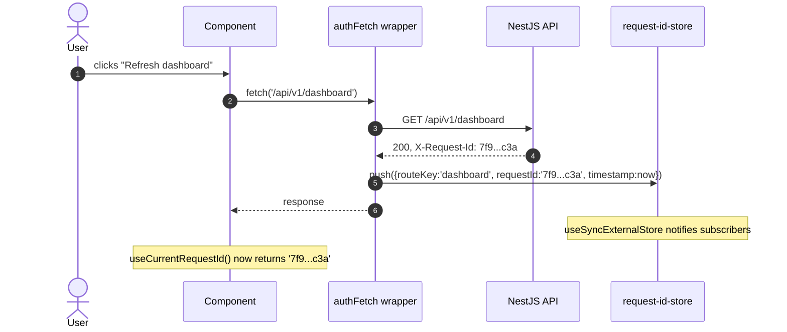
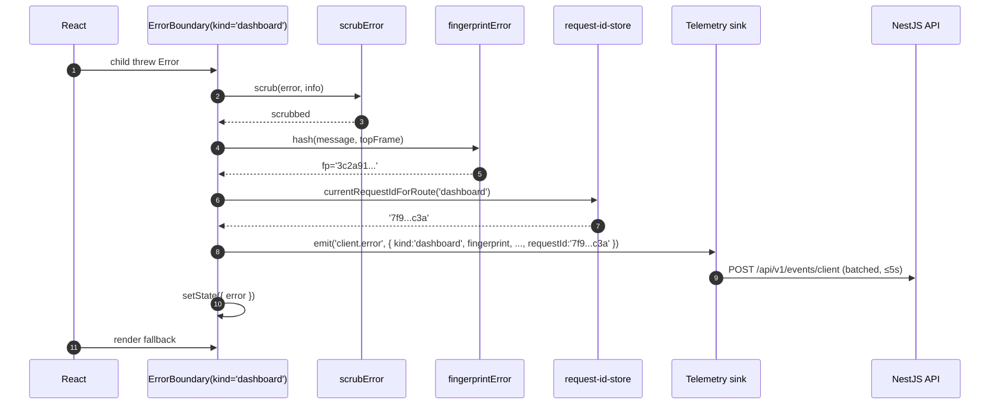
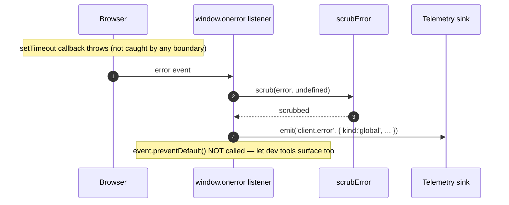
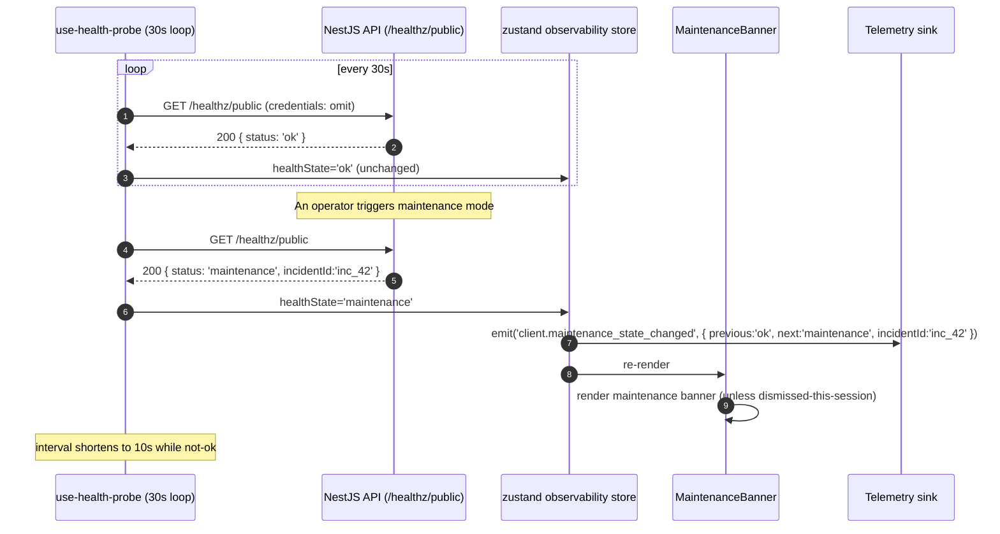
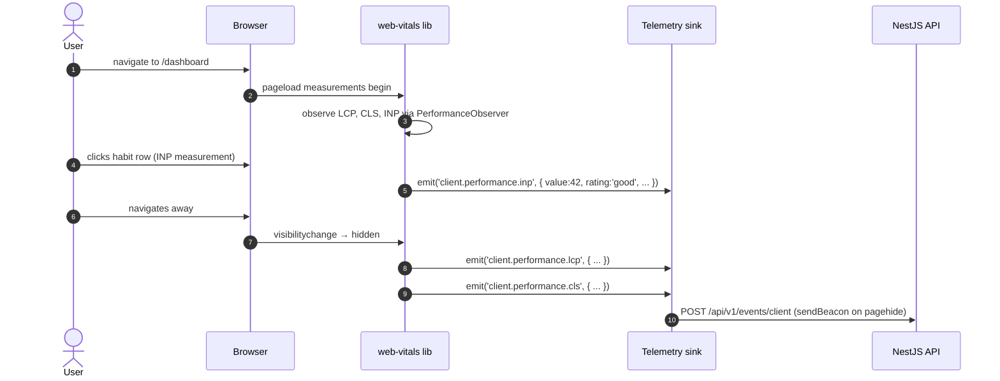

# WP10 — Observability & Production Readiness (Frontend): Architectural Plan

**Status:** Draft v1
**Owner:** Frontend (Lead Architect: Claude)
**Backend status (per CLAUDE.md WP10):**
- `AppLoggerService` (pino) with `RequestIdMiddleware` issuing UUID v4 `X-Request-Id` per request and surfacing it on every response header. AsyncLocalStorage carries the context through interceptors and handlers.
- `HttpLoggingInterceptor` logs each request with `{ request_id, user_id, method, route, status, duration_ms }`. Sensitive fields (`password`, `token`, `key`, `secret`) redacted via pino's `redact` option.
- `MetricsService` owns a Prometheus `Registry`. `GET /metrics` exposed without auth (network-level protection). RED counters/histograms auto-collected via a global `MetricsInterceptor`. Business KPIs incremented inline in the outbox publisher, recommendation worker, and notification scheduler.
- Health endpoints: `GET /health` always 200 (liveness). `GET /ready` pings Postgres + Redis; 503 if either fails. Redis-null (test mode) returns `'skip'` (not `'fail'`). **Both are operator endpoints (k8s); not for user-facing UX.**
- Graceful shutdown: `app.enableShutdownHooks()` in `main.ts`. Workers implement `OnModuleDestroy`. SIGTERM drains.
- `AuditService` fire-and-forget INSERTs to the existing `audit_log` table. Currently hooks `user.password_changed` and `recommendation.accepted`. Errors are caught and never block.
- OpenAPI drift check: `pnpm --filter backend generate:openapi` regenerates the committed `backend/openapi.json`. CI diffs and blocks on mismatch.
- E2E coverage floor: 70% lines (actuals ~85% lines / ~73% branches / ~78% functions).

**Per the scope question:** "Standard" — request-id capture, Web Vitals reporting, route-level error boundaries, build-info debug panel, public health probe (new endpoint `GET /healthz/public`) + maintenance banner, online/offline reflection. **No** CSP report-uri enforcement, **no** structured breadcrumb replay, **no** user-facing `/status` route.

**Scope:** This slice is the **frontend observability surface** that pairs with the backend's structured logs, metrics, and audit log. It covers (1) attaching and surfacing the backend's `X-Request-Id` everywhere a frontend error report or telemetry event lives, (2) emitting **Web Vitals** through the existing WP4 telemetry sink, (3) a **route-level error boundary tree** that captures render and async errors, scrubs PII, and posts structured reports, (4) a **build-info debug panel** for support sessions, (5) a **maintenance banner** driven by a new public health probe (§8 #1), and (6) **online/offline reflection** consolidating the partial behaviour spread across WP4 and WP9. Final result: when the user reports "the dashboard didn't load," we can trace it from their browser to a server-side log line in seconds.

> Read this together with `CLAUDE.md` (WP10 implementation notes), `wp4-plan.md` (the telemetry sink — Web Vitals, error reports, and maintenance state events all ride this pipeline), `auth-plan.md` (the existing `useFetchClient` wrapper where `X-Request-Id` is captured), `wp9-plan.md` (the service worker also captures request ids for its own fetches), and `docs/HabitLab_AI_Analysis_Report.docx` §8 (NFRs — performance budgets, accessibility) and §9 (operational requirements).

---

## 1. Goals & Constraints

**Functional goals**

- Capture **`X-Request-Id`** from every API response and attach it to:
  - the WP4 telemetry sink for *all* events emitted in that response's reaction window (e.g. a click that triggered the request),
  - all subsequent error reports until the next request supersedes it,
  - a developer-facing debug panel.
- Emit **Web Vitals** — `INP`, `LCP`, `CLS`, `FCP`, `TTFB` — via the existing telemetry sink. WP4 deferred this; WP10 finishes the wire-up.
- Provide a **route-level error boundary tree**: a global catch-all outside the router, plus per-route boundaries inside the auth shell. Each boundary scrubs PII, captures the last-known `request_id`, and posts a `client.error` event.
- Surface a **build-info debug panel** (`?debug=info` query param, dev/staging only) showing git SHA, build time, env, current `request_id`, last 10 emitted telemetry events.
- Render a **maintenance banner** when the new `GET /healthz/public` reports `'maintenance'` or `'degraded'`. The banner is non-modal, dismissible per-session, and refetches every 30s while active.
- Reflect **online/offline** state at the chrome level: a top-of-screen banner appears within 2s of offline, disappears within 2s of online. Consolidates the partial offline handling WP4 (telemetry queue) and WP9 (SW fetches) already do.
- Maintain **graceful API failure UX**: a 5xx on any TanStack Query surfaces a feature-appropriate retry affordance; a 5xx on a mutation rolls back optimistic state and toasts; a `'maintenance'` response surfaces the maintenance banner instead.

**Hard constraints (from CLAUDE.md + earlier plans)**

- **No third-party error tracker.** Sentry/Datadog/Bugsnag are not adopted. All observability flows through the WP4 telemetry sink + backend log/metric pipeline. Rationale: avoid PII exposure to a vendor, keep the sink as the single seam, no extra runtime weight.
- **`/health` and `/ready` are operator-only.** Per CLAUDE.md WP10: `/health` is unconditional 200, `/ready` is k8s liveness. The frontend's maintenance banner uses a **separate** `GET /healthz/public` endpoint (new — see §8 #1). The frontend never polls `/ready`.
- **PII scrubbing is non-negotiable.** Error reports must not include user email, habit names, recommendation body text, or any free-text user input. Scrubbing happens at error-capture time, in the boundary; not at the sink. The sink ships what it's given.
- **`X-Request-Id` is the trace key.** It propagates from backend response → frontend telemetry → error reports. There is no second trace key (no Sentry trace id, no OpenTelemetry trace id at the frontend yet).
- **Web Vitals reporting respects DNT and the existing telemetry-disabled mode.** `VITE_ENABLE_TELEMETRY=false` (WP4 default in dev) → no Web Vitals network calls. Console logging only.
- **Error boundaries are page-level minimum, not just root.** A single root boundary makes a slow-rendering page bring down the entire app on one bug. WP10 requires boundaries per route.
- **No source maps shipped to production clients.** Production builds emit source maps and upload them to backend storage (or an asset CDN behind auth) for symbolication; the bundled JS references map names but not URLs. Backend symbolication uses uploaded maps. (Implementation detail — operational, not architectural — but the *plan* depends on backend cooperation; see §8 #5.)
- **OpenAPI drift CI gate is honored.** Type generation, `pnpm generate:openapi`, diff check — non-negotiable for every PR. Already in CI per WP10 backend notes. Frontend's job is to regenerate cleanly and lint.
- **Build info is public but minimal.** Git SHA (7 chars), build time (ISO), env name (`production`/`staging`). No commit messages, no author info, no branch name.

**Non-goals for this slice**

- **CSP / report-uri / report-to.** Useful but operational; backend deploys the headers. Frontend has no architectural component for it.
- **Full breadcrumb capture / session replay.** No DOM mutation recorder, no last-N-action ring buffer for replay. The telemetry sink's existing events (auth, habit, recommendation, experiment exposure, push, etc.) are the breadcrumb stream.
- **User-facing `/status` page** showing system health. The maintenance banner is the UX. A status page is a separate product surface.
- **Anomaly detection on the client.** Backend Grafana / Prometheus rules own alerting; frontend just emits.
- **Distributed tracing context propagation (traceparent / W3C).** Not yet adopted backend-side; cannot be propagated unilaterally. Mentioned in §8 #2 as a future ask.
- **A11y audit automation.** Important, separate WP. WP10 includes a *manual* axe-core run in CI as a smoke check, not an exhaustive audit.
- **Web Vitals attribution dashboards.** Backend Grafana renders these from the events the sink delivers. Frontend doesn't dashboard its own metrics.
- **Self-test endpoints exposed to end users.** "Run a connectivity check" UI is not WP10.

---

## 2. Folder Structure

```
frontend/src/
├── lib/
│   ├── observability/                           NEW in WP10
│   │   ├── request-id/
│   │   │   ├── request-id-store.ts              in-memory ring of the N most recent request_ids by route
│   │   │   ├── capture-response.ts              fetch interceptor — reads X-Request-Id from response.headers
│   │   │   └── current-request-id.ts            useSyncExternalStore adapter; "current" = most recent
│   │   ├── web-vitals/
│   │   │   ├── report-web-vitals.ts             web-vitals onINP/onLCP/onCLS/onFCP/onTTFB → sink
│   │   │   └── thresholds.ts                    Google's "good / needs improvement / poor" buckets
│   │   ├── errors/
│   │   │   ├── error-scrubber.ts                pure fn — sanitize an Error before reporting
│   │   │   ├── error-payload.ts                 shape of the client.error event
│   │   │   ├── error-fingerprint.ts             hash of (message, top stack frame) for grouping
│   │   │   └── window-error-listener.ts         attaches window.onerror + unhandledrejection (last resort)
│   │   ├── health/
│   │   │   ├── use-health-probe.ts              useQuery polling /healthz/public on a 30s interval
│   │   │   └── health-state.ts                  types: 'ok' | 'degraded' | 'maintenance' | 'unknown'
│   │   ├── online/
│   │   │   ├── use-online-state.ts              wraps navigator.onLine + 'online'/'offline' events
│   │   │   └── online-broadcast.ts              optional: shares state across tabs via existing channel (no new BC)
│   │   ├── build-info/
│   │   │   └── build-info.ts                    typed constants: GIT_SHA, BUILD_TIME, ENV, RELEASE_TAG
│   │   └── index.ts                             barrel — public: ErrorBoundary, MaintenanceBanner, etc.
│   └── events/                                   (WP4) extended in §5 with new event types
│
├── components/
│   ├── ErrorBoundary.tsx                         NEW — class component; scrubs + posts; used by router
│   ├── ErrorFallback.tsx                         NEW — visual fallback; "Something went wrong" + retry + request_id
│   ├── MaintenanceBanner.tsx                     NEW — top-of-page; reads health-state; dismissible per-session
│   ├── OfflineBanner.tsx                         NEW — top-of-page; reads online-state
│   └── DebugPanel.tsx                            NEW — gated by ?debug=info; shows build info + request_id history
│
├── router/
│   └── routes.tsx                                (existing) wraps each route in <ErrorBoundary> with route-specific fallback
│
├── main.tsx                                       (existing) installs window.onerror + unhandledrejection BEFORE React mounts
│
└── api/
    └── fetch-client.ts                            (existing — WP2) extended to call captureRequestId() per response
```

**Why a `lib/observability/` and not a `features/observability/`.** Observability is cross-cutting infrastructure — every feature emits errors, every fetch captures `X-Request-Id`. It has no UI bounded context of its own (the maintenance banner is the closest, and it lives in `components/`). A `features/` folder would imply a domain; observability is plumbing.

**Why `request-id-store` is a ring not a single value.** Reporting "this error happened during request X" is more accurate than "the last request was X." A 200ms gap between a request completing and a click handler throwing means the *click handler* references the request that just completed. The ring keeps the last 10 entries by route key; the error scrubber looks up by route at capture time.

**Why a separate `window-error-listener.ts`.** React's error boundaries don't catch errors in event handlers, in async code, or in setTimeout callbacks. `window.onerror` + `unhandledrejection` cover those. Installed in `main.tsx` *before* React mounts so a startup crash is still reported.

---

## 3. Component Hierarchy

### 3.1 Boundary placement

```
<QueryClientProvider>
  <ErrorBoundary kind="root" fallback={<FatalErrorFallback />}>      ← catches everything
    <OnlineBanner />
    <MaintenanceBanner />
    <AuthProvider>
      <Routes>
        <Route path="/login"      element={<ErrorBoundary kind="auth"><LoginPage /></ErrorBoundary>} />
        <Route path="/dashboard"  element={<ErrorBoundary kind="dashboard"><Dashboard /></ErrorBoundary>} />
        <Route path="/habits"     element={<ErrorBoundary kind="habits"><HabitsPage /></ErrorBoundary>} />
        <Route path="/analytics"  element={<ErrorBoundary kind="analytics"><AnalyticsPage /></ErrorBoundary>} />
        <Route path="/coach"      element={<ErrorBoundary kind="coach"><CoachPage /></ErrorBoundary>} />
        <Route path="/settings/*" element={<ErrorBoundary kind="settings"><SettingsLayout /></ErrorBoundary>} />
      </Routes>
    </AuthProvider>
    <DebugPanel />                ← portal — only renders when ?debug=info present
  </ErrorBoundary>
</QueryClientProvider>
```

- The **root boundary** renders `<FatalErrorFallback />` — a full-screen "something went wrong" page with a Reload button and the captured `request_id`. Only used if a child boundary fails to render its own fallback (i.e. catastrophic).
- **Route boundaries** render an in-place fallback (e.g. "Couldn't load the dashboard — Retry") so the chrome (banners, debug panel) stays visible. The user can navigate to another route.
- Boundaries do **not** wrap individual cards or list items in v1. That's component-level resilience; we want errors to surface at the route level so they get attention.

### 3.2 `<ErrorBoundary>` contract

```tsx
interface ErrorBoundaryProps {
  readonly kind: 'root' | 'auth' | 'dashboard' | 'habits' | 'analytics' | 'coach' | 'settings';
  readonly fallback?: (props: { error: Error; reset: () => void; requestId: string | null }) => ReactNode;
  readonly children: ReactNode;
}

class ErrorBoundary extends Component<ErrorBoundaryProps, { error: Error | null }> {
  componentDidCatch(error: Error, info: ErrorInfo) {
    const scrubbed = scrubError(error, info);
    const requestId = currentRequestIdForRoute(this.props.kind);
    emitClientEvent({
      type: 'client.error',
      payload: {
        kind: this.props.kind,
        fingerprint: fingerprintError(scrubbed),
        message: scrubbed.message,
        stack: scrubbed.stack,
        componentStack: scrubbed.componentStack,
        requestId,
        buildInfo: BUILD_INFO,
      },
    });
  }
  // render() returns fallback or children
}
```

- **`kind`** is a literal-union taxonomy. Backend logs join on this for "which page is breaking?"
- **`reset`** unmounts the fallback and rerenders children. Used by the fallback's Retry button.
- **PII scrubbing** is done in `scrubError`, *before* emission. The sink sees a sanitized payload.

### 3.3 `<ErrorFallback />` API

```tsx
function ErrorFallback({ error, reset, requestId }: {
  error: Error;
  reset: () => void;
  requestId: string | null;
}) {
  return (
    <div role="alert" className="...">
      <h2>Couldn't load this page</h2>
      <p>We've logged the issue. You can try again or come back later.</p>
      {requestId && <p className="text-xs opacity-70">Reference: {requestId}</p>}
      <button onClick={reset}>Retry</button>
    </div>
  );
}
```

- `requestId` is shown verbatim so a user reporting the issue can quote it to support.
- No raw error message is shown to the user — that's a PII leak surface (a typed habit name might appear in a stack trace).

### 3.4 `<MaintenanceBanner />` API

```tsx
function MaintenanceBanner() {
  const { state, incidentId } = useHealthProbe();
  const dismissed = useSessionDismissed('maintenance');
  if (state === 'ok' || state === 'unknown' || dismissed) return null;
  return (
    <Banner tone={state === 'maintenance' ? 'info' : 'warning'} dismissible>
      {state === 'maintenance'
        ? "HabitLab is undergoing maintenance. Some features may be unavailable."
        : "We're seeing degraded performance. Things may be slower than usual."}
      {incidentId && <small> Reference: {incidentId}</small>}
    </Banner>
  );
}
```

- The probe is polled at 30s when state is `'ok'`, 10s when `'degraded'` or `'maintenance'`. Faster recovery detection during incidents.
- Dismissal is per-session (sessionStorage, not preferences). The banner reappears on a new tab.

### 3.5 `<OfflineBanner />` API

```tsx
function OfflineBanner() {
  const online = useOnlineState();
  if (online) return null;
  return (
    <Banner tone="warning">
      You're offline. Changes will sync when you reconnect.
    </Banner>
  );
}
```

- Hides automatically when `online` flips true.
- The "Changes will sync when you reconnect" line is honest: WP4's idempotency-key + telemetry queue + WP9's SW telemetry queue all retry on reconnect. WP3 mutations are *not* offline-queued in v1, but the optimistic UI handles transient drops.

### 3.6 `<DebugPanel />` API

Gated by `import.meta.env.DEV || import.meta.env.MODE === 'staging'` AND `?debug=info` present. Production builds dead-code-eliminate it.

```
┌── HabitLab Debug ──────────────────────┐
│ Build: 1a2b3c4 (2026-05-18T09:14:02Z)  │
│ Env: staging                           │
│ Current request_id: 7f9...c3a          │
│ User: user_42 (preferences loaded)     │
│ Experiments hydrated: 4                │
│ SW: active (version 1a2b3c4)           │
│ Push: subscribed (device #2)           │
│ Telemetry: 12 queued, last flush 4s    │
│ Health: ok                             │
│ ─── Recent request_ids ───             │
│ /api/v1/dashboard → 7f9...c3a (12s)    │
│ /api/v1/habits   → 4a1...d80 (32s)    │
└────────────────────────────────────────┘
```

- Read-only.
- Copy-to-clipboard on each row.
- Mounted via `createPortal` to `document.body` so it sits above modals.

### 3.7 Composition rules

- **Only `lib/observability/errors/`** may call `emitClientEvent({ type: 'client.error', ... })`. Other features emit feature-specific events (habit, recommendation, push, etc.). Lint guard: `no-restricted-syntax`.
- **Only `lib/observability/request-id/`** may read `X-Request-Id` from responses. Features access the current id via `useCurrentRequestId()` only. Lint guard: `no-restricted-imports` on `capture-response.ts` from anywhere except `api/fetch-client.ts`.
- **No feature may install its own `window.onerror`.** A second handler would re-emit the same error or swallow it. The single installer in `main.tsx` is canonical.
- **No feature may construct a maintenance banner of its own.** A 5xx response in a feature handler triggers TanStack's standard retry / toast UX, not a banner. The banner is health-probe-driven only.

---

## 4. State Management Strategy

### 4.1 Query keys

```ts
export const observabilityKeys = {
  all: ['observability'] as const,
  health: () => [...observabilityKeys.all, 'health'] as const,
};
```

### 4.2 Query configuration

| Query | refetchInterval | staleTime | gcTime | refetchOnWindowFocus | Notes |
|---|---|---|---|---|---|
| `observabilityKeys.health()` (when state=ok) | 30000 | 0 | 60000 | yes | Always-fresh; tight loop only when incident is suspected |
| `observabilityKeys.health()` (when state≠ok) | 10000 | 0 | 60000 | yes | Faster recovery detection |
| Web Vitals reports | — | — | — | — | Not a query; emitted to sink on web-vitals callbacks |

The probe is unauthenticated. It does not pass cookies (the endpoint is public; sending cookies needlessly is a small privacy/perf cost). `fetch(url, { credentials: 'omit' })`.

### 4.3 Request-id flow

The fetch wrapper (existing WP2 `useFetchClient`) is extended:

```ts
async function authFetch(input, init): Promise<Response> {
  const res = await fetch(input, { ...init, credentials: 'include' });
  captureRequestId(input, res);   // NEW — pulls X-Request-Id, indexes by route
  return res;
}
```

- `captureRequestId` parses the URL's pathname → route key (e.g. `/api/v1/dashboard` → `dashboard`). Reads `X-Request-Id` from `res.headers`. Pushes `{ routeKey, requestId, timestamp }` onto the ring (size 10).
- A separate "current" pointer always points to the most recent push (any route).
- `useSyncExternalStore` adapts the ring to React. `useCurrentRequestId()` returns the latest; `useRequestIdForRoute(kind)` returns the latest for that route.
- The ring is in-memory only. Lost on page refresh — which is fine; errors that survive refresh aren't actionable via request-id.

### 4.4 Web Vitals emission

```ts
import { onINP, onLCP, onCLS, onFCP, onTTFB } from 'web-vitals/attribution';

export function startWebVitals() {
  if (!import.meta.env.VITE_ENABLE_TELEMETRY) return;
  onINP((m) => emit('client.performance.inp', m));
  onLCP((m) => emit('client.performance.lcp', m));
  onCLS((m) => emit('client.performance.cls', m));
  onFCP((m) => emit('client.performance.fcp', m));
  onTTFB((m) => emit('client.performance.ttfb', m));
}

function emit(type: ClientEventType, m: Metric) {
  emitClientEvent({
    type,
    payload: {
      value: m.value,
      delta: m.delta,
      id: m.id,
      rating: m.rating,                 // 'good' | 'needs-improvement' | 'poor'
      navigationType: m.navigationType, // 'navigate' | 'reload' | 'back-forward' | 'prerender'
      attribution: redactAttribution(m.attribution), // strip PII from element selectors
    },
  });
}
```

- `web-vitals/attribution` includes element selectors that, in theory, can include text content of the element. `redactAttribution` strips text nodes, keeps tag + role + data-* attributes (which we control).
- `startWebVitals` is called once from `main.tsx` after render.
- Each metric fires at most twice per page (web-vitals' default — once when the page becomes visible-hidden, once on final visibility change). The sink dedups by `(type, id)`.

### 4.5 Error capture pipeline

```
┌────────────────────────────────────────────────────────────────────────────┐
│ window.onerror / unhandledrejection  →  scrubError  →  fingerprintError    │
│                       ↓                                                    │
│              client.error event (kind='global')                            │
│                       ↓                                                    │
│                WP4 telemetry sink                                          │
│                       ↓                                                    │
│              POST /api/v1/events/client                                    │
└────────────────────────────────────────────────────────────────────────────┘

React render error → ErrorBoundary.componentDidCatch  →  same path
                                  ↓
                       fallback rendered in-place
```

- **Scrub rules** (`scrubError`):
  - Replace tokens matching `/[A-Za-z0-9_-]{20,}/g` with `'<redacted-token>'` (catches JWT shapes that should never be in stacks).
  - Replace email-shaped substrings with `'<redacted-email>'`.
  - Truncate `componentStack` to the first 20 frames.
  - Drop `error.cause` if it's not an `Error` (could contain arbitrary objects).
- **Fingerprint** is `sha256(message + topStackFrame).slice(0, 12)`. Stable across builds *unless* a stack frame's source file path includes a content hash — see §7.2 #3.

### 4.6 What lives in Zustand (`lib/observability/store.ts`)

- `healthState: 'ok' | 'degraded' | 'maintenance' | 'unknown'` — mirror of the query for fast synchronous reads in non-React contexts (e.g. the fetch wrapper's interceptor logging a "we're degraded but still tried" annotation).
- `online: boolean` — mirror of `useOnlineState`.
- `errorCountByRoute: Record<RouteKey, number>` — telemetry-side counter, used by DevPanel.

Not persisted.

### 4.7 What lives in URL

- `?debug=info` — opens the debug panel. DEV/staging only. Production builds ignore.
- `?debug=requestid` — same panel, scrolled to the request-id ring.

### 4.8 Maintenance state event

The sink emits `client.maintenance_state_changed { previous, next }` whenever the health probe transitions. Useful in backend dashboards to correlate frontend-visible incidents with backend metrics.

---

## 5. Core TypeScript Types

### 5.1 Domain (re-exported from generated)

```ts
export type HealthPublicResponse  = components['schemas']['HealthPublicResponse'];
// Expected shape (see §8 #1):
// { status: 'ok' | 'degraded' | 'maintenance'; incidentId?: string; message?: string }
```

### 5.2 Hand-written narrowed types

```ts
// Error kinds — must match ErrorBoundary's `kind` literal union.
export type ErrorKind =
  | 'root'
  | 'global'        // window.onerror / unhandledrejection
  | 'auth'
  | 'dashboard'
  | 'habits'
  | 'analytics'
  | 'coach'
  | 'settings';

// Route keys used by the request-id ring. Subset of ErrorKind — anonymous routes have no auth scope.
export type RouteKey = Exclude<ErrorKind, 'root' | 'global'>;

export interface RequestIdRecord {
  readonly routeKey: RouteKey | 'unknown';
  readonly requestId: string;
  readonly timestamp: number;   // performance.now()
}

// Health probe state.
export type HealthState = 'ok' | 'degraded' | 'maintenance' | 'unknown';

// Build info — populated at build time via Vite define plugin.
export interface BuildInfo {
  readonly gitSha: string;        // 7-char short
  readonly buildTime: string;     // ISO 8601
  readonly env: 'production' | 'staging' | 'development';
  readonly releaseTag: string | null;
}

// Online state — minimal.
export interface OnlineState {
  readonly online: boolean;
  readonly since: number;         // performance.now() of last transition
}

// Error report payload — what the sink ships.
export interface ClientErrorPayload {
  readonly kind: ErrorKind;
  readonly fingerprint: string;       // 12-char hex
  readonly message: string;           // scrubbed
  readonly stack: string | null;      // scrubbed
  readonly componentStack: string | null;
  readonly requestId: string | null;
  readonly buildInfo: BuildInfo;
  readonly url: string;
  readonly userAgent: string;
}
```

### 5.3 Telemetry event types (extends WP4)

```ts
// Add to ClientEvent discriminated union in lib/events/client-event.ts
| { type: 'client.error'; payload: ClientErrorPayload }
| { type: 'client.performance.inp';  payload: WebVitalPayload }
| { type: 'client.performance.lcp';  payload: WebVitalPayload }
| { type: 'client.performance.cls';  payload: WebVitalPayload }
| { type: 'client.performance.fcp';  payload: WebVitalPayload }
| { type: 'client.performance.ttfb'; payload: WebVitalPayload }
| { type: 'client.maintenance_state_changed';
    payload: { previous: HealthState; next: HealthState; incidentId: string | null } }
| { type: 'client.online_state_changed'; payload: { online: boolean } };

export interface WebVitalPayload {
  readonly value: number;
  readonly delta: number;
  readonly id: string;
  readonly rating: 'good' | 'needs-improvement' | 'poor';
  readonly navigationType: string;
  readonly attribution: Record<string, string | number | boolean | null>;
}
```

The `client.performance.*` types replace the placeholder mentioned in `wp4-plan.md` TP-2 ("`client.performance` type exists in union but has no `emitPerformance` helper").

### 5.4 Mutation contexts

WP10 has no new mutations. The health probe is a query. Web Vitals are events, not mutations. Error reports are events.

---

## 6. Sequence Diagrams

### 6.1 Request-id capture and surface



### 6.2 Render error → boundary → telemetry



### 6.3 Window error (outside React)



### 6.4 Maintenance probe + banner transition



### 6.5 Web Vitals reporting on page lifecycle



---

## 7. Edge Cases & Architectural Bottlenecks

### 7.1 Correctness / UX edge cases

1. **Backend forgets to emit `X-Request-Id`.** Old endpoint, mocked response in a test, or a proxy stripping headers. **Mitigation:** the ring stores `requestId: null` for that response. Error reports tied to that route fall through to "no request id." Telemetry includes a `client.error.no_request_id_count` counter so the gap is observable.

2. **Two requests to the same route in flight, second completes first.** The ring records the second response first; "current" is the most recent. If the first response eventually arrives, it overwrites "current" — but its `request_id` is older. **Mitigation:** the ring orders by `timestamp` (insertion order). `currentRequestIdForRoute('dashboard')` returns the most recent for that route by timestamp. A small window of cross-pollution is acceptable; backend logs still tell the true story.

3. **Error fires before any fetch has happened.** A startup render error, for example. **Mitigation:** `requestId: null`. Error report still goes; backend correlates by user_id + timestamp.

4. **User dismisses maintenance banner, incident resolves, new incident starts.** The session-scoped dismissal would suppress the second banner. **Mitigation:** dismissal is keyed by `incidentId`, not "maintenance state." A new incident has a new id; banner reappears. If `incidentId` is absent, dismissal is keyed on a session-local timestamp and expires after 1h.

5. **Web Vitals on a prerendered page.** `navigationType: 'prerender'` skews TTFB and FCP. **Mitigation:** Web Vitals events include `navigationType`; backend analytics can filter. Frontend ships the raw signal.

6. **CLS measured during a user-driven layout change (e.g. opening a modal).** That CLS is fine — the user expected it. **Mitigation:** `web-vitals/attribution` includes a `largestShiftTarget` selector; backend dashboards can categorize. Frontend doesn't pre-filter.

7. **`navigator.onLine === true` but actually offline** (proxy says yes; DNS resolves locally; etc.). **Mitigation:** the OnlineBanner is a *hint*, not authoritative. The real signal is failed fetches. The fetch wrapper's retry logic surfaces failures regardless of `navigator.onLine`.

8. **Error boundary itself throws inside `componentDidCatch`.** **Mitigation:** the scrubber + fingerprint functions are pure and synchronous; their failure modes are narrow. The whole `componentDidCatch` body is wrapped in a `try/catch` that, on failure, falls back to `console.error` only. We accept losing the error report rather than crashing the boundary.

9. **Telemetry sink unavailable when an error fires.** **Mitigation:** WP4's sink already queues to IDB and flushes on reconnect. Errors are events; they queue alongside everything else. The maintenance banner provides UX cover.

10. **Health probe fails (network or 5xx).** Don't show the banner — `'unknown'` state. Don't loop tighter (that's a DOS risk during incidents). **Mitigation:** transition from `'ok'` to `'unknown'` does not emit a `maintenance_state_changed` event (avoid flooding the sink during outages). Transitions involving `'maintenance'` or `'degraded'` do.

11. **DebugPanel exposed in production via URL query.** **Mitigation:** the component's bundle entry is gated by `import.meta.env.MODE !== 'production'`. Vite's tree-shaker removes it. The query param has no effect on prod builds.

12. **Build-info shows stale data (CDN cache).** A user sees `gitSha: 1a2b3c4` while the actual deploy is `5d6e7f8`. **Mitigation:** `build-info.ts` is part of the main JS bundle; bundle filename includes its content hash. A user on the old bundle reports the old SHA, which is *correct* for their session. The right level of honesty.

13. **A page-level error boundary catches, but the user is mid-mutation.** Optimistic state is locked in the boundary's subtree. **Mitigation:** the boundary's `reset` re-mounts children; React Query re-queries; any failed mutation surfaces its retry affordance. A toast informs: "Couldn't load — retry?"

14. **Privacy-aware browsers (Brave, Firefox strict) block telemetry POSTs.** **Mitigation:** the sink fails open. Errors are not reported, Web Vitals are not reported. The app continues to work. There is no graceful degradation path that doesn't ship telemetry (we'd need explicit consent UI — out of scope for v1; logged as §8 #6).

15. **Long task or jank during error scrubbing.** Regex scans on a huge stack could block the main thread. **Mitigation:** `scrubError` is bounded — truncates stack to 20 frames + 4KB before scanning. Regex runs are linear on bounded input.

16. **`unhandledrejection` for a `fetch` that was already retried successfully.** TanStack's retry logic wraps fetch in `try/catch`; rejections shouldn't bubble. If they do (older Safari, custom promise polyfills), we'd double-report. **Mitigation:** `window-error-listener.ts` keeps a 5-minute LRU of fingerprints; duplicate fingerprints in that window are dropped.

17. **Error inside the global error listener** (e.g. scrubber bug). **Mitigation:** the listener body is wrapped in `try/catch`. Failure → `console.error` only.

18. **CORS strips `X-Request-Id`.** If the API and SPA are on different origins, the backend must include `X-Request-Id` in `Access-Control-Expose-Headers`. **Mitigation:** verify in §8 #3. Same-origin deploys (which is the current target) sidestep this entirely.

### 7.2 Architectural bottlenecks (decoupling concerns)

1. **Feature code must not emit `client.error`.** Errors come from boundaries and the global listener — period. **Mitigation:** ESLint `no-restricted-syntax` rule: `client.error` as a type literal is only allowed in `lib/observability/errors/`. Other files that try to emit it are blocked.

2. **`lib/observability/` cannot import from `features/`.** Observability is below features in the dependency graph. **Mitigation:** ESLint `no-restricted-imports`. The fetch wrapper sits in `api/`, not `features/`; that's where the request-id capture hooks in.

3. **Source-map symbolication couples backend to frontend build output.** Backend needs the maps to render symbol-correct stack traces. **Mitigation:** the build pipeline uploads `dist/*.js.map` to backend storage (or an internal CDN) tagged by `gitSha`. Backend's log enrichment service looks up by `gitSha` from the `BuildInfo` in the error payload. Architecturally: `gitSha` is the join key. Operational details in §8 #5.

4. **Health probe coupling.** The frontend's banner relies on a backend endpoint that doesn't exist yet (§8 #1 — blocker). **Mitigation:** until shipped, the probe query is gated off (`enabled: false`). The component renders nothing. No behavior degradation.

5. **Web Vitals library size.** `web-vitals` is ~3KB gzipped — acceptable. `web-vitals/attribution` is closer to 5KB. **Mitigation:** v1 ships attribution (the extra detail is worth it). If bundle size becomes a concern, drop attribution and only emit values.

6. **OpenAPI drift on `BuildInfo` / `HealthPublicResponse`.** Backend introduces a new health status (`'partial-degraded'`?) without frontend update. **Mitigation:** WP10's own CI gate (already shipped per CLAUDE.md). Type generation catches the drift. Lint clean before merge.

7. **The request-id ring being in-memory only.** A startup crash before any fetch loses all context. **Mitigation:** acceptable. Startup crashes are reported with `requestId: null`; backend can correlate by user_id + URL + UA. A persistent ring would have to be GDPR-careful (a request id is not PII but it's traceable to a session).

8. **Cross-feature dependency loop risk.** `lib/observability/` depends on `lib/events/` (WP4). `lib/events/` does not depend on `lib/observability/`. One-way. ESLint `no-cycle` catches the reverse.

9. **Boundary `kind` taxonomy drift.** Adding a new route requires updating the `ErrorKind` literal union AND adding a boundary. **Mitigation:** the router's route table is the source of truth. A code-mod or template enforces wrapping. PR review catches misses.

10. **Operator visibility into client errors.** Backend log dashboards aggregate `client.error` events from the sink. Indexed on `(kind, fingerprint, gitSha)`. **Mitigation:** the fingerprint is stable across builds for the same logical error (unless the stack frame's file path changes — see #11). Backend analytics has a "promote fingerprint to issue" pattern.

11. **Fingerprint stability across deploys.** If Vite content-hashes module paths into stack frames (e.g. `assets/index-a1b2c3.js`), the fingerprint changes on every deploy. **Mitigation:** `fingerprintError` strips the content-hash chunk from file paths before hashing. The regex matches Vite's default chunk naming convention. Tested per deploy.

12. **`gitSha` not available at runtime.** Vite's `define` plugin needs the SHA injected at build time. CI passes `--define GIT_SHA="$(git rev-parse --short HEAD)"`. **Mitigation:** `build-info.ts` reads `import.meta.env.VITE_GIT_SHA`; if missing, defaults to `'dev'`. The CI workflow injects it; local dev doesn't need it.

---

## 8. Open Questions for Backend / Spec

Confirm against §8/§9 of the analysis report. Items marked **(blocker)** must be resolved before scaffolding starts.

1. **`GET /healthz/public` endpoint** **(blocker)**. New public unauthenticated endpoint per the chosen approach. Proposed contract: `200 { status: 'ok' | 'degraded' | 'maintenance', incidentId?: string, message?: string }`. Cacheable for 10–30s via `Cache-Control`. No CORS issues if same-origin. Distinct from `/health` and `/ready`. Backend deliverable.

2. **`traceparent` / W3C distributed tracing.** Backend doesn't currently emit a `traceparent` header. Would the team accept adding it (via a NestJS middleware) so the frontend could include it on subsequent requests within the same user action? Not v1; flagged for a later cross-cutting WP.

3. **`Access-Control-Expose-Headers` includes `X-Request-Id`.** When the API and SPA are on different origins (staging via subdomain?), CORS strips response headers by default. The backend must include `X-Request-Id` in `Access-Control-Expose-Headers`. Confirm. If the current deploy is same-origin, this is preventive but recommended.

4. **`client.error` payload size limits.** The sink batches up to 50 events. An error with a 4KB stack + 1KB component stack × 50 = ~250KB per batch. Acceptable? If not, sink would need a per-event size cap. Backend's `POST /events/client` request body limit — confirm. Currently unspecified in CLAUDE.md (the endpoint itself isn't yet live, per WP4 notes).

5. **Source maps in production.** Backend needs symbolicated stack traces in logs to be useful. Options: (a) backend stores `*.js.map` files keyed by `gitSha` and symbolicates on ingest; (b) frontend ships maps publicly (rejected — leaks internals). Recommend (a). Requires a small backend service or a Grafana plugin. Not blocking the frontend slice but blocking the *value* of the slice.

6. **Telemetry consent UI.** GDPR/CCPA: do we need an explicit consent banner before sending Web Vitals + errors? Backend audit log can record consent. Recommend: add a "We collect anonymous performance metrics. Learn more." link in the footer, with a toggle in `/settings/privacy`. v1 scope: assume consent (no telemetry in DEV by default; production opt-out via the same setting). Flagged for review.

7. **Maintenance state authority.** When an operator triggers maintenance, who flips `/healthz/public`'s response? A feature flag store (LaunchDarkly etc.)? A Redis key (`maintenance:active`)? A DB column? Recommend: a Redis key set/cleared via the backend CLI (`pnpm cli maintenance:on/off`). Simple, fast, no extra infra.

8. **Web Vitals sampling.** Sending every metric for every user is fine at our scale but won't scale to millions. Backend should have a stance: sample 100% in v1, downsample later via header on the sink. Confirm or defer.

9. **Audit log surfaced to user.** Backend's `audit_log` includes `user.password_changed` and `recommendation.accepted`. Should there be a `/settings/security` page surfacing recent password changes / account events? Adjacent to WP10 but more user-product than observability. Defer to a separate small WP.

10. **Buildinfo on backend `/health`.** Useful for support: "your client SHA is X; the server SHA is Y." Backend's `/health` could include `{ status, version, gitSha }`. Currently it's "always 200." A small extension. Not v1.

---

## 9. Acceptance Criteria for the WP10 Frontend Slice

The slice is "done" when:

- Every API response captured by the fetch wrapper writes its `X-Request-Id` to the ring. `useCurrentRequestId()` and `useRequestIdForRoute(kind)` return the current value.
- The router renders each top-level route inside `<ErrorBoundary kind="...">` with a route-appropriate fallback. A render error inside `<Dashboard>` does not crash `<HabitsPage>`.
- The root boundary catches errors that escape route boundaries and renders `<FatalErrorFallback />`.
- `window.onerror` and `unhandledrejection` handlers are installed in `main.tsx` before React mounts. They emit `client.error` with `kind: 'global'`.
- `scrubError` redacts JWT-shaped tokens, email-shaped strings, and truncates stacks. Unit tests cover each rule.
- Each error report carries a 12-char `fingerprint`, the current `requestId` (or null), and the `BuildInfo` constants.
- `client.error` events flow through the WP4 sink. The sink batches them with other events. `sendBeacon` on `pagehide` flushes pending errors.
- `web-vitals/attribution` emits `INP`, `LCP`, `CLS`, `FCP`, `TTFB` to the sink. Attribution is redacted via `redactAttribution` (no text content; only tag/role/data-attr).
- `useHealthProbe` polls `GET /healthz/public` every 30s when state is `'ok'`, 10s otherwise. Transitions emit `client.maintenance_state_changed` events.
- `<MaintenanceBanner />` renders when state is `'maintenance'` or `'degraded'`. Dismissal is per-`incidentId`, per-session.
- `<OfflineBanner />` reflects `navigator.onLine` with sub-2s latency on transition.
- `<DebugPanel />` renders on `?debug=info` in DEV/staging. Production builds tree-shake it. Shows git SHA, build time, env, current request_id, recent request_ids, telemetry queue depth, health state, online state.
- `BuildInfo` constants are populated at build time via Vite `define`. Missing values default to `'dev'`/`null`.
- ESLint rules enforce: (a) no `client.error` emission outside `lib/observability/errors/`; (b) no `navigator.serviceWorker.*` outside `features/notifications/`; (c) no second `window.onerror` listener anywhere; (d) `lib/observability/` does not import `features/`.
- `pnpm test` covers: scrubError redaction rules (each), fingerprintError stability across content-hash changes, error boundary captures render errors, error boundary fallback renders, request-id ring overwrite semantics, health probe state transitions, Web Vitals emission, online/offline banner transitions, debug panel gating.
- Manual smoke: open `/dashboard?debug=info` → debug panel visible with current SHA → throw a test error from the console → boundary fallback renders → backend logs show a `client.error` event with the matching `request_id` and `gitSha` → trigger maintenance mode via backend CLI → frontend shows the banner within 30s → trigger off → banner disappears within 10s.

---

## 10. Sequencing & Dependencies

Sequencing within the slice:

1. **`BuildInfo` + Vite define plugin first.** Plumbing. Verify `gitSha` and `buildTime` are populated in a production build.
2. **`request-id` capture in the fetch wrapper second.** Extends WP2's `useFetchClient`. Ring + `useSyncExternalStore` adapter. Easy unit tests with a mocked Response.
3. **`scrubError` + `fingerprintError` third.** Pure functions. Heavy unit testing.
4. **`ErrorBoundary` + `ErrorFallback` fourth.** Wire to `emit('client.error', ...)`. Storybook entries for each `kind`.
5. **`window.onerror` + `unhandledrejection` listeners fifth.** Install in `main.tsx` before React. LRU dedup of fingerprints.
6. **Web Vitals sixth.** Install `web-vitals/attribution`, wire to sink, redact attribution. Verify `pagehide` flush via the sink's existing path.
7. **Health probe + `<MaintenanceBanner />` seventh.** Requires §8 #1 backend endpoint. Until then, hook is disabled; component renders nothing.
8. **`<OfflineBanner />` + online-state hook eighth.** Trivial once the rest is in place.
9. **`<DebugPanel />` ninth.** Read-only aggregator. Gated by env + query param.
10. **CI gates last.** Confirm OpenAPI drift gate is on; add a smoke test that a render error in a route reaches the sink endpoint mock.

Dependencies on other WPs:

- **WP2:** `useFetchClient` is the integration point for request-id capture. The fetch wrapper already exists; WP10 adds `captureRequestId(req, res)` to its post-response hook.
- **WP3 / WP5 / WP6+7 / WP8 / WP9:** every feature with a route now gets a boundary. No feature code changes are required — wrapping happens at the router level.
- **WP4:** the telemetry sink carries `client.error`, `client.performance.*`, `client.maintenance_state_changed`, `client.online_state_changed`. ClientEvent union is extended in `lib/events/client-event.ts`. The sink itself is unchanged.
- **WP9:** the service worker's own telemetry emitter (a separate, immediate-flush path per WP9 §5.4) does not capture request-ids the same way — SW fetches happen out-of-band from the SPA's fetch wrapper. The SW reads `X-Request-Id` from its `fetch` calls and includes it on the SW telemetry posts.
- **Backend WP10:** structured logs, metrics, audit log, health endpoints, OpenAPI drift CI — all already shipped.

Deferred to a later WP:

- **CSP / report-uri / report-to.** Operational; backend deploys headers.
- **Session replay / breadcrumb capture.** WP4's event stream serves as a coarse breadcrumb; full replay is out of scope.
- **Distributed tracing (`traceparent`).** §8 #2.
- **Audit log surfaced to users (`/settings/security`).** §8 #9.
- **A11y automated audit in CI** beyond a manual axe-core smoke run.
- **Telemetry consent UI / GDPR opt-out flow.** §8 #6.
- **Symbolication pipeline backend** (source map storage + lookup). §8 #5.

---

*End of plan. Implementation kickoff awaits sign-off and resolution of §8 #1 (`/healthz/public` endpoint). All other §8 items are non-blocking but should be confirmed before the corresponding flow ships (notably §8 #3 — `Access-Control-Expose-Headers` — before request-id capture is tested in any cross-origin environment, and §8 #5 — source map symbolication — before client errors become operationally useful).*
