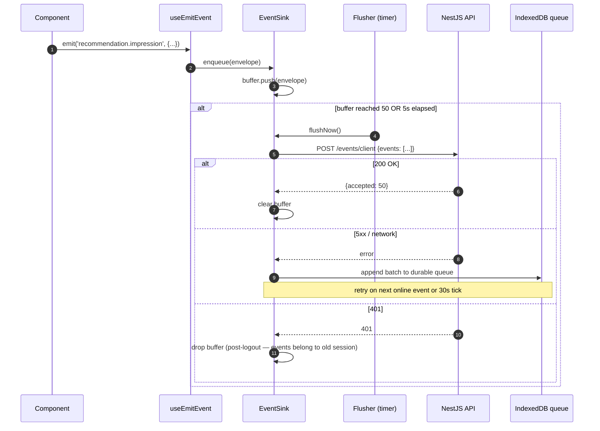
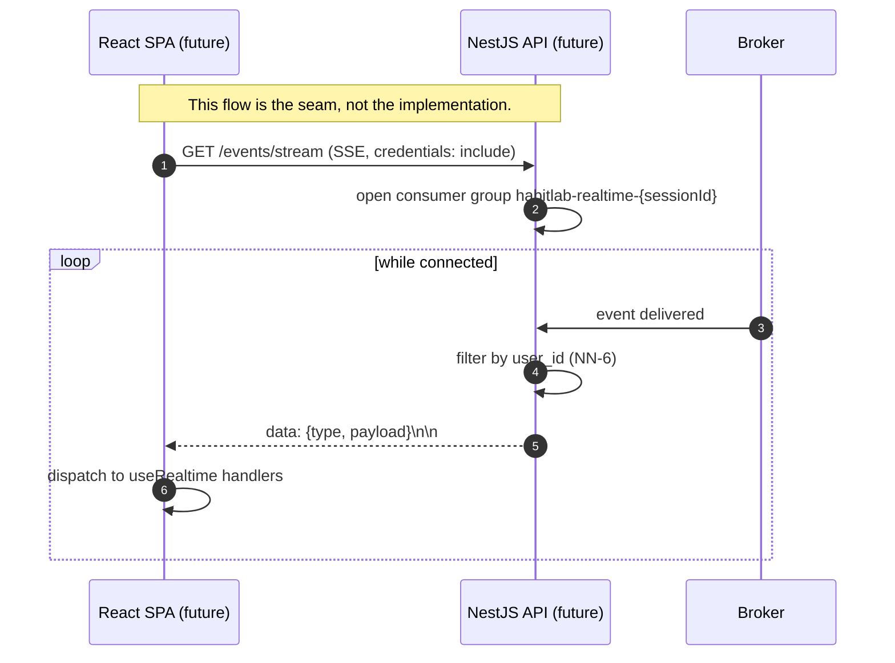

# WP4 — Event-Driven Infrastructure: Frontend Touchpoints Plan

**Status:** Draft v1
**Owner:** Frontend (Lead Architect: Claude)
**Backend status:** WP4 done — `events` table partitioned, outbox publisher live, broker abstraction (Redis Streams `habitlab:events` in prod, in-process stub in test), `processed_events(event_id, consumer_name)` idempotency table, consumer groups `habitlab-analytics` and `habitlab-recommendations` running.
**Scope:** This is **not a user-facing feature**. WP4 is pure backend infrastructure — there is no "Events" page or button. This document defines the frontend's *contractual* relationship with the event substrate: what the SPA emits, what it depends on for correctness, what idempotency guarantees it must provide, and what forward-compat seams it should leave in place for realtime delivery in later WPs.

> Read this together with `CLAUDE.md` (architectural non-negotiables 2–4 — outbox, idempotency, CQRS-lite reads), `auth-plan.md` and `habits-plan.md` (the slices that already implicitly depend on WP4), and `docs/HabitLab_AI_Analysis_Report.docx` §6.2 (event taxonomy + payloads), §6.4 (cache coherence model).

---

## 1. Goals & Constraints

WP4 is the messaging substrate that powers WP5 (analytics), WP6 (recommendations), WP7 (LLM augmentation), WP8 (A/B exposure analysis), and WP9 (notifications). The frontend never speaks to the broker directly — the backend is the only event producer that matters. **But the frontend has four real touchpoints** that need to be made explicit.

**Functional goals**

- **TP-1 — Idempotency keys on all state-changing mutations.** The backend's outbox-and-dedupe machinery (`processed_events(event_id, consumer_name)`) protects against at-least-once delivery between services. The frontend has a parallel concern: a user double-clicks a button, or the network retries a request. Without an `Idempotency-Key` header, the backend creates two events for one user intent. The frontend must generate a UUID v4 per logical mutation and replay it on retries.
- **TP-2 — A typed client telemetry sink.** A small set of events that have no corresponding state mutation but still belong on the event log: page views (FR-080 if present), recommendation impressions, A/B exposures (already handled by WP8 backend, but client-side latency matters), and client-side errors. These flow to a single `POST /events/client` endpoint that the backend ingests into the same event log.
- **TP-3 — Cache-reconciliation contract.** WP5 introduced "API SETs on miss; worker DELs on commit" (CLAUDE.md NN-4). The frontend's React Query `staleTime` + `invalidateQueries` choreography assumes a bounded reconciliation window — typically <1 second. This document codifies that assumption so future regressions are caught.
- **TP-4 — Forward-compat seam for realtime delivery.** Today the frontend polls / refetches on focus. Tomorrow we may add Server-Sent Events (SSE) so that "habit logged in another tab" updates this tab without a window-focus event. The hook surface is designed now so the wiring is mechanical later.

**Hard constraints (from CLAUDE.md)**

- **NN-2:** every backend mutation emits a domain event in the same DB transaction (outbox). The frontend does not need to know this — but it must not duplicate the work. The frontend never POSTs `event` records directly; it POSTs *resource mutations* (`POST /habits/:id/logs`) and trusts the backend to emit the corresponding `habit.logged` event.
- **NN-3:** consumers are idempotent via `processed_events(event_id, consumer_name)`. The frontend's contribution is `Idempotency-Key` per request, which the backend uses to keep the same `event_id` across retries.
- **NN-4:** Workers DEL cache keys; they never SET. API SETs on miss. The frontend's invalidation calls (`queryClient.invalidateQueries`) coordinate with this — they trigger refetches that the API serves either from cache (if the worker hasn't DEL'd yet) or from the database (if it has).
- **No browser storage for telemetry payloads** containing identifiers (NN-7 spillover). The telemetry queue lives in memory + IndexedDB *for offline buffering only*, with no JWT or PII. Cookies still own auth.

**Non-goals for WP4 frontend slice**

- Building a UI for the event log itself. There is none.
- Replacing analytics products like PostHog. The telemetry sink is for *first-party* events that share the backend taxonomy (recommendation impressions, exposure timing) — not for blanket product analytics.
- Real-time UI updates over a persistent connection. The seam exists; the implementation does not.
- A second event bus inside the SPA. The browser already has `BroadcastChannel` (used by WP2 for cross-tab logout); we do not introduce a third pub/sub layer.

---

## 2. Folder Structure

WP4 is cross-cutting infrastructure, not a feature. Code lives under `src/api/` and `src/lib/`, **not** `features/`. There is no `features/events/`.

```
frontend/src/
├── api/
│   ├── client.ts                     (WP2) — adds Idempotency-Key header per TP-1
│   ├── idempotency.ts                NEW — generateKey(), per-mutation UUID lifecycle
│   ├── refresh-mutex.ts              (WP2)
│   ├── query-keys.ts                 (WP2 + WP3)
│   └── generated.ts                  (auto)
│
├── lib/
│   ├── events/
│   │   ├── client-event.ts           ClientEvent type, narrow union of emitted events
│   │   ├── event-sink.ts             buffer + flush to POST /events/client
│   │   ├── event-flusher.ts          batches, retries, backoff
│   │   ├── offline-queue.ts          IndexedDB-backed durable queue (no PII)
│   │   ├── use-emit-event.ts         React hook — fire-and-forget producer
│   │   ├── use-realtime.ts           STUB — accepts handlers, returns no-op subscriptions
│   │   └── README.md                 (this doc, summarized + a usage cheat sheet)
│   ├── broadcast.ts                  (WP2 — BroadcastChannel; reused, not extended)
│   └── reconciliation/
│       ├── reconciliation-window.ts  asserts max stale-after-mutate (TP-3)
│       └── reconciliation.test.ts    integration test against backend
│
├── features/
│   ├── auth/                         (WP2)
│   ├── habits/                       (WP3)
│   ├── tracking/                     (WP3)
│   ├── dashboard/                    (WP3)
│   ├── recommendations/              (WP3 partial; WP6 fills out)
│   └── experiments/                  (WP8 stub — useExposure() emits TP-2 event)
│
└── App.tsx                           wires <EventSinkProvider> at root
```

**Why an `events` library, not a feature.** The frontend never owns a route, page, or component for events. It owns a *primitive*: `useEmitEvent()`. That primitive is consumed by every feature. Putting it in `features/events/` would be misleading — it has no UI surface and no domain model of its own.

---

## 3. The Touchpoint Map (replaces "Component Hierarchy")

A traditional component tree doesn't apply here. Instead, this is the map of **where the frontend touches the WP4 substrate**.

```
┌──────────────────────────────────────────────────────────────────────────┐
│  React SPA                                                               │
│                                                                          │
│  ┌─────────────────┐    ┌──────────────────┐    ┌────────────────────┐   │
│  │ Mutation hooks  │    │ useEmitEvent()   │    │ useRealtime()      │   │
│  │ (WP2/3/6/9)     │    │  (TP-2)          │    │  (TP-4 stub)       │   │
│  │                 │    │                  │    │                    │   │
│  │ Idempotency-Key │    │ ClientEvent      │    │ subscribe(type, h) │   │
│  └────────┬────────┘    └────────┬─────────┘    └─────────┬──────────┘   │
│           │                       │                        │             │
│           │                       ▼                        │             │
│           │             ┌─────────────────┐                │             │
│           │             │  EventSink      │                │             │
│           │             │  (in-memory     │                │             │
│           │             │   buffer +      │                │             │
│           │             │   IDB queue)    │                │             │
│           │             └────────┬────────┘                │             │
│           │                      │                         │             │
└───────────┼──────────────────────┼─────────────────────────┼─────────────┘
            │                      │                         │
            ▼                      ▼                         ▼
    POST /api/v1/*       POST /api/v1/events/client     (future: SSE
    (resource mutation;  (telemetry batch)               GET /api/v1/events/stream)
     backend emits
     domain event)
            │
            ▼
┌──────────────────────────────────────────────────────────────────────────┐
│  Backend (WP4)                                                           │
│                                                                          │
│   ┌────────────┐    outbox    ┌──────────┐    XADD    ┌──────────────┐   │
│   │ Repository │ ───────────▶ │ events   │ ─────────▶ │ Redis Stream │   │
│   │ (txn)      │              │ table    │            │ habitlab:... │   │
│   └────────────┘              └──────────┘            └──────┬───────┘   │
│                                                              │           │
│                          ┌───────────────────────────────────┴────┐      │
│                          ▼                                        ▼      │
│                  habitlab-analytics                    habitlab-recs     │
│                  consumer group                        consumer group    │
│                  (DEL dashboard:...                    (INSERT recs)     │
│                   DEL analytics:...)                                     │
└──────────────────────────────────────────────────────────────────────────┘
```

**Three things to notice**

1. The mutation hooks (left lane) **do not** emit events themselves. They send `Idempotency-Key` headers, and the backend's outbox emits the canonical event. This is correct — frontend and backend events would otherwise drift.
2. `useEmitEvent` (middle lane) is for events that have **no corresponding resource mutation**: page views, impressions, exposures, client errors. These are first-class citizens in the event log but originate from the SPA.
3. `useRealtime` (right lane) is a stub. It defines the API surface so feature code can call `useRealtime('habit.logged', refetch)` today and Just Work tomorrow when SSE arrives — the implementation is `() => () => {}` for now.

---

## 4. State Management Strategy

### 4.1 Idempotency-Key lifecycle (TP-1)

A mutation's idempotency key is generated *per logical user intent*, not per HTTP attempt. Network retries reuse the same key.

```
on mutation.mutate(input):
    key = uuidv4()
    attempt(input, key)

attempt(input, key):
    POST <path> with Idempotency-Key: key
    on 5xx or network → exponential backoff → attempt(input, key)  // SAME KEY
    on success/4xx → mutation resolves                              // KEY DISCARDED
```

Implementation lives in `api/idempotency.ts` and is wired into the WP2 fetch wrapper. **Every mutation in the codebase gets this for free** — no per-hook code changes after the wrapper is updated.

The backend's outbox uses the `Idempotency-Key` to keep the same `event_id` across retries: if the same key arrives twice, the second insert into the outbox is a no-op (UNIQUE constraint), and the consumers' `processed_events` table catches any straggler.

### 4.2 Client telemetry sink (TP-2)

```
useEmitEvent(type, payload)
    → eventSink.enqueue({ type, payload, occurredAt: now() })

EventSink:
    in-memory buffer (max 50 events, max 5 seconds before flush)
    on flush:
        POST /api/v1/events/client { events: [...] }
        on success → clear buffer
        on failure → push batch to IndexedDB durable queue, retry on next online event
        on auth 401 → drop the buffer (do not retry across logout)
```

**Key properties**

- **Fire-and-forget from the caller's perspective.** `useEmitEvent` returns void. Components never await event emission.
- **Batched.** A page that fires 5 impressions doesn't make 5 HTTP calls. The batch endpoint amortizes overhead.
- **Durable across refresh** for offline / page-unload scenarios via IndexedDB queue. On unload, `navigator.sendBeacon` flushes any pending batch (works after the page is hidden). The IDB queue is the safety net.
- **Bounded.** Hard cap at 1000 events in the IDB queue. If exceeded (someone left the tab open all weekend offline), oldest events are dropped with a warning toast on next reconnect.
- **No PII in payloads.** The schema enforces this — `userId` is implicit (cookie); the payload is feature-specific data only.

### 4.3 Cache reconciliation contract (TP-3)

The implicit invariant the frontend depends on:

> After a successful mutation, a refetch of any cache key that *should* have been invalidated will see canonical server state within **1000ms** under normal load.

Concretely:

| Mutation | Cache keys the frontend invalidates | Backend events emitted | Consumer that DELs server cache | Expected window |
|---|---|---|---|---|
| `POST /habits/:id/logs` | `dashboardKeys.summary()`, `habitKeys.detail(id)` | `habit.logged` | `habitlab-analytics` | <500ms p99 |
| `POST /habits` | `habitKeys.lists()`, `dashboardKeys.summary()` | `habit.created` | `habitlab-analytics` | <500ms p99 |
| `DELETE /habits/:id` | `habitKeys.all`, `dashboardKeys.summary()` | `habit.deleted` | `habitlab-analytics` | <500ms p99 |
| `POST /recommendations/:id/accept` | `dashboardKeys.summary()`, `habitKeys.detail(id)` | `recommendation.accepted` | none (HTTP path also clears cache directly) | <100ms p99 |

`lib/reconciliation/reconciliation.test.ts` is an integration test (run only with a live backend) that:

1. Creates a habit.
2. Logs it.
3. Polls `GET /dashboard` until `current_streak == 1`, with a 1000ms ceiling.
4. Asserts the ceiling is not breached.

This test is the canary for WP4 broker latency regressions. CI may skip it (no Redis), but staging runs it on every deploy.

### 4.4 Realtime seam (TP-4)

```ts
useRealtime<T>(eventType: ClientEventType, handler: (payload: T) => void): void
```

For WP4, the implementation is:

```ts
export function useRealtime() {
  // intentionally empty — refetch-on-focus + WP2 BroadcastChannel cover the use cases
  // until SSE is added in a later WP.
}
```

The contract is fixed now so that:
- The dashboard can call `useRealtime('habit.logged', () => qc.invalidateQueries(dashboardKeys.summary()))` today.
- That call is a no-op now.
- When SSE is added, the call becomes live without touching the dashboard component.

This is the **classic "interface first, implementation later" pattern.** Worth doing because reaching for it after SSE lands means rewriting consumer call sites.

### 4.5 What does NOT live in this layer

- Domain events (`habit.logged`, `user.logged_in`, etc.) — those are backend-emitted from the outbox. The frontend never produces them.
- Analytics product events (page transitions, button clicks) — these are TP-2 client events, but the schema is curated, not blanket. Adding a new client-event type requires a backend schema update first (NN-8 OpenAPI drift check).
- Auth state — already covered by WP2's `auth.me` query and `BroadcastChannel`. We do not multiplex auth state through the event sink.

---

## 5. Core TypeScript Types

### 5.1 Idempotency

```ts
// api/idempotency.ts
export type IdempotencyKey = string & { readonly __brand: 'IdempotencyKey' };

export function generateIdempotencyKey(): IdempotencyKey {
  return crypto.randomUUID() as IdempotencyKey;
}

// Wrapper signature change in client.ts:
export interface ApiFetchInit extends RequestInit {
  readonly idempotencyKey?: IdempotencyKey;  // injected by mutation hooks
}
```

The branded type prevents passing arbitrary strings — only `generateIdempotencyKey()` produces a valid one.

### 5.2 Client events (TP-2)

```ts
// lib/events/client-event.ts

// Discriminated union — every event the SPA can emit. New types require a backend
// schema PR + OpenAPI regeneration first (NN-8).
export type ClientEvent =
  | { type: 'page.viewed'; payload: { path: string; referrer: string | null } }
  | { type: 'recommendation.impression'; payload: { recommendationId: string; position: number } }
  | { type: 'experiment.exposure'; payload: { experimentKey: string; variantKey: string } }
  | { type: 'client.error'; payload: { message: string; stack: string | null; route: string } }
  | { type: 'client.performance'; payload: { metric: 'lcp' | 'cls' | 'fid'; value: number } };

export type ClientEventType = ClientEvent['type'];

// Envelope sent over the wire (matches backend POST /events/client schema)
export interface ClientEventEnvelope {
  readonly type: ClientEventType;
  readonly payload: ClientEvent['payload'];
  readonly occurredAt: string;       // ISO 8601, client clock — backend re-stamps
  readonly clientEventId: string;    // UUID — primary dedup key for the batch
}

export interface ClientEventBatch {
  readonly events: readonly ClientEventEnvelope[];
}
```

> **MOCK marker:** the backend `POST /events/client` endpoint may not exist yet. If it doesn't, the sink's flush is a no-op (logs to console in dev) until WP4 backend exposes it. This is the **only** new endpoint WP4 frontend asks of the backend; everything else is contract-only.

### 5.3 Reconciliation window assertion

```ts
// lib/reconciliation/reconciliation-window.ts

export interface ReconciliationProbe<T> {
  readonly fetch: () => Promise<T>;
  readonly predicate: (data: T) => boolean;
  readonly maxWaitMs: number;        // default 1000
  readonly pollIntervalMs: number;   // default 50
}

export interface ReconciliationResult<T> {
  readonly satisfied: boolean;
  readonly elapsedMs: number;
  readonly attempts: number;
  readonly lastValue: T | null;
}

export async function awaitReconciliation<T>(
  probe: ReconciliationProbe<T>
): Promise<ReconciliationResult<T>> { /* ... */ }
```

Used only in tests (and possibly in dev tooling to surface reconciliation regressions during manual QA). Not used in production code paths.

### 5.4 Realtime hook surface (stub but locked-in)

```ts
// lib/events/use-realtime.ts

export type RealtimeUnsubscribe = () => void;

export function useRealtime<T extends ClientEventType>(
  type: T,
  handler: (payload: Extract<ClientEvent, { type: T }>['payload']) => void,
): void;
// implementation: empty effect for WP4 — locked in for future
```

---

## 6. Sequence Diagrams

### 6.1 Resource mutation with idempotency (TP-1)

```mermaid
sequenceDiagram
  autonumber
  actor U as User
  participant FE as React SPA
  participant W as fetch wrapper
  participant API as NestJS API
  participant DB as Postgres (events table)
  participant B as Broker (Redis Stream)

  U->>FE: Submit (e.g. log habit)
  FE->>FE: generateIdempotencyKey() → K
  FE->>W: mutate, headers: {Idempotency-Key: K}
  W->>API: POST /habits/:id/logs
  alt success first try
    API->>DB: BEGIN; INSERT habit_logs; INSERT outbox(event_id, idem_key=K); COMMIT
    DB-->>API: ok
    API-->>W: 201
  else network blip → retry
    W-->>W: timeout, exponential backoff
    W->>API: POST /habits/:id/logs (SAME K)
    API->>DB: outbox INSERT (idem_key=K) → UNIQUE violation → skip
    API->>DB: but the original txn either committed or rolled back
    Note over API,DB: If original committed: API returns 200 with same body via outbox replay logic
    Note over API,DB: If original rolled back: this attempt creates fresh row + event
    API-->>W: 200/201
  end
  API->>B: outbox publisher → XADD habitlab:events
  B->>B: consumers process (analytics worker DELs cache)
  W-->>FE: success, mutation resolves
  FE->>FE: invalidateQueries(...) → next refetch sees fresh server state
```

**The subtle part** is step 8–10: the backend distinguishes "this idempotency key already produced a successful event" from "this is a new attempt." The frontend's role is just *honesty* — same key for retries of the same intent, fresh key for a new intent.

### 6.2 Client telemetry batch (TP-2)



**Page unload scenario.** When the tab closes, `beforeunload` fires `navigator.sendBeacon('/api/v1/events/client', JSON.stringify(batch))`. `sendBeacon` is fire-and-forget but guaranteed to reach the network even after the page is hidden. Anything still pending lives in IndexedDB and is flushed on next page load.

### 6.3 Cache reconciliation window (TP-3)

```mermaid
sequenceDiagram
  autonumber
  actor U as User
  participant FE as React SPA
  participant API as NestJS API
  participant Cache as Redis
  participant DB as Postgres
  participant B as Broker
  participant W as Analytics worker

  U->>FE: Toggle habit log (optimistic UI flip)
  FE->>API: POST /habits/:id/logs
  API->>DB: BEGIN; INSERT log; INSERT event(habit.logged); COMMIT
  API->>B: XADD habitlab:events
  API-->>FE: 201

  par broker fanout
    B->>W: XREADGROUP delivers event
    W->>DB: recompute habit_analytics (idempotent)
    W->>Cache: DEL dashboard:{userId}
  and frontend invalidation
    FE->>FE: invalidateQueries(dashboardKeys.summary())
    FE->>API: GET /dashboard (refetch)
  end

  alt worker DEL'd before refetch arrived
    API->>Cache: GET dashboard:{userId} → MISS
    API->>DB: aggregate fresh data
    API->>Cache: SET dashboard:{userId}
    API-->>FE: 200 + X-Cache: MISS (canonical)
  else refetch arrived first (race)
    API->>Cache: GET dashboard:{userId} → HIT (stale)
    API-->>FE: 200 + X-Cache: HIT (stale by ≤500ms)
    Note over FE: optimistic UI is correct; next focus refetch will see truth
  end
```

The **race in branch 12–14** is the heart of the reconciliation contract. It is *acceptable* because:

- The optimistic UI already shows the user's intent reflected.
- The next refetch (window focus, route change, or manual) sees canonical data.
- The window is bounded by broker fanout latency (Redis Streams: <100ms p99 in our env).

If this window grows, it manifests as "I logged a habit but my dashboard streak didn't update for a few seconds." TP-3's integration test catches regressions before they reach production.

### 6.4 Realtime push (TP-4 forward-compat — not implemented in WP4)



When this lands, `useRealtime` becomes a thin wrapper over `EventSource`. Component code that already calls `useRealtime('habit.logged', refetch)` does not change.

---

## 7. Edge Cases & Architectural Bottlenecks

### 7.1 Correctness edge cases

1. **Idempotency key reuse across logical intents.** A naive implementation generates the key once at hook construction and reuses it. That's wrong — clicking "Log" twice on the same habit on different days must produce two events. **Mitigation:** the key is generated inside `mutate()`, not at hook construction. Each call to `mutation.mutate(input)` gets a fresh key. Retries (within the wrapper) reuse it.

2. **Idempotency key leakage across users.** User A logs in, makes a request that fails, user B logs in on the same machine (shared kiosk). The retry of A's request would carry A's idempotency key but B's auth cookie. **Mitigation:** the wrapper drops in-flight retries on logout (the WP2 `BroadcastChannel` `LOGOUT` message clears the retry queue).

3. **Telemetry sink during logout.** Pending events in the buffer belong to the old session. **Mitigation:** §6.2 step 13 — auth 401 from the sink drops the buffer rather than retrying.

4. **IndexedDB unavailable (private browsing, Safari quirks).** **Mitigation:** the offline queue gracefully degrades to "in-memory only." Events lost on unload are acceptable for telemetry (these are not user-facing data).

5. **Massive event burst on slow network.** A page with 50 recommendations fires 50 impression events on render. Without batching, 50 HTTP calls. **Mitigation:** §4.2's 5-second / 50-event flush window. Verified by load test in `event-sink.test.ts`.

6. **Clock skew on `occurredAt`.** Client clocks lie. **Mitigation:** the backend re-stamps with server time on ingest. Client `occurredAt` is kept for ordering within a single batch only — server time is canonical.

7. **Reconciliation window blown on cold start.** First request after deploy: workers are warming up, broker has lag, the user's mutation reflects in the UI ~3 seconds later. **Mitigation:** none at the frontend level — this is a backend health concern. TP-3's test runs in staging with a warm cluster and surfaces the ceiling. Frontend tolerates the rare 3s reconciliation gracefully because the optimistic UI is already correct.

8. **Optimistic + realtime double-update.** Future: SSE pushes `habit.logged` while the optimistic update is still pending its own refetch. The dashboard streak might increment twice for one log. **Mitigation:** when `useRealtime` is wired up, its handler debounces its `invalidateQueries` calls — a real implementation will dedupe by recent `event_id`s the SPA has already triggered itself.

9. **Brand of `IdempotencyKey` lost across module boundaries.** TypeScript brands are erased at runtime. If a refactor passes the key as `string`, the type system stops protecting us. **Mitigation:** ESLint rule forbids `string` parameters named `idempotencyKey` or `Idempotency-Key`. Drift caught at lint time.

10. **`POST /events/client` does not yet exist.** If the backend hasn't built it, the flusher's first flush 404s. **Mitigation:** dev mode logs `[event-sink] would POST { ... }` to console and skips the network call. Production mode short-circuits the flusher if `VITE_ENABLE_TELEMETRY !== 'true'`. The endpoint is then enabled via an env flag flip.

### 7.2 Architectural bottlenecks (decoupling concerns)

1. **Event sink as a god module.** If every feature dumps every event through `useEmitEvent`, the schema sprawls. **Mitigation:** the `ClientEvent` discriminated union is the gate. Adding a type requires (a) a backend schema PR, (b) regeneration of `api/generated.ts`, (c) updating the union. Three steps prevent casual additions.

2. **Coupling components to event types.** A component that emits a hard-coded `'recommendation.impression'` is fine, but if 12 components all emit `'page.viewed'`, the schema invariants (e.g. "always include referrer") are easy to violate. **Mitigation:** dedicated emitter helpers live alongside the type — `emitImpression(recId, position)` rather than `emit('recommendation.impression', ...)`. Components import the helper.

3. **Idempotency wrapper as a hidden side-effect.** Future debugging could surface "why did this request have this header?" if the wrapper injects keys silently. **Mitigation:** request log middleware in dev mode logs `[client] POST /habits/:id/logs (idem: 7f3e...)` to the console. Searchable trail.

4. **Reconciliation-window assumption rotting.** Today: <500ms. Three months from now: someone adds a heavy aggregation in the analytics worker, p99 climbs to 2s. The frontend silently degrades. **Mitigation:** TP-3 test runs in CI staging; PRs that breach the ceiling fail the gate. Documented in this plan so future maintainers know why the test exists.

5. **Realtime stub becoming permanent.** "TODO: implement realtime" rots into "we never did." **Mitigation:** every consumer of `useRealtime` is, by design, *correct without it* (refetch-on-focus + BroadcastChannel cover the use cases). Realtime is a UX upgrade, not a correctness requirement. Acceptable to defer indefinitely.

6. **Dual cache invalidation paths.** The frontend invalidates React Query; the backend worker DELs Redis. They are independent. If the frontend forgets to invalidate, the user's tab shows stale data even though the server cache is fresh. If the backend forgets to DEL, the next refetch reads cached stale data. **Mitigation:** the §4.3 table is policy. WP3's `_invalidation.ts` and the backend's `analytics-worker.service.ts` are the two sites that implement it. PR review checklist requires both to update for any new cache key.

7. **`BroadcastChannel` and `useRealtime` overlap.** Both signal cross-context updates. **Mitigation:** clear separation of concerns — `BroadcastChannel` is for cross-*tab* sync (auth state), `useRealtime` is for cross-*device* sync (eventual SSE). They never overlap; rules documented in `lib/events/README.md`.

8. **Telemetry data privacy.** Client events flow to the backend, get stored in the events table, may be exported for analysis. PII leakage risk. **Mitigation:** the `ClientEvent` payload schema is *positive* (lists allowed fields) rather than *negative* (forbids fields). No `name`, `email`, `description` in any payload. Lint rule scans payload literals.

---

## 8. Open Questions for Backend / Spec

Confirm against §6.2 / §6.4 of the analysis report. None block scaffolding, since most touchpoints are contract-only.

1. **Does `POST /events/client` exist?** The telemetry sink needs an ingest endpoint. If not yet built, this is a new WP4 backend deliverable — small, but real.
2. **Idempotency-Key recognition.** Does the backend already honor `Idempotency-Key` on mutations, or is it a new requirement? CLAUDE.md NN-3 implies *consumer* idempotency via `processed_events`, not request-level idempotency. If the latter is missing, the frontend's TP-1 has half its value (the half that survives at-least-once delivery from frontend retries).
3. **Reconciliation p99.** What is the measured broker fanout latency in production? TP-3 needs a real ceiling, not a guess. Recommend instrumenting.
4. **Client error reporting.** Should `client.error` events flow to the same event log, or to a separate observability path (Sentry, etc.)? CLAUDE.md WP10 mentions structured logging but not client-side errors.
5. **Web Vitals (`client.performance`).** Is this in scope for WP4, or deferred to WP10? Listing it in the type union now is cheap; emitting them needs a `web-vitals` library hook.
6. **Schema drift gating.** When `ClientEvent` adds a new variant, is the backend `events` table partition column tolerant of unknown types, or does it reject them? Affects rollout sequencing (frontend-first vs backend-first).
7. **A/B exposure event timing.** WP8 emits `experiment.exposure` server-side per `GET /experiments/variant`. Should the SPA also emit a client-side `experiment.exposure` for *render-time* exposure (the variant was actually shown to the user, not just fetched)? These are different events; the project may want both.

---

## 9. Acceptance Criteria for the WP4 Frontend Slice

The slice is "done" when:

- Every WP3 mutation hook sends an `Idempotency-Key` header (verified by integration test that asserts header presence on a Cypress request log).
- Manually retrying a failed `POST /habits/:id/logs` (e.g. via DevTools "Replay" with same headers) produces zero duplicate `habit.logged` events in the backend events table.
- `useEmitEvent` is callable from any component and:
  - Buffers up to 50 events / 5 seconds before flushing.
  - Falls back to IndexedDB on network failure.
  - Calls `navigator.sendBeacon` on `pagehide`.
  - Dropped on `auth 401`.
- The reconciliation integration test asserts `<1000ms` between `POST /habits/:id/logs` and `GET /dashboard` reflecting the new streak (run against staging on every deploy; gated, not blocking, in PR CI).
- `useRealtime` exists with the locked-in signature, returns a no-op, and is callable from at least one consumer (e.g. dashboard) without runtime error.
- Lint rule passes: no string parameter named `idempotencyKey` outside `api/idempotency.ts`.
- `pnpm test` covers: idempotency key generation per intent, retry reuse, telemetry batching, sink fallback to IDB, sendBeacon on unload, realtime stub no-op.
- Manual smoke: throttle network to "Slow 3G," log a habit, wait, observe optimistic UI is correct, observe `Idempotency-Key` header in DevTools, observe backend creates exactly one `habit.logged` event.

---

## 10. Sequencing & Dependencies on Other WPs

This slice has minimal UI work but high coordination cost. Recommended order:

1. **TP-1 first** (idempotency wrapper). Mechanical. One file change in `api/client.ts`, one new file in `api/idempotency.ts`, one ESLint rule. Backwards-compatible — existing code still works.
2. **TP-3 second** (reconciliation test). Defines the SLA, gives us a regression canary before adding new event types.
3. **TP-4 third** (realtime stub). Trivial. Defining the surface unlocks consumer code in WP3/5/6 to call it without hitching them to "wait for WP4."
4. **TP-2 last** (telemetry sink). Has external dependency (`POST /events/client` endpoint must exist). Defer until backend confirms.

The first three can ship in a single PR without backend coordination. TP-2 is a separate PR after backend lands its endpoint.

---

*End of plan. Implementation kickoff awaits sign-off and resolution of §8.*
