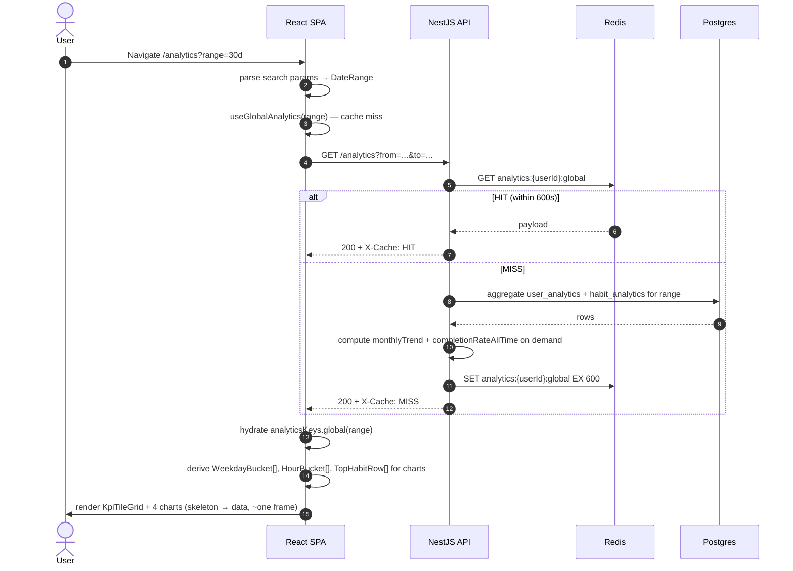
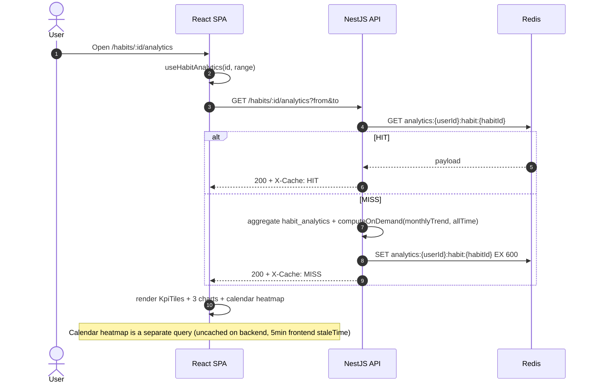
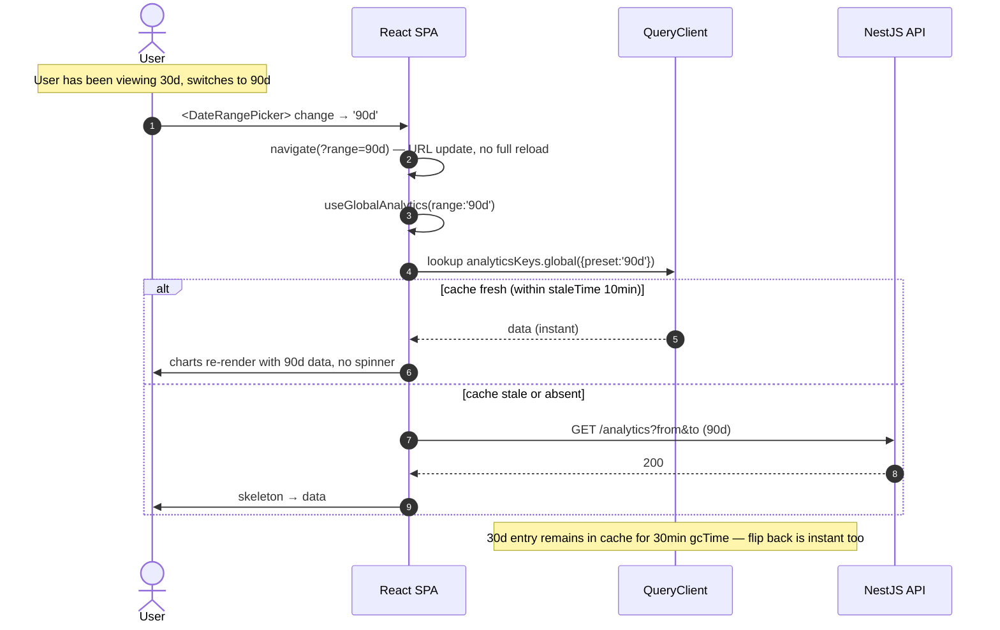
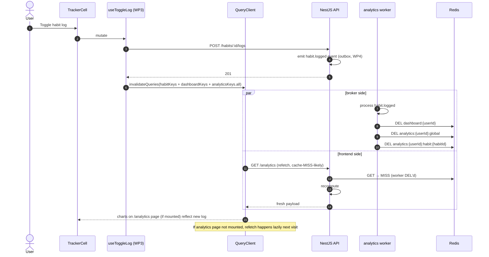

# WP5 — Analytics: Frontend Architectural Plan

**Status:** Draft v1
**Owner:** Frontend (Lead Architect: Claude)
**Backend status:** WP5 done — `analytics-worker.service.ts` consumes from `habitlab:events` (consumer group `habitlab-analytics`), populates `user_analytics` and `habit_analytics` tables, three endpoints live: `GET /habits/:id/analytics` (FR-041), `GET /habits/:id/calendar?from&to` (FR-042, max 365d, uncached), `GET /analytics` (FR-043). Cache keys: `analytics:{userId}:global` TTL 600s, `analytics:{userId}:habit:{habitId}` TTL 600s. WP3 already touched this surface lightly via `<HabitMiniAnalytics>` on the habit detail page.
**Scope:** Client-side architecture for the dedicated **Analytics** page at `/analytics`, the per-habit deep view at `/habits/:id` (analytics tab), and the chart primitives both pages share. The user's mental model is "show me the patterns in my behavior."

> Read this together with `CLAUDE.md` (WP5 implementation notes — cache keys, weekday convention, on-demand fields), `habits-plan.md` (the slice this builds on, particularly `<HabitMiniAnalytics>` and `<HabitCalendarHeatmap>`), and `docs/HabitLab_AI_Analysis_Report.docx` §5.1.8 / §5.1.9 (analytics tables), §6.1 / §6.4 (endpoints + cache).

---

## 1. Goals & Constraints

**Functional goals**

- Provide a dedicated **Analytics page** at `/analytics` showing global behavioral patterns: completion rate trend, weekday distribution, hour-of-day distribution, top-performing habits, longest streak history.
- Provide a **per-habit Analytics view** (tab on habit detail or full-screen at `/habits/:id/analytics`) with the same chart primitives focused on a single habit, plus a 365-day calendar heatmap (already drafted in WP3, integrated here).
- Render charts that are **responsive, keyboard-accessible, and printable**. The Analytics page is what users will screenshot and share — design for that.
- Support **date-range filtering** (last 30 / 90 / 365 days, custom range) consistently across all charts.
- Reuse the WP3 cache coordination (5-minute `staleTime` matched to backend TTL) — extended for the 10-minute analytics TTL.
- Wire the WP4 telemetry sink: emit `page.viewed` with `path: '/analytics'` and per-chart impression events.

**Hard constraints (from CLAUDE.md WP5 notes)**

- **completion_by_weekday convention:** Mon=0..Sun=6 (matches §5.1.8 `best_weekday`). Frontend formatting layer must respect this — never assume Sun=0 like browser `Date.getDay()`.
- **completion_by_hour source:** `EXTRACT(HOUR FROM logged_at AT TIME ZONE users.timezone)` — these are *user-local* hours. The chart axis label says "When you actually complete this habit" (a.k.a. behavioral truth), not "scheduled time."
- **Calendar endpoint is uncached** by design (per-call computation, max 365 days). The frontend's React Query `staleTime` is the only thing protecting backend load. WP3 set this at 5 minutes; keep it.
- **`monthly_trend` and `completion_rate_all_time`** are computed on demand per request (not stored). Treat them as part of the response, not separate fields requiring extra calls.
- **Cache keys are user-scoped + (optionally) habit-scoped.** Frontend cache keys mirror this: `['analytics', 'global']` and `['analytics', 'habit', habitId]`. No habit-id leakage into the global key.
- **NN-1 (TanStack Query):** all server state via React Query; no Redux, no Context-as-state-store.
- **NN-8:** all response shapes from generated OpenAPI types. `HabitAnalytics`, `UserAnalytics`, `CalendarDay` etc. come from `api/generated.ts`.

**Non-goals for WP5**

- Cross-user comparison ("you vs. average user"). Privacy + product complexity. Defer.
- Goal-setting (e.g. "increase completion rate to 80%"). Defer to a future polish WP.
- Export to CSV / PDF report. The "screenshot the page" UX covers 80% of the use case for v1.
- Real-time chart updates as logs land. The 5-minute `staleTime` is the right window for analytics; live updates would be visual noise.
- A/B testing on chart copy or layout. WP8 will integrate via `<VariantSlot>` later if needed.

---

## 2. Folder Structure

Analytics is a feature of its own. It owns chart primitives that other features (notably `dashboard` and `habits`) will consume. The chart primitives are **not** in `components/ui/` — they're domain-specific to analytics.

```
frontend/src/
├── features/
│   ├── analytics/
│   │   ├── api/
│   │   │   ├── use-global-analytics.ts        useQuery(['analytics','global', range])
│   │   │   ├── use-habit-analytics.ts         useQuery(['analytics','habit',id, range])
│   │   │   └── use-habit-calendar.ts          (re-exported from features/habits, kept as single source)
│   │   ├── components/
│   │   │   ├── charts/
│   │   │   │   ├── CompletionTrendLine.tsx     line: 30/90/365-day completion %
│   │   │   │   ├── WeekdayBarChart.tsx         bar: Mon..Sun completion counts
│   │   │   │   ├── HourBarChart.tsx            bar: 0..23 user-local hours
│   │   │   │   ├── StreakHistoryChart.tsx     line: streak length over time
│   │   │   │   ├── TopHabitsChart.tsx          horizontal bar: rate30d ranked
│   │   │   │   └── ChartFrame.tsx              wraps title + tooltip + a11y data table fallback
│   │   │   ├── kpi/
│   │   │   │   ├── KpiTile.tsx                 single metric (label, value, delta)
│   │   │   │   └── KpiTileGrid.tsx             responsive grid wrapper
│   │   │   ├── filters/
│   │   │   │   ├── DateRangePicker.tsx         30 / 90 / 365 / custom presets
│   │   │   │   └── HabitFilterChips.tsx        multi-select habit pills
│   │   │   ├── empty/
│   │   │   │   └── AnalyticsEmptyState.tsx     "Log a habit to see your patterns"
│   │   │   └── AnalyticsLayoutShell.tsx        page header + filter bar + grid
│   │   ├── pages/
│   │   │   ├── AnalyticsPage.tsx               /analytics
│   │   │   └── HabitAnalyticsPage.tsx          /habits/:id/analytics (or tab in detail)
│   │   ├── lib/
│   │   │   ├── format-axis.ts                  weekday labels, hour labels (12h vs 24h via locale)
│   │   │   ├── color-scale.ts                  heatmap intensity → tailwind class
│   │   │   ├── range-presets.ts                {30d, 90d, 365d, custom} → {from, to}
│   │   │   ├── chart-export.ts                 SVG → PNG via canvas (for screenshot UX, optional)
│   │   │   └── empty-detection.ts              decides "is there enough data to render?"
│   │   ├── store/
│   │   │   └── analytics-ui-store.ts           Zustand: selected range, comparison habits
│   │   ├── testing/
│   │   │   └── fixtures.ts                     makeUserAnalytics(), makeHabitAnalytics()
│   │   └── index.ts                            barrel — only the page exports + KpiTile primitive
│   │
│   ├── habits/                                 (WP3 — unchanged, but HabitDetailPage now embeds analytics tab)
│   ├── dashboard/                              (WP3 — KpiTile imported from features/analytics)
│   └── ...
│
├── lib/
│   └── recharts/                               narrow re-exports of recharts to keep API surface small
│       └── primitives.ts                       LineChart, ResponsiveContainer, etc.
│
└── router/
    └── routes.tsx                              + /analytics, + /habits/:id/analytics (tab route)
```

**Why a `charts/` subfolder rather than putting each chart at the feature root.** Six charts is enough that flat layout strains. The `charts/` boundary also makes it obvious which components own visualization (and therefore depend on Recharts) versus orchestration (which doesn't). When the Recharts API changes in a future major version, the blast radius is one folder.

**Why `KpiTile` lives here, not in `components/ui/`.** It carries an analytics-specific contract — it expects a metric with optional delta vs. previous period. It's not a generic stat card.

---

## 3. Component Hierarchy

### 3.1 Global Analytics page

```
<ProtectedRoute requireVerified>
  <AppShell>
    <AnalyticsPage>
      <PageHeader title="Analytics" />
      <AnalyticsLayoutShell>
        <FilterBar>
          <DateRangePicker value={range} />
          <HabitFilterChips selected={habitIds} />
        </FilterBar>
        <DataState query={globalAnalyticsQuery} empty={<AnalyticsEmptyState />}>
          <KpiTileGrid>
            <KpiTile label="Active streak" value={user.longestStreak} delta="+2 days" />
            <KpiTile label="Avg completion 30d" value="73%" delta="+5%" />
            <KpiTile label="Habits tracked" value={user.totalHabits} />
            <KpiTile label="Logs this period" value={user.totalLogs} />
          </KpiTileGrid>
          <ChartGrid>
            <ChartFrame title="Completion trend"><CompletionTrendLine /></ChartFrame>
            <ChartFrame title="Best days"><WeekdayBarChart /></ChartFrame>
            <ChartFrame title="When you complete"><HourBarChart /></ChartFrame>
            <ChartFrame title="Top habits"><TopHabitsChart /></ChartFrame>
          </ChartGrid>
        </DataState>
      </AnalyticsLayoutShell>
    </AnalyticsPage>
  </AppShell>
</ProtectedRoute>
```

### 3.2 Per-habit Analytics view

```
<HabitDetailPage>                                  (WP3)
  <Tabs defaultValue="overview">
    <TabsList>
      <Tab value="overview">Overview</Tab>
      <Tab value="analytics">Analytics</Tab>
    </TabsList>
    <TabsContent value="analytics">
      <HabitAnalyticsView habitId={id}>
        <DateRangePicker value={range} />
        <DataState query={habitAnalyticsQuery}>
          <KpiTileGrid>
            <KpiTile label="Current streak" value={habit.currentStreak} />
            <KpiTile label="Best streak" value={habit.longestStreak} />
            <KpiTile label="Rate (30d)" value="68%" />
            <KpiTile label="Best day" value="Wednesday" />
          </KpiTileGrid>
          <ChartFrame><CompletionTrendLine habitId={id} /></ChartFrame>
          <ChartFrame><WeekdayBarChart habitId={id} /></ChartFrame>
          <ChartFrame><HourBarChart habitId={id} /></ChartFrame>
          <HabitCalendarHeatmap habitId={id} year={2026} />     {/* from features/habits */}
        </DataState>
      </HabitAnalyticsView>
    </TabsContent>
  </Tabs>
</HabitDetailPage>
```

### 3.3 Chart-primitive composition rules

- **Every chart accepts data via props, never queries directly.** This keeps charts unit-testable without mocking React Query and lets a single query feed multiple charts on a page (one `/analytics` call → 4 charts).
- **`<ChartFrame>` owns title, loading skeleton, error, and the a11y data-table fallback.** A keyboard user pressing Tab into a chart sees a screen-reader-only `<table>` with the same data. This is non-negotiable per WCAG 2.1; covered by jest-axe in tests.
- **`<KpiTile>` accepts a `delta` prop (string + sign).** Up arrow / down arrow rendered inline. Color: green for "more habits done" sign, red otherwise. Direction is metric-specific — "missed days" delta is reversed.
- **Charts do not own their date range.** The page passes `range` down. Charts are pure data → SVG.
- **Recharts is wrapped, not exposed.** `lib/recharts/primitives.ts` re-exports only the components we use. If we ever swap to Chart.js or Visx, one file changes.

---

## 4. State Management Strategy

### 4.1 Query keys

```ts
export const analyticsKeys = {
  all: ['analytics'] as const,
  global: (range: DateRange) => [...analyticsKeys.all, 'global', range] as const,
  habit: (habitId: string, range: DateRange) =>
    [...analyticsKeys.all, 'habit', habitId, range] as const,
};
```

The `range` is part of the key. Switching from 30d to 90d does not invalidate the 30d cache — it lets us flip back without refetching. This trades cache space for click latency, which is the right trade for an exploratory analytics UX.

### 4.2 Query configuration

| Query | staleTime | gcTime | refetchOnWindowFocus | Notes |
|---|---|---|---|---|
| `analyticsKeys.global(range)` | **10 min** | 30 min | yes | matches backend `analytics:{userId}:global` TTL 600s |
| `analyticsKeys.habit(id, range)` | 10 min | 30 min | yes | matches backend `analytics:{userId}:habit:{habitId}` TTL 600s |
| `habitKeys.calendar(id, from, to)` | 5 min | 30 min | no | uncached on backend; frontend protects load |

**Why analytics gets a longer staleTime than dashboard.** The dashboard's 5-minute window matches `dashboard:{userId}` TTL 300s. Analytics' backend TTL is twice as long because the data is twice as expensive to compute and changes meaningfully on a longer cadence (a single habit log doesn't move a 30-day average noticeably). Frontend `staleTime` mirrors the server's design.

### 4.3 Cache invalidation

Analytics is downstream of habit logs. The same `_invalidation.ts` policy module from WP3 is extended:

| WP3 mutation | Analytics keys invalidated |
|---|---|
| `useToggleLog` | `analyticsKeys.global(*)`, `analyticsKeys.habit(habitId, *)` |
| `useCreateHabit` | `analyticsKeys.global(*)` (the new habit changes "habits tracked" KPI) |
| `useDeleteHabit` | `analyticsKeys.global(*)`, `analyticsKeys.habit(id, *)` |
| `useUpdateHabit` | none — analytics aggregates don't depend on habit metadata |

Note `(*)` — when a log lands, **all date ranges of cached analytics are stale**, not just one. React Query's `invalidateQueries({ queryKey: analyticsKeys.all })` does this in one call. That's correct and cheap; charts that aren't currently rendered are simply re-fetched lazily next time they mount.

### 4.4 Date range as URL state (not Zustand)

The selected range is part of the page state — it should survive a refresh and be shareable via URL. Therefore it lives in **search params**, not Zustand. `?range=30d` or `?from=2026-01-01&to=2026-04-30`.

```
/analytics?range=90d
/analytics?from=2026-01-01&to=2026-04-30
/habits/abc/analytics?range=30d
```

Zustand keeps only the *last range the user picked* as a per-device preference (so navigating to `/analytics` for the first time defaults to their preferred range). This persists via `persist` middleware, fine per CLAUDE.md NN-7 (no auth in localStorage; UI prefs OK).

### 4.5 What does NOT live in Zustand

- The analytics data. Server state. React Query.
- Chart hover state. Local component state.
- The selected date range (canonical version). URL. (See §4.4.)

### 4.6 What DOES live in Zustand (`analytics-ui-store.ts`)

- Default range preset (`'30d' | '90d' | '365d' | 'custom'`).
- Comparison habit IDs (when comparison view is enabled — out of scope for WP5 but the store carries the field).
- Hour chart format preference (`'12h' | '24h'`) if not derivable from locale.

---

## 5. Core TypeScript Types

### 5.1 Domain (re-exported from generated)

```ts
export type UserAnalytics = components['schemas']['UserAnalytics'];
export type HabitAnalytics = components['schemas']['HabitAnalytics'];
export type AnalyticsResponse = components['schemas']['AnalyticsResponse']; // GET /analytics envelope
export type CalendarDay = components['schemas']['HabitCalendarDay'];
```

Expected fields in `HabitAnalytics` per CLAUDE.md WP5 notes (confirm via OpenAPI):

```ts
interface HabitAnalyticsShape {
  habitId: string;
  currentStreak: number;
  longestStreak: number;
  completionRate30d: number;          // [0..1] — denominator always 30
  completionRateAllTime: number;       // computed on demand
  bestWeekday: 0 | 1 | 2 | 3 | 4 | 5 | 6;  // Mon=0..Sun=6
  bestHour: number;                    // 0..23, user-local
  completionByWeekday: readonly number[]; // length 7, Mon=0..Sun=6
  completionByHour: readonly number[];    // length 24
  monthlyTrend: readonly { month: string; rate: number }[]; // computed on demand
}
```

### 5.2 Hand-written contracts

```ts
// Date range — single source of truth for filter UI + query keys.
export type RangePreset = '30d' | '90d' | '365d';

export type DateRange =
  | { kind: 'preset'; preset: RangePreset }
  | { kind: 'custom'; from: string; to: string };  // ISO YYYY-MM-DD

// What KpiTile expects.
export interface KpiTileModel {
  readonly label: string;
  readonly value: string | number;
  readonly delta?: {
    readonly value: number;        // signed
    readonly direction: 'up' | 'down' | 'flat';
    readonly polarity: 'positive' | 'negative';  // green for positive, red for negative
  };
  readonly hint?: string;          // tooltip text
}

// Per-chart data contracts — narrow inputs, no full HabitAnalytics dump.
export interface CompletionTrendPoint {
  readonly date: string;           // YYYY-MM-DD
  readonly rate: number;           // 0..1
}

export interface WeekdayBucket {
  readonly weekday: 0 | 1 | 2 | 3 | 4 | 5 | 6;  // Mon=0..Sun=6
  readonly count: number;
}

export interface HourBucket {
  readonly hour: number;           // 0..23, user-local
  readonly count: number;
}

export interface TopHabitRow {
  readonly habitId: string;
  readonly name: string;
  readonly color: HabitColor;
  readonly rate30d: number;
}

// Chart frame surface — every chart consumes this.
export interface ChartFrameProps {
  readonly title: string;
  readonly description?: string;
  readonly query: UseQueryResult<unknown, unknown>;  // for skeleton/error
  readonly accessibleData?: ReadonlyArray<readonly [string, string]>;  // for a11y table
  readonly children: React.ReactNode;
}

// Date range component contract.
export interface DateRangePickerProps {
  readonly value: DateRange;
  readonly onChange: (next: DateRange) => void;
  readonly minDate?: string;       // user account creation
  readonly maxDate?: string;       // today in user.timezone
}
```

### 5.3 URL state schema

```ts
// Lightweight zod schema — used by the page to parse search params on mount.
export const AnalyticsSearchParamsSchema = z.union([
  z.object({ range: z.enum(['30d', '90d', '365d']) }),
  z.object({
    from: z.string().regex(/^\d{4}-\d{2}-\d{2}$/),
    to: z.string().regex(/^\d{4}-\d{2}-\d{2}$/),
  }),
]);
```

---

## 6. Sequence Diagrams

### 6.1 Global analytics page load (with cache)



### 6.2 Per-habit analytics fetch (separate cache key)



### 6.3 Date range change (instant if cached)



This is the "exploratory clicking" UX point. A user toggling 30 / 90 / 365 multiple times in a session pays for each range exactly once.

### 6.4 Cache invalidation cascade after a habit log



The race is the same as WP3's dashboard reconciliation (TP-3 in `wp4-plan.md`). Bounded by broker fanout latency. The 1-second ceiling applies.

---

## 7. Edge Cases & Architectural Bottlenecks

### 7.1 Correctness / UX edge cases

1. **Empty analytics for a brand-new user.** All counts are zero, all charts are flat, the page looks broken. **Mitigation:** `lib/empty-detection.ts` checks `user.totalLogs < 5` (or similar threshold) and renders `<AnalyticsEmptyState />` with a CTA to track a habit. Per-chart, also handle "single data point" — a line chart with one point is not a line; render a dot with a tooltip "log more days to see a trend."

2. **Weekday convention drift.** Backend says Mon=0..Sun=6 (CLAUDE.md WP5). Browser `Date.getDay()` says Sun=0..Sat=6. **Mitigation:** every weekday-aware function lives in `lib/format-axis.ts`. Convention is *backend's*. Tests assert that input array `[42, 0, 0, 0, 0, 0, 0]` renders with "42 on Monday." If a future refactor brings in a date library default, tests fail.

3. **`bestHour` is in user timezone.** A user moves Istanbul → Tokyo. Future logs are in Tokyo time, but historical `completionByHour` was computed against Istanbul. **Mitigation:** the backend recomputes against current `user.timezone` per query (not a stored aggregate at fixed tz — confirm in §8). Frontend just trusts the response and labels axis with `Intl.DateTimeFormat` using `user.timezone`.

4. **Custom date range exceeds backend window.** The user picks 730 days (2 years) but `GET /analytics` only accepts 365. **Mitigation:** `<DateRangePicker>` enforces max range client-side; server-side validation is the safety net.

5. **Date range with `from > to`.** User picks dates backward in the calendar. **Mitigation:** picker swaps them silently; alternatively shows inline warning. Decision: silent swap (less friction).

6. **Locale-specific weekday names.** Turkish vs. English vs. Japanese. **Mitigation:** `lib/format-axis.ts` uses `Intl.DateTimeFormat(locale, { weekday: 'short' })` with explicit anchor dates (e.g. 2026-01-05 was a Monday). No hard-coded `'Mon'` strings.

7. **Hour axis: 12h vs 24h.** Locale-specific. **Mitigation:** `Intl.DateTimeFormat(locale, { hour: 'numeric' })` with each hour anchor; user override via Zustand pref.

8. **Charts re-render on every hover.** Recharts can be naive about this. **Mitigation:** chart components are `React.memo` with prop equality on `data` reference. Data is computed via `useMemo` from query result; same input → same reference → no re-render.

9. **Print / screenshot cuts off charts.** `<ChartGrid>` uses `print:break-inside-avoid` Tailwind class. Charts use `ResponsiveContainer` with explicit `aspect` ratio. Tested via `?print=true` query param toggling print preview CSS.

10. **Rapid range toggling causes request storm.** A user spams 30/90/365/30/90 in 2 seconds. Without protection, 5 in-flight requests. **Mitigation:** React Query's deduplication handles same-key requests in flight, but the keys differ. Add a 200ms debounce on the range picker's `onChange` for custom ranges. Presets, since the cache may already have them, stay instant.

11. **Cache invalidation cost with `analyticsKeys.all`.** Invalidating the full subtree drops all cached ranges (30/90/365 etc.). When the user comes back, the first range they look at refetches. **Mitigation:** acceptable. The alternative — invalidating only the currently-displayed range — leaves stale data in other range caches, which the user could see by toggling. Correctness over micro-perf.

12. **Heatmap cells too small on mobile.** A 365-day calendar grid at 320px width gives ~7px cells, untappable. **Mitigation:** on viewports < 640px, the heatmap renders the *current quarter* by default with a horizontal swipe to other quarters. Desktop renders the full year. (The component lives in `features/habits/`; this constraint is enforced there — flagged here so analytics integration honors it.)

13. **`completion_by_hour` axis with sparse data.** A user with 8 morning logs has 0 in 23 of 24 buckets. Bar chart looks lopsided. **Mitigation:** option to clip the y-axis to "max bucket value × 1.2" so the rendered chart focuses on signal, not noise. Toggle in tile menu.

14. **Telemetry storm from page mount.** Mounting analytics fires 4 chart impressions + 1 page-view = 5 events. Rapidly switching pages amplifies. **Mitigation:** the WP4 telemetry sink (TP-2) batches at 5s/50 events; this is well within the budget. Worth verifying with a spam test in staging.

15. **`/habits/:id/analytics` with deleted habit.** User has the URL bookmarked; the habit was deleted yesterday. **Mitigation:** `useHabitAnalytics` 404 handler navigates to `/analytics` and surfaces a toast.

### 7.2 Architectural bottlenecks (decoupling concerns)

1. **Charts are fed by features they don't own.** `<TopHabitsChart>` reads from `analyticsKeys.global` but renders habit names + colors that come from `habitKeys.list`. **Mitigation:** the analytics response embeds habit name/color when relevant (confirm in §8). If the backend returns only IDs, the page composes both queries and passes a mapped array to the chart — never the chart joining caches itself.

2. **Chart library coupling.** Recharts is the de facto choice (project instructions mention it), but its API is large and easy to leak. **Mitigation:** `lib/recharts/primitives.ts` is the single import site. Charts import only what's re-exported. ESLint `no-restricted-imports` blocks `'recharts'` outside that file. Library swap in the future means rewriting one wrapper.

3. **`HabitMiniAnalytics` (WP3) vs. `HabitAnalyticsPage` (WP5) duplication.** Both surface streak + best_weekday + best_hour. **Mitigation:** the mini view selects fields from the same `HabitAnalytics` payload; same hook (`use-habit-analytics`). The mini view does not render charts — only KpiTiles. One source of truth for the data, two presentations.

4. **DateRangePicker reused but with different constraints per page.** On `/analytics` the max range is 365 days; on the calendar it's also 365; on a future "year-over-year" view it's 730. **Mitigation:** the picker accepts `maxRangeDays` as a prop. Default 365. Each consumer sets its own.

5. **A11y data tables alongside charts.** Easy to forget. **Mitigation:** `<ChartFrame>` mandates `accessibleData` prop in TypeScript (non-optional for non-decorative charts). Cannot ship a chart without an a11y fallback because the type system says so.

6. **Per-chart impression telemetry coupling.** Every chart emits a `chart.impression` event on first render. If 4 charts emit in lockstep, payloads are near-duplicates. **Mitigation:** emit one `page.viewed { path: '/analytics', charts: ['weekday','hour','...'] }` instead of N impressions. Cleaner schema, single event.

7. **Range schema vs. URL parsing.** The URL is the source of truth, but the picker's internal state can drift if not careful. **Mitigation:** `useDateRangeFromUrl()` hook owns parse + write. Picker calls `setRange(next)` which calls `navigate(?range=...)`; React Router re-runs the parse. Single direction; no `useState` mirror.

8. **Stale `analyticsUiStore.lastRange` after schema change.** Today: `'30d' | '90d' | '365d' | 'custom'`. Future: add `'7d'`. Persisted Zustand value `'7d'` from a future version becomes invalid on downgrade. **Mitigation:** Zustand `persist` versioning — bump version on schema change, migrate on hydrate, fall back to default if migration fails.

---

## 8. Open Questions for Backend / Spec

Confirm against §5.1.8 / §5.1.9 / §6.1 of the analysis report. None block scaffolding.

1. **`GET /analytics` envelope shape.** Does it nest `{user: UserAnalytics, habits: HabitAnalytics[]}`, or flatten? The chart-data derivation depends on this.
2. **`bestHour` recomputation on timezone change.** When `user.timezone` changes, are existing logs re-bucketed against the new tz, or does `bestHour` continue to reflect the old tz until new logs accumulate? Affects §7.1 #3.
3. **`completion_by_weekday` denominator.** Is it raw counts (number of completions on each weekday) or rates (completions / opportunities on that weekday)? Chart label changes either way.
4. **Date range parameters.** `?from=YYYY-MM-DD&to=YYYY-MM-DD` (inclusive) vs `?days=30` shorthand? Recommend the former for parity with calendar endpoint.
5. **Top-habits embedding.** Does `GET /analytics` embed habit name/color in `topHabits`, or only `habitId`? Affects §7.2 #1.
6. **`monthlyTrend` granularity.** Fixed at month? Or does the endpoint accept `granularity=week|month|quarter`? The trend-line chart can render any granularity but axis density differs.
7. **Calendar endpoint cache exemption.** CLAUDE.md WP5 says "no cache" — confirmed deliberate (per-call computation), not a TODO. Frontend's 5-minute `staleTime` is the protection.
8. **Telemetry endpoint for chart impressions.** Per WP4 §7.2 #6, prefer one `page.viewed` over N impressions. Confirm backend schema accepts `charts: string[]` as a payload field, or whether per-chart is required.
9. **`completionRate30d` interpretation.** Backend uses denominator 30 always (CLAUDE.md WP3). For habits older than 30 days this is rate-like; for habits 5 days old it's misleading (5/30 = 17% even with perfect adherence). Display strategy: render the number and add a tooltip "based on the last 30 days regardless of habit age" — confirm copy.

---

## 9. Acceptance Criteria for the WP5 Frontend Slice

The slice is "done" when:

- `/analytics` and `/habits/:id/analytics` (or detail-page tab) render and pass routing tests.
- All four global charts render correctly with Mon=0..Sun=6 weekday convention, verified by snapshot test against fixture data.
- Switching date range presets re-fetches the right cache key and updates the URL search params; back button restores the previous range.
- Each chart provides an accessible `<table>` fallback that jest-axe can find and that lists the same data.
- The empty-state renders for a fixture user with `totalLogs < 5`.
- Recharts is not imported anywhere outside `lib/recharts/primitives.ts` (lint rule).
- `pnpm test` covers: weekday formatting (Mon=0 → "Mon"), hour formatting (locale-aware), range parser (URL ↔ DateRange), chart memoization (no re-render on hover), invalidation cascade after toggle log.
- A second mount of `/analytics` within 10 minutes produces `X-Cache: HIT` (smoke check that backend cache is wired).
- Toggling a habit log on the dashboard, then navigating to `/analytics`, shows updated completion numbers within the reconciliation window (TP-3 from WP4).
- Manual smoke: log in → navigate `/analytics` → see KpiTiles populate from cache MISS → toggle range to 90d → see instant render or fresh fetch → open per-habit analytics → see calendar heatmap render in <50ms on a Pixel 5 → take a screenshot, charts not clipped → tab through with keyboard, every chart announces its data table.

---

## 10. Sequencing & Dependencies

WP5 frontend depends on:

- **WP3** (the WP3 `<HabitMiniAnalytics>` already exists — extend, don't duplicate).
- **WP4 TP-3** (reconciliation window test — analytics is the second consumer of this contract after dashboard, and benefits from having the SLA already enforced).
- **WP4 TP-2** (telemetry sink — required for `page.viewed` and chart impression events; implementable concurrently).

Recommended order within the slice:

1. **Chart primitives + ChartFrame + a11y fallback first.** Pure components, fixture-driven, testable in Storybook (or equivalent) without backend.
2. **Hooks + types + invalidation extension second.** Plumbing only; no UI.
3. **AnalyticsPage assembly third.** Combines the above.
4. **HabitAnalyticsPage / tab integration last.** Reuses everything; small additional surface.

Each step is independently reviewable and shippable.

---

*End of plan. Implementation kickoff awaits sign-off and resolution of §8.*
