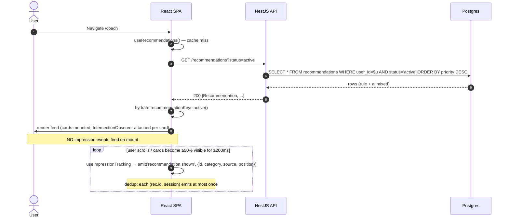
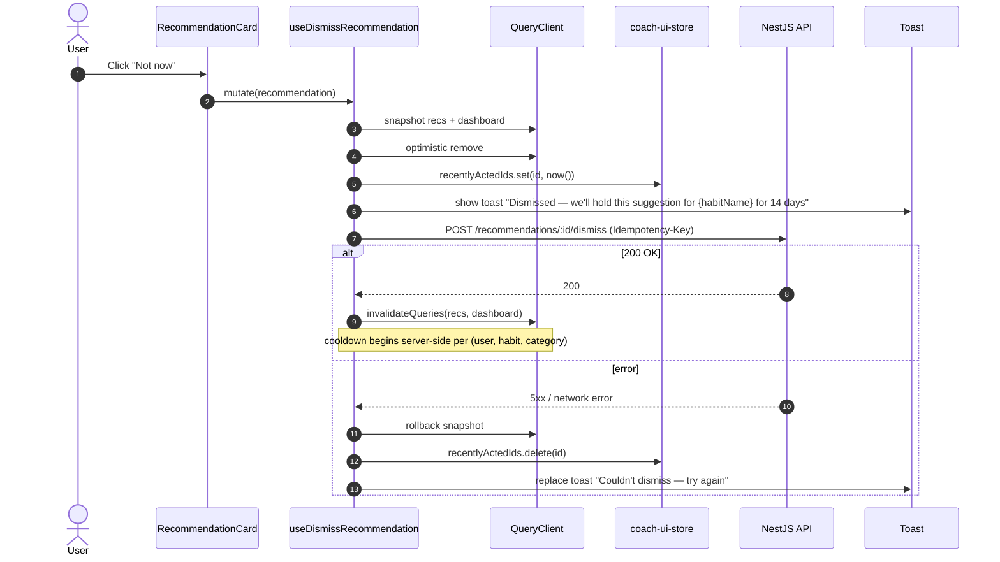
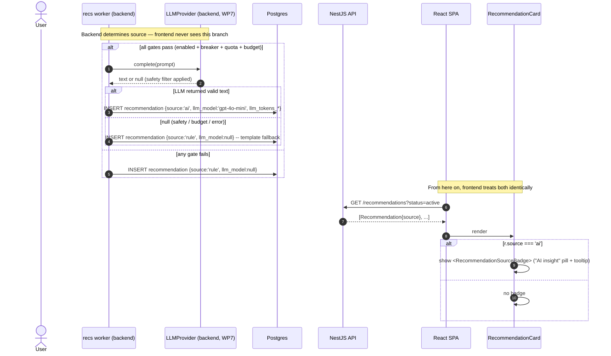

# WP6 + WP7 — Smart Coach (Rule-Based + LLM-Augmented Recommendations): Frontend Architectural Plan

**Status:** Draft v2
**Owner:** Frontend (Lead Architect: Claude)
**Backend status:**
**WP6** done — `RecommendationWorkerService` consumes `habitlab:events` (consumer group `habitlab-recommendations`), six rules wired (reschedule p70, reduce_difficulty p80, streak_celebration p60, encouragement_after_skip p75, consistency_reinforcement p65, retroactive_logging_reminder p85), 14-day cooldown per `(user, habit, category)` (FR-053), `accept` for `reschedule` atomically patches `habits.preferred_time`.
**WP7** done — `LLMProvider.complete(prompt)` with `OpenAILlmProvider` (gpt-4o-mini, temp 0.3, 150 max tokens, 8s timeout, 1 retry) gated by ai_recommendations_enabled → circuit breaker → per-user daily quota (≤3) → system budget ($3/day default). Safety filter (>280 chars / medical keywords / refusal / URL / `?`-ending → null → template fallback). LLM tokens + cost recorded in `recommendations.llm_*` columns.

---

### Revisions in v2

Applied from architectural review (see review thread). Each item below is cross-referenced to the section it touches.

1. **Dismiss undo dropped for v1** (§3.4, §4.4, §6.3, §9). The undo path was a fictional contract — no backend revert endpoint exists, and the "local cache only" fallback creates a UX lie when the next refetch reconciles. Cleaner to ship dismiss as terminal in v1 and add undo when the backend supports it. Toast remains, without the Undo affordance. The PATCH endpoint is moved from "recommended addition" to "deferred to v2 — required to re-enable undo" in §8.
2. **Invalidation matrix tightened** (§4.3). `reduce_difficulty` no longer invalidates `habitKeys.*` — per CLAUDE.md WP6, only `reschedule` patches a habit row today. Speculative "if backend extends" rows are removed from the matrix and pushed entirely to §8 as open questions.
3. **Cooldown copy is now habit-named** (§7.1 #4 / dismiss flow). "You won't see this again for two weeks" was a global lie — cooldown is per `(user, habit, category)`. New copy: "We'll hold this suggestion for {habitName} for the next 14 days." Helper in `lib/cooldown-message.ts` takes the habit name as input.
4. **Worker-vs-accept race documented** (§7.1 #11). Cooldown protects against the same `(habit, category)` reappearing the moment the worker fires again, but the test harness should gate on it explicitly.
5. **`HABIT_MUTATED` BroadcastChannel message is coach-owned, not a WP2 retrofit** (§7.1 #1). WP2 only standardized auth messages. The coach feature defines and exports the `HABIT_MUTATED` envelope type from its `index.ts`; the habits feature subscribes. Cross-feature coordination via a typed message, not a private channel.
6. **`<VariantSlot>` scope clarified — UI chrome only, never recommendation title/body** (§1 hard constraints, §3.2, §7.2 #9). Title and body are server-authoritative; backend writes variant-resolved text into the recommendation row. The frontend's `<VariantSlot>` is reserved for the page header, action button labels, and the source-badge tooltip — chrome that the backend doesn't own.
7. **CSS layout protection for suspicious payloads** (§3.4). "Render as-is, log telemetry" was the text policy. Layout protection (`max-h`, `overflow-hidden`, `line-clamp-4` on full, `line-clamp-2` on compact) prevents a regression payload from breaking the feed layout while the telemetry catches the backend bug.
8. **`recommendation.shown` uses Intersection Observer, not mount-time** (§3 — new primitive, §5.4, §7.1 #9). Mount-time emission inflates impressions for off-screen cards in long feeds. `useImpressionTracking` fires once per `(rec.id, session)` when the card crosses 50% visibility for ≥200ms.
9. **§8 expanded** with three new open questions: `AcceptRecommendationResponse` shape (presence of `habit` field for side-effect categories), backend `hasHabits: boolean` on `/recommendations` envelope as a clean alternative to coach importing habits-feature for the empty state, and confirmation that backend writes variant-resolved title/body for rec_copy_v1 experiments.
10. **§7.2 #1 (decoupling) softened** — coach importing `useHabits` from `features/habits/index.ts` is acceptable per public-barrel policy, but the cleaner option (`hasHabits` on `/recommendations`) is recorded in §8 as the preferred long-term shape.

---

**Scope:** A dedicated **Smart Coach** page (`/coach`) showing the full feed of active recommendations, plus the per-recommendation accept/dismiss interactions that work consistently from the dashboard's top-3 surface and from the coach page. WP6 and WP7 are scoped together because they share one UI — WP7 adds a single `source` field to the recommendation envelope; the frontend's job is to render that distinction tastefully without making it feel like an A/B label.

> Read this together with `CLAUDE.md` (WP6 + WP7 implementation notes — rule priorities, cooldown semantics, LLM gate order, safety filter), `habits-plan.md` (dashboard + accept side-effect on `habits.preferred_time`), `wp4-plan.md` (idempotency keys + telemetry sink), `wp5-plan.md` (the analytics that feed rule conditions), and `docs/HabitLab_AI_Analysis_Report.docx` §5.1.11 (recommendations table), §6.3 (LLM integration + safety), §7.2 (use cases).

---

## 1. Goals & Constraints

**Functional goals**

- Provide a **Smart Coach** page at `/coach` showing the user's active recommendations as a feed: title, body, category badge, source (rule vs AI), accept / dismiss / snooze actions.
- Render the dashboard's top-3 recommendations (already in WP3's `DashboardPage` via the `/dashboard` payload) using the **same `<RecommendationCard>` component** as the coach page. One component, two contexts.
- Handle `accept` semantics per category — most accepts just mark the recommendation `accepted`, but `reschedule` also patches `habits.preferred_time` (CLAUDE.md WP6). The frontend must reflect both effects in one optimistic update.
- Make AI-generated recommendations transparent without theatrical "🤖 AI" stamps. A small "AI insight" pill with a tooltip linking to a brief explanation. Trust is earned through restraint.
- Honor the **14-day cooldown** in the UI: after dismissal, surface a subtle, habit-named affordance so users understand why their feed feels stable. Copy template: "We'll hold this suggestion for {habitName} for the next 14 days." Cooldown is per `(user, habit, category)` — never a global lie like "you won't see this for two weeks" which would imply the entire coach goes quiet.
- Wire WP8 variant-aware copy: when the recommendation envelope carries `experiment_variant`, render the variant copy without the coach feature importing `features/experiments`.
- Emit WP4 telemetry: `recommendation.shown` per **visible** card (Intersection Observer, ≥50% visibility for ≥200ms, deduped per session — §3.5), `recommendation.accepted_client` / `recommendation.dismissed_client` mirrored as client events (backend already emits server-side; the `_client` suffix distinguishes render-time from server-authoritative).

**Hard constraints (from CLAUDE.md)**

- **WP6 cooldown is per `(user, habit, category)`.** The frontend must not assume "dismissed = gone forever." A new recommendation in the same category for the same habit will reappear after 14 days. Copy for the dismiss confirmation should reflect this.
- **`accept` side-effects are category-specific.** Today only `reschedule` mutates an external resource. The frontend's accept hook must read the category, decide which caches to invalidate, and not hard-code "always invalidate habits." Encoded in §4.3.
- **WP7 LLM is invisible to the frontend logic — only to the user.** The `source: 'rule' | 'ai'` field affects rendering only. The accept/dismiss code path is identical. The frontend does not call OpenAI, does not see prompts, does not see token counts. Cost transparency is a backend-only concern.
- **Safety filter is server-side.** The frontend never sanitizes recommendation text. If a payload arrives that violates expected length or content, the frontend renders it as-is and logs a `client.recommendation.suspicious` telemetry event (text exceeded 280 chars, etc.) so we catch backend regressions. No client-side rewriting.
- **`<VariantSlot>` scope is UI chrome only.** The recommendation `title` and `body` are server-authoritative — the backend writes variant-resolved text into the row at creation time when `rec_copy_v1` is active. `<VariantSlot>` is reserved for things the backend doesn't own: the page header copy ("Smart Coach" vs "Your Insights"), action button labels when an experiment varies them, the source-badge tooltip text. The frontend never wraps `{r.title}` or `{r.body}` in a `<VariantSlot>` — that would conflate "data the backend resolved" with "chrome the frontend resolves." Confirmation in §8 #7.
- **NN-8:** all types come from generated OpenAPI. `Recommendation`, `RecommendationCategory`, `RecommendationStatus`, `AcceptRecommendationResponse` etc.

**Non-goals for this slice**

- "Regenerate this insight" / "give me a different recommendation" buttons. These would burn LLM budget on user whim. Defer.
- Showing token counts, model name, or cost to the user. Backend internals.
- Per-habit recommendations page or per-habit recommendations endpoint. The Coach feed is global; habit detail shows up to one habit-relevant rec inline (if present).
- User-controlled rule priorities or "I never want streak_celebration" preferences. Defer to a future settings WP.
- Streaming AI responses. WP7 is request/response; no SSE today.

---

## 2. Folder Structure

WP3 already created `features/recommendations/` with `RecommendationCard.tsx` + accept/dismiss mutation stubs. This slice fills out that feature.

```
frontend/src/
├── features/
│   ├── recommendations/
│   │   ├── api/
│   │   │   ├── use-recommendations.ts        useQuery(['recommendations','active'])  (NEW)
│   │   │   ├── use-accept-recommendation.ts  (WP3 stub → filled out: category-aware invalidation)
│   │   │   ├── use-dismiss-recommendation.ts (WP3 stub → filled out)
│   │   │   ├── use-snooze-recommendation.ts  (NEW — optional, per §1)
│   │   │   └── _invalidation.ts              policy: which caches to DEL on accept by category
│   │   ├── components/
│   │   │   ├── RecommendationCard.tsx        the only card component — variants for dashboard/coach
│   │   │   ├── RecommendationFeed.tsx        list/grid wrapper, sorted by priority
│   │   │   ├── RecommendationCategoryBadge.tsx   icon + color per category
│   │   │   ├── RecommendationSourceBadge.tsx     "AI insight" pill with tooltip (WP7)
│   │   │   ├── RecommendationAcceptDialog.tsx    confirm + show predicted effect (e.g. "Move reminder to 18:00?")
│   │   │   ├── RecommendationDismissedToast.tsx  "Dismissed — we'll hold this for {habitName} for 14 days" (no undo in v1)
│   │   │   ├── CoachEmptyState.tsx           "No insights yet — keep tracking" + CTA
│   │   │   └── CoachLoadingSkeleton.tsx
│   │   ├── pages/
│   │   │   └── CoachPage.tsx                 /coach
│   │   ├── lib/
│   │   │   ├── category-meta.ts              { icon, color, label } per RecommendationCategory
│   │   │   ├── action-preview.ts             AcceptPayload → human-readable "preview" (§4.4)
│   │   │   ├── source-explanation.ts         tooltip text per RecommendationSource (en/tr)
│   │   │   └── cooldown-message.ts           "14 days" / "until {date}" copy helper
│   │   ├── store/
│   │   │   └── coach-ui-store.ts             Zustand: recently-acted ids (anti-refetch-revive window)
│   │   ├── testing/
│   │   │   └── fixtures.ts                   makeRecommendation({category, source})
│   │   └── index.ts                          barrel — public: CoachPage, RecommendationCard, hooks
│   │
│   ├── habits/                               (WP3 — accept on `reschedule` invalidates habitKeys.detail)
│   ├── dashboard/                            (WP3 — DashboardRecommendations uses RecommendationCard)
│   └── experiments/                          (WP8 — VariantSlot consumed by coach *chrome* only: page header, accept button label, source-badge tooltip)
│
└── router/
    └── routes.tsx                            + /coach (ProtectedRoute requireVerified)
```

**Why one `<RecommendationCard>` with variants, not three components.** The dashboard's compact tile, the coach feed's full card, and a potential future habit-detail inline card all share the same data and the same accept/dismiss logic. Drift between three components would mean three places to update when the cooldown copy changes. Variant-via-prop is the right trade.

---

## 3. Component Hierarchy

### 3.1 Coach page

```
<ProtectedRoute requireVerified>
  <AppShell>
    <CoachPage>
      <PageHeader title="Smart Coach" description="Personalized insights from your habits" />
      <DataState query={recommendationsQuery} empty={<CoachEmptyState />}>
        <CoachStats>
          <CoachStat label="Active insights" value={recommendations.length} />
          <CoachStat label="Accepted this month" value={user.acceptedCount} />
        </CoachStats>
        <RecommendationFeed>
          {recommendations.map(r => (
            <RecommendationCard variant="full" recommendation={r} />
          ))}
        </RecommendationFeed>
      </DataState>
      <RecommendationAcceptDialog open={...} recommendation={pendingAccept} />
    </CoachPage>
  </AppShell>
</ProtectedRoute>
```

### 3.2 Inside `<RecommendationCard variant="full">`

```
<Card ref={impressionRef}>                                       {/* useImpressionTracking — §3.5 */}
  <CardHeader>
    <RecommendationCategoryBadge category={r.category} />        // icon + color
    {r.source === 'ai' && <RecommendationSourceBadge />}         // small "AI insight" pill (WP7)
  </CardHeader>
  <CardBody>
    <h3>{r.title}</h3>                                            {/* server-authoritative, variant-resolved by backend */}
    <p>{r.body}</p>                                               {/* server-authoritative */}
  </CardBody>
  <CardActions>
    <Button onClick={() => onAccept(r)}>
      <VariantSlot id="coach.action.accept" fallback={acceptLabel(r.category)} />
    </Button>
    <Button variant="ghost" onClick={() => onDismiss(r)}>Not now</Button>
  </CardActions>
</Card>
```

`{r.title}` and `{r.body}` are rendered verbatim — no `<VariantSlot>` wrapper. The backend has already written the resolved variant text into those fields. `<VariantSlot>` appears only on the chrome (the accept button label, here), where frontend owns the copy.

### 3.3 Inside `<RecommendationCard variant="compact">` (dashboard)

Same data, denser layout: category icon + title only (body truncated to one line with `…`), single CTA collapses to "View" → opens the full card in a sheet.

### 3.4 Composition rules

- The card never queries — the parent passes `recommendation: Recommendation`. The card calls `useAcceptRecommendation` and `useDismissRecommendation` for actions only.
- `<RecommendationAcceptDialog>` is shared. It shows category-specific preview text: for `reschedule`, "Move your reminder to 18:00?"; for `reduce_difficulty`, "Lower difficulty from 4 to 3?" Generated by `lib/action-preview.ts`.
- `<RecommendationSourceBadge>` is the **only** place that differentiates AI from rule. It's a 12px pill, not a header banner. The body copy itself is identical in treatment regardless of source.
- **Dismiss is terminal in v1.** The mutation fires immediately, a toast confirms "Dismissed — we'll hold this suggestion for {habitName} for the next 14 days," with no Undo affordance. Undo is deferred to a v2 ticket pending the backend PATCH endpoint (§8 #2).
- **Layout protection against suspicious payloads.** Per §1 hard constraints, the frontend renders text as-is even on length / shape regressions, but the card's body container is constrained to prevent a runaway payload from breaking the feed:
  - `variant="full"`: `max-h-[12rem]` + `overflow-hidden` + `line-clamp-4` on the body, `line-clamp-2` on the title.
  - `variant="compact"`: `max-h-[5rem]` + `overflow-hidden` + `line-clamp-2` on the body, `line-clamp-1` on the title.
  - A truncated card emits `recommendation.suspicious` with `reason: 'too_long'` so the regression is observable in backend telemetry.

### 3.5 `useImpressionTracking(ref, options)` — the only correct way to fire `recommendation.shown`

Mount-time emission inflates impressions in long feeds — a card off-screen still emits. The correct contract is **viewport-visible-for-long-enough**.

```ts
interface ImpressionOptions {
  readonly recommendationId: string;
  readonly category: RecommendationCategory;
  readonly source: RecommendationSource;
  readonly position: number;
  readonly thresholdRatio?: number;   // default 0.5 — 50% of the card visible
  readonly minDurationMs?: number;    // default 200 — sustained for at least 200ms
}

function useImpressionTracking<E extends Element>(
  ref: React.RefObject<E>,
  options: ImpressionOptions,
): void;
```

Implementation contract:

- Wraps a single `IntersectionObserver` per page (shared via context) — not one observer per card.
- Fires `recommendation.shown` exactly once per `(recommendationId, session)` tuple. A page-scoped `Set<string>` in the impression context dedupes; resets only on full page unload.
- A card that becomes visible, then scrolls off before `minDurationMs` elapses, does **not** fire. Tracked via per-card timer cleared on `intersectionRatio < threshold`.
- Honors `prefers-reduced-motion` and document visibility — when the tab is hidden (`document.visibilityState === 'hidden'`), no events fire. Re-becoming visible re-arms the timer.
- The hook is a no-op in `vitest` environment unless explicitly opted in via fixture — keeps unit tests deterministic.

`<RecommendationCard>` consumes it:

```tsx
const ref = useRef<HTMLDivElement>(null);
useImpressionTracking(ref, {
  recommendationId: r.id,
  category: r.category,
  source: r.source,
  position: index,
});
return <Card ref={ref}>...</Card>;
```

This replaces the §7.1 "mount-time emission" approach entirely. WP4 telemetry contract for `recommendation.shown` is updated to specify the visibility semantics (§5.4 note added).

---

## 4. State Management Strategy

### 4.1 Query keys

```ts
export const recommendationKeys = {
  all: ['recommendations'] as const,
  active: () => [...recommendationKeys.all, 'active'] as const,
  // accepted/dismissed history not surfaced in WP6+7 UI; reserved
};
```

The dashboard's top-3 do **not** get a separate query — they live inside the `dashboardKeys.summary()` payload. This is critical: it means a successful accept invalidates `dashboardKeys.summary()` (the dashboard refetches with one fewer rec) **and** `recommendationKeys.active()` (the coach feed refetches if it's mounted). Two cache families, one truth.

### 4.2 Query configuration

| Query | staleTime | gcTime | refetchOnWindowFocus | Notes |
|---|---|---|---|---|
| `recommendationKeys.active()` | 2 min | 10 min | yes | recs change every few minutes as workers process |
| `dashboardKeys.summary()` | 5 min | (WP3) | yes | embeds top-3 recs — invalidated by accept/dismiss |

**Why 2 min, not 5 min like dashboard.** The coach page is where users dwell on recommendations; users expect a freshly-rendered list when they return after a few minutes (the recommendation worker processes events on broker fanout). 2 min is the right window — short enough to feel current, long enough to avoid spam refetches.

### 4.3 Accept/dismiss invalidation matrix (the heart of this slice)

`_invalidation.ts` is the single source of truth.

| Action | Category | Always invalidate | Additionally invalidate |
|---|---|---|---|
| Accept | `reschedule` | `recommendationKeys.active()`, `dashboardKeys.summary()` | `habitKeys.detail(habitId)`, `habitKeys.lists()` (preferred_time changed) |
| Accept | `reduce_difficulty` | same | **none** — per CLAUDE.md WP6, accept for this category is acknowledgment-only today. The backend does **not** patch `habits.difficulty`. If that changes (§8 #4), this row gains habit-cache invalidation. Until then, treating it the same way is correctness-preserving and avoids a refetch storm. |
| Accept | `streak_celebration` \| `encouragement_after_skip` \| `consistency_reinforcement` \| `retroactive_logging_reminder` | same | none — these accepts are pure acknowledgments |
| Dismiss | any | `recommendationKeys.active()`, `dashboardKeys.summary()` | none |
| Snooze (optional) | any | `recommendationKeys.active()`, `dashboardKeys.summary()` | none |

Each mutation hook reads `recommendation.category` and consults `_invalidation.ts` for the right keys. Hooks never call `qc.invalidateQueries(...)` directly. The matrix reflects current backend behavior only; speculative "if the backend extends" rows live in §8, not here, to avoid eager invalidations against fields the server didn't change.

### 4.4 Optimistic update for accept/dismiss

The hot path here is *not* as hot as the WP3 toggle, but the UX expectation is the same: instant feedback. Pattern:

1. `onMutate`:
   - Cancel in-flight `recommendationKeys.active()` and `dashboardKeys.summary()`.
   - Snapshot both caches.
   - Remove the recommendation from both caches optimistically.
   - For `reschedule` accept: also patch the affected habit's `preferred_time` in `habitKeys.detail(id)` and the list entry. Use `action_payload.preferred_time` from the rec.
2. `onError`:
   - Roll back both snapshots.
   - Toast: "Couldn't apply — try again."
3. `onSettled`:
   - Invalidate per the matrix.
   - The server's truth replaces the optimistic guesses.

**Dismiss is terminal in v1.** The mutation fires immediately and the toast confirms the action with cooldown copy ("Dismissed — we'll hold this suggestion for {habitName} for the next 14 days") but offers **no Undo affordance**. The previous draft proposed an undo path; in review we decided the only honest implementations require a backend revert endpoint that doesn't exist today. A "cache-only undo" creates a UX lie when the next refetch reconciles. We ship dismiss as final and revisit undo when the backend exposes an idempotent `PATCH /recommendations/:id { status }` (tracked in §8 #2 as a deferred v2 prerequisite).

The `coach-ui-store.ts` keeps `recentlyActedIds` for the optimistic-vs-refetch race in §7.1 — that's not undo, it just prevents a refetch from reviving a card the user already dismissed inside a short window.

### 4.5 What lives in Zustand (`coach-ui-store.ts`)

- `recentlyActedIds: Map<string, number>` — recommendation id → timestamp the user accepted/dismissed. Used to suppress them from optimistic re-insertion if a refetch races a mutation within ~30s. Auto-pruned on read; no background timer.
- (Removed in v2: `dismissUndoGraceMs`. Dismiss undo is deferred — see §4.4.)

Not persisted to localStorage (transient session state).

### 4.6 What lives in URL

- Nothing for now. The coach page has no filters or selected item. If we add a category filter later, `/coach?category=reschedule`. The `<RecommendationAcceptDialog>` open state is component-local — opening it does not affect URL.

---

## 5. Core TypeScript Types

### 5.1 Domain (re-exported from generated)

```ts
export type Recommendation = components['schemas']['Recommendation'];
export type RecommendationCategory = components['schemas']['RecommendationCategory'];
export type RecommendationStatus = components['schemas']['RecommendationStatus'];
export type RecommendationSource = components['schemas']['RecommendationSource'];

export type AcceptRecommendationRequest =
  components['schemas']['AcceptRecommendationRequest'];
export type AcceptRecommendationResponse =
  components['schemas']['AcceptRecommendationResponse'];
```

Expected `Recommendation` shape (confirm against §5.1.11 of the analysis report):

```ts
interface RecommendationShape {
  id: string;
  habitId: string | null;            // null for user-level recs (rare in WP6)
  category: RecommendationCategory;  // 6 literal strings, see §5.2
  title: string;
  body: string;
  priority: number;                  // 60..85 from the six rules
  source: RecommendationSource;      // 'rule' | 'ai' (WP7)
  llmModel: string | null;           // populated when source === 'ai'
  actionPayload: ActionPayload | null;
  experimentVariant: string | null;  // WP8 — usually null in WP6+7 unless rec_copy_v1 is running
  status: RecommendationStatus;      // 'active' | 'accepted' | 'dismissed' | 'expired'
  createdAt: string;
}
```

### 5.2 Hand-written narrowed unions

```ts
// Narrow union mirrors the six rules in CLAUDE.md WP6 notes.
export type RecommendationCategory =
  | 'reschedule'
  | 'reduce_difficulty'
  | 'streak_celebration'
  | 'encouragement_after_skip'
  | 'consistency_reinforcement'
  | 'retroactive_logging_reminder';

export type RecommendationSource = 'rule' | 'ai';

export type RecommendationStatus = 'active' | 'accepted' | 'dismissed' | 'expired';

// Per-category action payload — discriminated by category.
export type ActionPayload =
  | { category: 'reschedule'; preferredTime: string }    // "HH:00"
  | { category: 'reduce_difficulty'; targetDifficulty: 1 | 2 | 3 | 4 | 5 }
  | { category: 'streak_celebration'; }                  // no payload
  | { category: 'encouragement_after_skip'; }
  | { category: 'consistency_reinforcement'; }
  | { category: 'retroactive_logging_reminder'; suggestedDate: string };

// Card prop contract.
export interface RecommendationCardProps {
  readonly recommendation: Recommendation;
  readonly variant: 'compact' | 'full';
  readonly onAccept?: (r: Recommendation) => void;
  readonly onDismiss?: (r: Recommendation) => void;
}

// Category UI metadata — driven by category-meta.ts, not scattered in components.
export interface CategoryMeta {
  readonly icon: LucideIcon;
  readonly label: string;          // localized
  readonly accentClass: string;    // tailwind text/bg class
  readonly acceptLabel: string;    // localized — "Move reminder" / "Lower difficulty" / "Got it"
}
```

### 5.3 Mutation contexts

```ts
export interface AcceptContext {
  readonly snapshot: {
    readonly recommendations: readonly Recommendation[] | undefined;
    readonly dashboard: DashboardSummary | undefined;
    readonly habit?: Habit;            // present iff side-effect category
  };
  readonly recommendation: Recommendation;
}

export interface DismissContext extends AcceptContext {}
```

### 5.4 Telemetry event types (extends WP4)

```ts
// Add to ClientEvent discriminated union in lib/events/client-event.ts
| { type: 'recommendation.shown'; payload: { recommendationId: string; category: RecommendationCategory; source: RecommendationSource; position: number } }
| { type: 'recommendation.accepted_client'; payload: { recommendationId: string; category: RecommendationCategory; source: RecommendationSource } }
| { type: 'recommendation.dismissed_client'; payload: { recommendationId: string; category: RecommendationCategory; source: RecommendationSource } }
| { type: 'recommendation.suspicious'; payload: { recommendationId: string; reason: 'too_long' | 'missing_title' | 'unknown_category' } };
```

The `_client` suffix on accepted/dismissed distinguishes client-render-time from backend-authoritative server-side events. The server emits its own `recommendation.accepted` event via the outbox per `POST /recommendations/:id/accept` (WP4); the client event is for measuring render → action latency.

---

## 6. Sequence Diagrams

### 6.1 Coach page load + render



The shown events flow through the WP4 telemetry sink — batched, and only after the card has actually been seen. See §3.5 for the contract.

### 6.2 Accept `reschedule` (the complex case — side effect on `habits`)

```mermaid
sequenceDiagram
  autonumber
  actor U as User
  participant Card as RecommendationCard
  participant Dlg as AcceptDialog
  participant Mut as useAcceptRecommendation
  participant QC as QueryClient
  participant API as NestJS API
  participant DB as Postgres
  participant B as Broker

  U->>Card: Click "Move reminder"
  Card->>Dlg: open with actionPreview("Move reminder to 18:00?")
  U->>Dlg: Confirm
  Dlg->>Mut: mutate(recommendation)
  Mut->>QC: cancelQueries(recs, dashboard, habit detail)
  Mut->>QC: snapshot all three
  Mut->>QC: optimistic: remove rec from feed/dashboard; patch habit.preferred_time
  QC-->>Card: re-render (rec gone, habit time updated everywhere it's visible)
  Mut->>API: POST /recommendations/:id/accept (Idempotency-Key: K)
  API->>DB: BEGIN; UPDATE recommendations SET status='accepted'; UPDATE habits SET preferred_time; INSERT events(recommendation.accepted, habit.updated); COMMIT
  API->>B: outbox publisher → habitlab:events
  API-->>Mut: 200 {recommendation, habit}
  Mut->>QC: setQueryData habit (real values)
  Mut->>QC: invalidateQueries per matrix → recs, dashboard, habit detail/list
  QC->>API: GET /dashboard (background refetch)
  API-->>QC: fresh truth
  Note over Card,QC: user sees no spinner — feed already updated, server reconciles silently
```

### 6.3 Dismiss (terminal in v1)



Undo is intentionally absent in v1. The deferred ticket is gated on §8 #2 (backend `PATCH /recommendations/:id { status }`).

### 6.4 Rule-based vs AI-augmented (frontend perspective — same path, different badge)



The only branch in the frontend is the badge. The card's behavior — accept, dismiss, telemetry — is the same.

---

## 7. Edge Cases & Architectural Bottlenecks

### 7.1 Correctness / UX edge cases

1. **Accept of `reschedule` while the habit detail page is open in another tab.** Tab A accepts the recommendation, mutates `preferred_time`. Tab B's habit detail shows stale time. **Mitigation:** the **coach feature** defines and broadcasts a typed `HABIT_MUTATED` message on the `habitlab-auth` BroadcastChannel after a `reschedule` accept resolves. The message envelope is **owned by the coach feature** (exported as a public type from `features/recommendations/index.ts`), not retrofitted into WP2's auth channel schema. The habits feature subscribes:

   ```ts
   // features/recommendations/index.ts (public)
   export interface HabitMutatedMessage {
     readonly type: 'HABIT_MUTATED';
     readonly habitId: string;
     readonly source: 'recommendation_accept';
     readonly fields: ReadonlyArray<'preferred_time' | 'difficulty'>;
   }

   // features/habits/use-cross-tab-sync.ts
   useBroadcastSubscription<HabitMutatedMessage>('HABIT_MUTATED', (msg) => {
     qc.invalidateQueries({ queryKey: habitKeys.detail(msg.habitId) });
     qc.invalidateQueries({ queryKey: habitKeys.lists() });
   });
   ```

   WP2's channel was named for auth but is a general transport; ownership of message *types* belongs to whichever feature originates the mutation. No retrofit is needed in WP2 — just a documented expansion of the message union in the channel's central type file.

2. **AI-generated copy that's locale-inappropriate.** WP7 prompt builder is locale-aware (`en`/`tr`) per CLAUDE.md. If the user's locale changes mid-session, cached AI recs still carry the old language. **Mitigation:** recommendations are not re-rendered for locale change — they're aggregated at generation time. New recs after a locale change will be in the new language. Frontend doesn't fight this. Document in §8 if there's an expectation otherwise.

3. **Empty feed when a user has habits but no recs yet.** Recs are async — created by the worker after events land. A new user may see an empty `/coach` for hours. **Mitigation:** `<CoachEmptyState>` distinguishes "no habits" (CTA: create one) from "habits but no recs yet" (copy: "Log a few days to unlock insights"). Detection today: read habit count via `features/habits/index.ts` (a *barrel* import — public surface — is acceptable per §7.2 #1, internals are off-limits). **Preferred future shape:** backend adds `hasHabits: boolean` to the `/recommendations` response envelope so the empty state needs no cross-feature read. Tracked in §8 #11.

4. **Cooldown copy must name the habit.** The dismiss toast and any "you won't see this again" affordance must reference *which habit and which category* are silenced. Cooldown is per `(user, habit, category)` — saying "you won't see this for two weeks" implies the whole coach goes quiet, which is false. **Mitigation:** `lib/cooldown-message.ts` exports `formatCooldownToast({ habitName, category, days })`. Default copy: `"Dismissed — we'll hold this suggestion for ${habitName} for the next 14 days."` `category` is reserved for a future variant that names the suggestion type (e.g. "reminder timing tips for {habitName}"), not exposed in v1.

5. **More than 10 active recommendations.** Unlikely given cooldown + worker dedup, but possible (6 categories × multiple habits). **Mitigation:** feed renders all; sticky priority sort. No pagination in WP6+7. If feed length exceeds 20, surface a "Showing X insights — older ones first" footer.

6. **Stale `action_payload` after habit edit.** Recommendation was created when habit `preferred_time` was 09:00, suggested moving to 18:00. User then edited the habit to `preferred_time` 17:00. The reschedule rec is now near-redundant. **Mitigation:** backend should mark such recs as `expired` when the underlying condition changes. If not, the frontend renders with no special treatment; users dismiss what no longer applies. Backend question §8 #5.

7. **Suspicious AI payload escapes safety filter (regression).** A 300-char body, or a URL slips through. **Mitigation (two layers):** (a) **text policy** — render as-is, emit `recommendation.suspicious` client event for backend observability. No client-side text mutation. (b) **layout policy** — §3.4 `max-h` + `overflow-hidden` + `line-clamp-*` constrains the card so a runaway payload cannot break the feed grid. The combination preserves "render what the server sent" without surrendering layout integrity.

8. **AI source badge confuses users.** "What does AI insight mean? Did you read my data?" **Mitigation:** tooltip on the badge with one sentence + a link to a brief "How insights are generated" doc. Honest, brief, no marketing fluff. Copy reviewed before ship. Tooltip body is wrapped in `<VariantSlot id="coach.source.tooltip">` since it's chrome — backend doesn't author this text.

9. **Telemetry honesty for `recommendation.shown`.** Mount-time emission would inflate impressions: a card off-screen at the bottom of a long feed would emit `shown` even though the user never saw it. **Mitigation:** §3.5 `useImpressionTracking` uses Intersection Observer with a 50% visibility threshold and a 200ms minimum dwell time before emitting. Each `(rec.id, session)` emits at most once. WP4 telemetry contract for `recommendation.shown` is updated to specify these semantics — the schema is unchanged, only the firing rule.

10. **Optimistic accept conflicts with concurrent recommendation update.** Worker creates a new rec at t=0; user accepts an existing rec at t=0.1; refetch at t=0.2 returns the new rec. The optimistic remove still hides the accepted rec, but the new rec appears. **Mitigation:** acceptable — the optimistic remove operates on a specific `id`, the refetch contains new data. They don't conflict semantically. Tests cover this scenario.

11. **Worker-vs-accept race for the same `(habit, category)`.** User dismisses a `reschedule` rec at t=0; the recommendation worker processes a `habit_log.created` event at t=0.1 and would re-fire the `reschedule` rule for the same `(habit, category)`. The 14-day cooldown check (§8 #1 of this slice and CLAUDE.md WP6) is the protection — the rule's predicate consults `recommendations WHERE (user_id, habit_id, category) AND created_at > now() - 14 days`. **Mitigation:** correctness lives server-side, but worth gating in the frontend test harness so a regression in the cooldown check is caught: a Playwright/component test dismisses a rec, then fires a synthetic `habit_log.created` event, then polls for at most 5s and asserts that no rec in the same `(habit, category)` reappears. Tracked alongside §10 sequencing.

12. **`experiment_variant` field arrives on a recommendation (WP8).** When `rec_copy_v1` is running, backend writes the variant key to `recommendation.experiment_variant` **and writes the variant-resolved title/body into `recommendation.title` and `recommendation.body`**. The frontend renders those fields verbatim — there is no client-side variant resolution for recommendation content. **Mitigation:** zero changes in the coach when WP8 lands. `<VariantSlot>` in this slice wraps only chrome (page header, accept button label, source-badge tooltip), per §3.2. Confirmation in §8 #7.

13. **Habit detail's "single best rec" inline render.** If we surface one habit-relevant rec on `/habits/:id`, two questions: (a) which one (highest priority where `habitId === id`)?, (b) does accepting from there have the same side effects? **Mitigation:** the same `<RecommendationCard variant="compact">` is rendered; the habit detail page filters the active list by `habitId`. Same hooks, same invalidation matrix — no special path.

### 7.2 Architectural bottlenecks (decoupling concerns)

1. **Coach must not import `features/habits` *internals*.** The reschedule accept patches a habit, and the empty-state needs habit count, but the coach feature should not reach into `features/habits/api/...` or component files directly. **Mitigation:** `features/habits/index.ts` exports `habitKeys` and `useHabits` (and `useHabitsCount` if added) as part of the public surface. The coach's `_invalidation.ts` and `CoachEmptyState.tsx` import via the barrel only. The coach never imports a habit *component* or a private hook file. A cleaner long-term shape — `hasHabits: boolean` on the `/recommendations` response — would remove even the public-barrel dependency for the empty state; recorded in §8 #11.

2. **The accept side-effect matrix is policy, not code-by-code.** Hard-coding "if category === reschedule, invalidate habit" inside the mutation hook scatters knowledge. **Mitigation:** `_invalidation.ts` exposes `invalidationKeysForAccept(category): QueryKey[]`. New categories require updating one file. PR review checklist enforces this.

3. **AI source badge must not become an A/B testing parameter.** WP7's AI vs rule is *not* an A/B test — it's a system gate cascade. If we let `<RecommendationSourceBadge>` be variant-driven, we conflate "system behavior" with "user experiment." **Mitigation:** the badge is wired to `recommendation.source` only. No `<VariantSlot>` wrapping it.

4. **AcceptDialog preview text duplicates category meta.** Easy for `lib/category-meta.ts` and `lib/action-preview.ts` to drift. **Mitigation:** category-meta exports `acceptLabel`; action-preview imports it and adds payload-specific extension ("Move reminder" + " to 18:00?"). One canonical source for the action label; payload is the only additive concern.

5. **Backend `source` enum can grow.** Future: `source: 'ai' | 'rule' | 'manual' | 'hybrid'`. The frontend's badge logic is a switch — if a new value lands without UI handling, default to no badge. **Mitigation:** `RecommendationSource` is a generated enum; the badge component renders nothing for unknown sources (exhaustiveness check via TS `never`).

6. **LLM cost transparency creep.** Stakeholders may ask "show users their AI insight count this week." Don't. **Mitigation:** the LLM columns (`llm_tokens_*`, `llm_cost_cents`) are scrubbed from the frontend's `Recommendation` type at the OpenAPI level — backend should expose `source` only. If they do flow through, the type system can't prevent rendering them; lint rule blocks references to `llmTokensInput`, etc., outside an explicit allow list (admin pages, none exist today).

7. **Coach page and dashboard top-3 drift.** Different sort orders, different copy. **Mitigation:** the dashboard's top-3 is a slice of the coach's full feed; both use `priority DESC` (backend invariant per CLAUDE.md WP6). Tests assert ordering parity.

8. **Recommendation telemetry events flood the event log.** 20-active-rec users emit 20 shown events on every coach mount. Over a month, large volume. **Mitigation:** schema-level `shown` event is intentional (used to compute click-through rate on insights, FR-???). Acceptable. WP4 sink batching keeps HTTP volume bounded.

9. **Variant-aware copy ownership.** If WP8 `rec_copy_v1` is active, who decides what the variant text says — backend or frontend? **Decision:** strict split. Recommendation `title` and `body` are **server-authoritative** — backend reads the user's variant assignment at creation time and writes the resolved string into the row. The frontend renders the row's text verbatim. `<VariantSlot>` is **chrome-only** — used exclusively for copy the frontend authors (page header, action button labels, source-badge tooltip). This boundary prevents two systems from disagreeing about what to show. Confirmation that backend writes resolved title/body for `rec_copy_v1` is open question §8 #7.

---

## 8. Open Questions for Backend / Spec

Confirm against §5.1.11 and §6.3 of the analysis report. None block scaffolding.

1. **`GET /recommendations` endpoint exists?** CLAUDE.md describes the worker writing recs but only mentions the dashboard's direct SQL query for top-3. The coach page needs a list endpoint with `?status=active`. If absent, this is a new WP6+7 backend deliverable (small).
2. **`PATCH /recommendations/:id { status }` — deferred to v2.** v1 ships without dismiss undo (§4.4). Re-enabling undo requires an idempotent backend endpoint that flips `status` from `dismissed` back to `active`. Recommended shape: `PATCH /recommendations/:id { status: 'active' }` returning the updated row. Not a v1 blocker — listed here so we don't quietly forget.
3. **`AcceptRecommendationResponse` envelope shape.** Critical for §5.3 mutation contexts and §4.3 invalidation matrix. Confirm the response body shape, especially: does it carry `{ recommendation, habit? }` where `habit` is present **iff** the category produced a habit side-effect (i.e. `reschedule` today, possibly `reduce_difficulty` later)? Or does the backend return only the updated recommendation and require the frontend to refetch the habit? Affects whether the accept flow has one round trip or two.
4. **Locale on AI recommendations.** When user changes locale, do existing AI recs get translated, regenerated, or left alone? Recommended: left alone (cheapest, no surprises). §7.1 #2.
5. **`reduce_difficulty` accept side-effect.** CLAUDE.md explicitly notes only `reschedule` patches a habit. Does accept of `reduce_difficulty` patch `habits.difficulty`, or is it acknowledgment-only? Today the §4.3 matrix treats it as acknowledgment; if backend extends, the matrix and AcceptDialog preview both need updates.
6. **Recommendation expiry conditions.** When a rec's underlying condition no longer holds (e.g. user already moved their preferred_time before accepting the reschedule rec), does the worker mark it `expired`? Or does it sit `active` forever until cooldown clears? §7.1 #6.
7. **WP8 `rec_copy_v1` writes resolved title/body.** Confirm that when `rec_copy_v1` is active, the recommendation worker resolves the user's variant assignment **at creation time** and writes the variant's title/body string directly into `recommendation.title` / `recommendation.body`. This is the assumption behind §3.2's "no `<VariantSlot>` around `{r.title}`" decision. If backend instead stores a variant key and expects the frontend to look up the copy, the design changes substantially.
8. **`source` value space.** Confirm `source ∈ {'rule', 'ai'}` exactly in the OpenAPI schema. Future values (e.g. `'manual'`, `'hybrid'`) would change the exhaustiveness check in the badge.
9. **`source: 'ai'` field exposure.** Confirm OpenAPI schema includes `source` and excludes `llm_*` cost columns. We do not want token counts in the user-facing API contract.
10. **Idempotency-Key on accept/dismiss.** Same WP4 contract — the accept mutation may be retried. Backend should treat `Idempotency-Key` as the idempotency token (returning the prior result on duplicate). Critical because `reschedule` accept is non-idempotent at the DB level (UPDATE habits) without it.
11. **`hasHabits: boolean` on `/recommendations` response.** Coach's empty state today distinguishes "no habits" from "habits but no recs yet" by reading the habits feature for count (acceptable per §7.2 #1). Cleaner shape: `GET /recommendations` returns `{ recommendations: [...], hasHabits: boolean }`. Removes one cross-feature coupling. Cheap on the backend (single `EXISTS` query). Not a v1 blocker.
12. **`action_payload` schema stability.** §5.2 hand-narrows it. Confirm the generated OpenAPI type matches this discriminated structure (or that it's a `Record<string, unknown>` we narrow client-side).
13. **Maximum simultaneous active recs.** §7.1 #5. Cooldown bounds this loosely; a hard cap (e.g. 10) at the backend would simplify the feed UX.

---

## 9. Acceptance Criteria for the WP6 + WP7 Frontend Slice

The slice is "done" when:

- `/coach` renders the active recommendations feed sorted by priority descending.
- The dashboard's top-3 surface uses the same `<RecommendationCard>` component as the coach feed (no duplication).
- Accept of a `reschedule` recommendation:
  - Optimistically removes the rec from feed + dashboard.
  - Optimistically updates the affected habit's `preferred_time` in both `habitKeys.detail(id)` and `habitKeys.lists()`.
  - On error, rolls both back.
  - On success, server's response replaces optimistic guess.
- Accept of `reduce_difficulty` / `streak_celebration` / `encouragement_after_skip` / `consistency_reinforcement` / `retroactive_logging_reminder` removes the rec but does **not** invalidate `habitKeys.*` (matrix in §4.3).
- Dismiss is terminal: rec disappears immediately, toast confirms cooldown with the habit name (`"Dismissed — we'll hold this suggestion for {habitName} for the next 14 days"`). No Undo affordance ships in v1.
- AI-generated recommendations show a discreet "AI insight" pill; rule-based ones show no badge. No theatrical visual difference in the card body.
- Locale switch (en/tr) leaves existing recommendations untranslated (no client-side translation).
- Cross-tab sync: accepting a `reschedule` rec in tab A causes tab B's habit detail page to refresh `preferred_time` without manual reload (via the `HABIT_MUTATED` BroadcastChannel message owned by the coach feature).
- `recommendation.shown` telemetry fires only after a card has been ≥50% visible in the viewport for ≥200ms, and at most once per `(rec.id, session)` — verified with a fake `IntersectionObserver` in unit tests and a Playwright scroll test.
- Suspicious-payload defense: a synthetic 500-char body renders without breaking the feed layout (CSS `max-h` + `line-clamp` engaged) and emits `recommendation.suspicious` with `reason: 'too_long'`.
- Cooldown enforcement (server contract gate): a dismiss-then-synthetic-event integration test confirms the same `(habit, category)` rec does **not** reappear within 14 days. Catches a regression in the backend cooldown predicate.
- `pnpm test` covers: feed render, accept reschedule with habit-cache update, accept simple category with no habit-cache update, dismiss terminality (no undo button, cooldown toast copy renders the habit name), suspicious-payload telemetry + layout protection, Intersection Observer impression dedup, exhaustiveness check on category and source unions.
- Manual smoke: visit `/coach` → see at least one rec (after backend seeds with test events) → accept reschedule → habit detail's preferred_time reflects new value → check dashboard → top-3 reflects updated feed → dismiss another rec → toast shows habit-named cooldown copy → wait 30s → refetch confirms it stays dismissed.
- Lint: `llm_tokens_input`, `llm_tokens_output`, `llm_model`, `llm_cost_cents` not referenced anywhere in `features/recommendations/components/` or `pages/`.
- Lint: no `<VariantSlot>` wraps `{recommendation.title}` or `{recommendation.body}` (greppable rule — slot only allowed around chrome).

---

## 10. Sequencing & Dependencies

**WP6 ships before WP7 conceptually**, but on the frontend they ship together — WP7 adds one field (`source`) plus one component (`<RecommendationSourceBadge>`). Sequencing within the slice:

1. **`<RecommendationCard>` first** (fixture-driven). Renders for both sources, both variants. Storybook-testable without backend. CSS layout constraints (§3.4) wired from day one.
2. **`useImpressionTracking` primitive (§3.5) second.** Lands with the card so the telemetry contract is correct from the first commit. Unit-test with a fake `IntersectionObserver`.
3. **`use-recommendations` + `use-accept` + `use-dismiss` third.** Plumbing, with the invalidation matrix in place. `useDismiss` ships **without** an undo path.
4. **`/coach` page fourth.** Assembly. `<CoachEmptyState>` reads habit count via `features/habits` barrel — will migrate to backend `hasHabits` if §8 #11 lands before ship.
5. **Cross-tab `HABIT_MUTATED` wiring fifth.** Coach feature publishes; habits feature subscribes. Both sides import the message type from `features/recommendations/index.ts`.
6. **Dashboard top-3 integration sixth.** Replace WP3's stub `<RecommendationCard>` usage with the real component (one-line change if the prop API was kept compatible — see §3.4).
7. **`<RecommendationSourceBadge>` last.** Trivial; ships when WP7 backend confirms `source` field is in the OpenAPI spec.

Dependencies on other WPs:

- **WP3:** `dashboardKeys.summary()` and `habitKeys.*` are read by the invalidation matrix; `features/habits/index.ts` exports `useHabitsCount` (or equivalent) for the empty state until §8 #11 lands.
- **WP4:** `Idempotency-Key` on accept/dismiss (TP-1), telemetry sink for `recommendation.shown` / `.accepted_client` / `.dismissed_client` / `.suspicious` (TP-2). The shown contract is amended in WP4 docs to specify viewport semantics.
- **WP5:** none directly; analytics' `bestHour` is what *triggers* the `reschedule` rule on the backend, but the frontend doesn't care.
- **WP8:** `<VariantSlot>` wraps chrome only (page header, accept button, source-badge tooltip). Recommendation title/body are server-authoritative — backend resolves `rec_copy_v1` variant text at creation time (§8 #7 confirms).

Deferred to v2 (post-slice):

- Dismiss undo, gated on backend `PATCH /recommendations/:id { status }` (§8 #2).
- `hasHabits` on `/recommendations` response (§8 #11) — removes the empty-state cross-feature read.

---

*End of plan v2. Implementation kickoff awaits sign-off and resolution of §8 #3 and §8 #7 (the two questions whose answers affect type-level decisions). All other §8 items are non-blocking and can be answered during or after implementation.*
