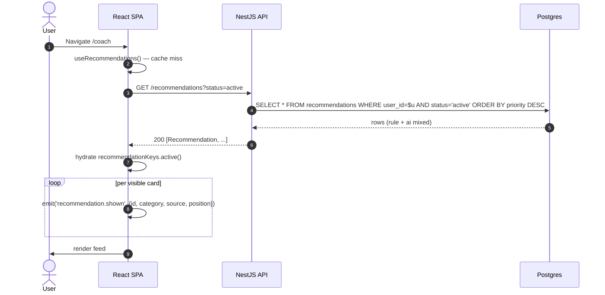
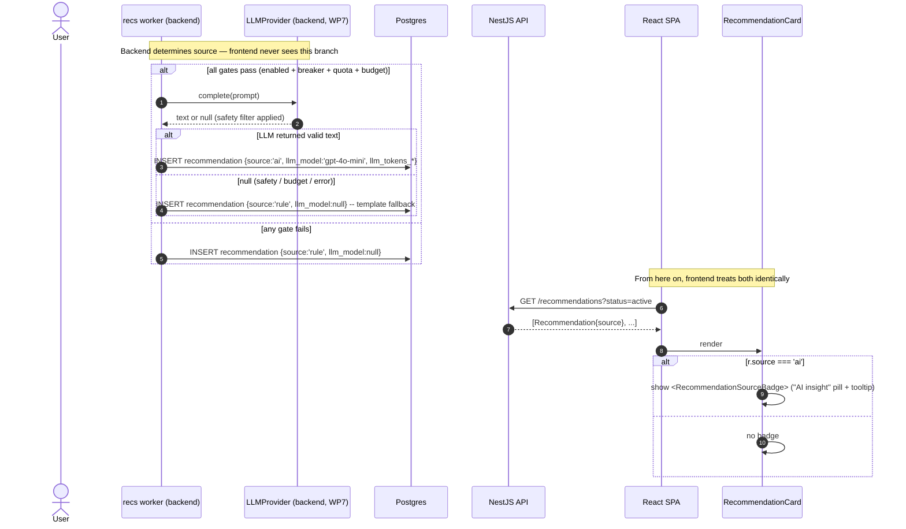

# WP6 + WP7 — Smart Coach (Rule-Based + LLM-Augmented Recommendations): Frontend Architectural Plan

**Status:** Draft v1
**Owner:** Frontend (Lead Architect: Claude)
**Backend status:**
**WP6** done — `RecommendationWorkerService` consumes `habitlab:events` (consumer group `habitlab-recommendations`), six rules wired (reschedule p70, reduce_difficulty p80, streak_celebration p60, encouragement_after_skip p75, consistency_reinforcement p65, retroactive_logging_reminder p85), 14-day cooldown per `(user, habit, category)` (FR-053), `accept` for `reschedule` atomically patches `habits.preferred_time`.
**WP7** done — `LLMProvider.complete(prompt)` with `OpenAILlmProvider` (gpt-4o-mini, temp 0.3, 150 max tokens, 8s timeout, 1 retry) gated by ai_recommendations_enabled → circuit breaker → per-user daily quota (≤3) → system budget ($3/day default). Safety filter (>280 chars / medical keywords / refusal / URL / `?`-ending → null → template fallback). LLM tokens + cost recorded in `recommendations.llm_*` columns.

**Scope:** A dedicated **Smart Coach** page (`/coach`) showing the full feed of active recommendations, plus the per-recommendation accept/dismiss interactions that work consistently from the dashboard's top-3 surface and from the coach page. WP6 and WP7 are scoped together because they share one UI — WP7 adds a single `source` field to the recommendation envelope; the frontend's job is to render that distinction tastefully without making it feel like an A/B label.

> Read this together with `CLAUDE.md` (WP6 + WP7 implementation notes — rule priorities, cooldown semantics, LLM gate order, safety filter), `habits-plan.md` (dashboard + accept side-effect on `habits.preferred_time`), `wp4-plan.md` (idempotency keys + telemetry sink), `wp5-plan.md` (the analytics that feed rule conditions), and `docs/HabitLab_AI_Analysis_Report.docx` §5.1.11 (recommendations table), §6.3 (LLM integration + safety), §7.2 (use cases).

---

## 1. Goals & Constraints

**Functional goals**

- Provide a **Smart Coach** page at `/coach` showing the user's active recommendations as a feed: title, body, category badge, source (rule vs AI), accept / dismiss / snooze actions.
- Render the dashboard's top-3 recommendations (already in WP3's `DashboardPage` via the `/dashboard` payload) using the **same `<RecommendationCard>` component** as the coach page. One component, two contexts.
- Handle `accept` semantics per category — most accepts just mark the recommendation `accepted`, but `reschedule` also patches `habits.preferred_time` (CLAUDE.md WP6). The frontend must reflect both effects in one optimistic update.
- Make AI-generated recommendations transparent without theatrical "🤖 AI" stamps. A small "AI insight" pill with a tooltip linking to a brief explanation. Trust is earned through restraint.
- Honor the **14-day cooldown** in the UI: after dismissal, surface a subtle "You won't see this again for two weeks" affordance so users understand why their feed feels stable.
- Wire WP8 variant-aware copy: when the recommendation envelope carries `experiment_variant`, render the variant copy without the coach feature importing `features/experiments`.
- Emit WP4 telemetry: `recommendation.impression` per visible card, `recommendation.accepted` / `recommendation.dismissed` mirrored as client events (backend already emits server-side; this is for client-render-time exposure).

**Hard constraints (from CLAUDE.md)**

- **WP6 cooldown is per `(user, habit, category)`.** The frontend must not assume "dismissed = gone forever." A new recommendation in the same category for the same habit will reappear after 14 days. Copy for the dismiss confirmation should reflect this.
- **`accept` side-effects are category-specific.** Today only `reschedule` mutates an external resource. The frontend's accept hook must read the category, decide which caches to invalidate, and not hard-code "always invalidate habits." Encoded in §4.3.
- **WP7 LLM is invisible to the frontend logic — only to the user.** The `source: 'rule' | 'ai'` field affects rendering only. The accept/dismiss code path is identical. The frontend does not call OpenAI, does not see prompts, does not see token counts. Cost transparency is a backend-only concern.
- **Safety filter is server-side.** The frontend never sanitizes recommendation text. If a payload arrives that violates expected length or content, the frontend renders it as-is and logs a `client.recommendation.suspicious` telemetry event (text exceeded 280 chars, etc.) so we catch backend regressions. No client-side rewriting.
- **Variant rendering happens via `<VariantSlot>`.** The recommendation copy may already carry variant text from the backend (rec_copy_v1 experiment). The frontend respects whatever the backend sent. No client-side variant resolution for recommendation bodies.
- **NN-8:** all types come from generated OpenAPI. `Recommendation`, `RecommendationCategory`, `RecommendationStatus`, `AcceptRecommendationResponse` etc.

**Non-goals for this slice**

- "Regenerate this insight" / "give me a different recommendation" buttons. These would burn LLM budget on user whim. Defer.
- Showing token counts, model name, or cost to the user. Backend internals.
- Per-habit recommendations page or per-habit recommendations endpoint. The Coach feed is global; habit detail shows up to one habit-relevant rec inline (if present).
- User-controlled rule priorities or "I never want streak_celebration" preferences. Defer to a future settings WP.
- Streaming AI responses. WP7 is request/response; no SSE today.

---

## 2. Folder Structure

WP3 already created `features/recommendations/` with `RecommendationCard.tsx` + accept/dismiss mutation stubs. This slice fills out that feature.

```
frontend/src/
├── features/
│   ├── recommendations/
│   │   ├── api/
│   │   │   ├── use-recommendations.ts        useQuery(['recommendations','active'])  (NEW)
│   │   │   ├── use-accept-recommendation.ts  (WP3 stub → filled out: category-aware invalidation)
│   │   │   ├── use-dismiss-recommendation.ts (WP3 stub → filled out)
│   │   │   ├── use-snooze-recommendation.ts  (NEW — optional, per §1)
│   │   │   └── _invalidation.ts              policy: which caches to DEL on accept by category
│   │   ├── components/
│   │   │   ├── RecommendationCard.tsx        the only card component — variants for dashboard/coach
│   │   │   ├── RecommendationFeed.tsx        list/grid wrapper, sorted by priority
│   │   │   ├── RecommendationCategoryBadge.tsx   icon + color per category
│   │   │   ├── RecommendationSourceBadge.tsx     "AI insight" pill with tooltip (WP7)
│   │   │   ├── RecommendationAcceptDialog.tsx    confirm + show predicted effect (e.g. "Move reminder to 18:00?")
│   │   │   ├── RecommendationDismissedToast.tsx  "Dismissed — won't appear for 14 days" with undo
│   │   │   ├── CoachEmptyState.tsx           "No insights yet — keep tracking" + CTA
│   │   │   └── CoachLoadingSkeleton.tsx
│   │   ├── pages/
│   │   │   └── CoachPage.tsx                 /coach
│   │   ├── lib/
│   │   │   ├── category-meta.ts              { icon, color, label } per RecommendationCategory
│   │   │   ├── action-preview.ts             AcceptPayload → human-readable "preview" (§4.4)
│   │   │   ├── source-explanation.ts         tooltip text per RecommendationSource (en/tr)
│   │   │   └── cooldown-message.ts           "14 days" / "until {date}" copy helper
│   │   ├── store/
│   │   │   └── coach-ui-store.ts             Zustand: dismissed-undo grace window, recently-acted ids
│   │   ├── testing/
│   │   │   └── fixtures.ts                   makeRecommendation({category, source})
│   │   └── index.ts                          barrel — public: CoachPage, RecommendationCard, hooks
│   │
│   ├── habits/                               (WP3 — accept on `reschedule` invalidates habitKeys.detail)
│   ├── dashboard/                            (WP3 — DashboardRecommendations uses RecommendationCard)
│   └── experiments/                          (WP8 — VariantSlot consumed by RecommendationCard for headline copy)
│
└── router/
    └── routes.tsx                            + /coach (ProtectedRoute requireVerified)
```

**Why one `<RecommendationCard>` with variants, not three components.** The dashboard's compact tile, the coach feed's full card, and a potential future habit-detail inline card all share the same data and the same accept/dismiss logic. Drift between three components would mean three places to update when the cooldown copy changes. Variant-via-prop is the right trade.

---

## 3. Component Hierarchy

### 3.1 Coach page

```
<ProtectedRoute requireVerified>
  <AppShell>
    <CoachPage>
      <PageHeader title="Smart Coach" description="Personalized insights from your habits" />
      <DataState query={recommendationsQuery} empty={<CoachEmptyState />}>
        <CoachStats>
          <CoachStat label="Active insights" value={recommendations.length} />
          <CoachStat label="Accepted this month" value={user.acceptedCount} />
        </CoachStats>
        <RecommendationFeed>
          {recommendations.map(r => (
            <RecommendationCard variant="full" recommendation={r} />
          ))}
        </RecommendationFeed>
      </DataState>
      <RecommendationAcceptDialog open={...} recommendation={pendingAccept} />
    </CoachPage>
  </AppShell>
</ProtectedRoute>
```

### 3.2 Inside `<RecommendationCard variant="full">`

```
<Card>
  <CardHeader>
    <RecommendationCategoryBadge category={r.category} />        // icon + color
    {r.source === 'ai' && <RecommendationSourceBadge />}         // small "AI insight" pill (WP7)
  </CardHeader>
  <CardBody>
    <VariantSlot id={`rec.${r.category}.title`}>
      <h3>{r.title}</h3>                                          // fallback = backend default
    </VariantSlot>
    <p>{r.body}</p>
  </CardBody>
  <CardActions>
    <Button onClick={() => onAccept(r)}>{acceptLabel(r.category)}</Button>
    <Button variant="ghost" onClick={() => onDismiss(r)}>Not now</Button>
  </CardActions>
</Card>
```

### 3.3 Inside `<RecommendationCard variant="compact">` (dashboard)

Same data, denser layout: category icon + title only (body truncated to one line with `…`), single CTA collapses to "View" → opens the full card in a sheet.

### 3.4 Composition rules

- The card never queries — the parent passes `recommendation: Recommendation`. The card calls `useAcceptRecommendation` and `useDismissRecommendation` for actions only.
- `<RecommendationAcceptDialog>` is shared. It shows category-specific preview text: for `reschedule`, "Move your reminder to 18:00?"; for `reduce_difficulty`, "Lower difficulty from 4 to 3?" Generated by `lib/action-preview.ts`.
- `<RecommendationSourceBadge>` is the **only** place that differentiates AI from rule. It's a 12px pill, not a header banner. The body copy itself is identical in treatment regardless of source.
- The card supports **undo within 5 seconds** after dismiss via toast. The mutation is fired immediately (optimistic), but the user has a window to reverse it before the cooldown effectively kicks in. See §7.1 #2.

---

## 4. State Management Strategy

### 4.1 Query keys

```ts
export const recommendationKeys = {
  all: ['recommendations'] as const,
  active: () => [...recommendationKeys.all, 'active'] as const,
  // accepted/dismissed history not surfaced in WP6+7 UI; reserved
};
```

The dashboard's top-3 do **not** get a separate query — they live inside the `dashboardKeys.summary()` payload. This is critical: it means a successful accept invalidates `dashboardKeys.summary()` (the dashboard refetches with one fewer rec) **and** `recommendationKeys.active()` (the coach feed refetches if it's mounted). Two cache families, one truth.

### 4.2 Query configuration

| Query | staleTime | gcTime | refetchOnWindowFocus | Notes |
|---|---|---|---|---|
| `recommendationKeys.active()` | 2 min | 10 min | yes | recs change every few minutes as workers process |
| `dashboardKeys.summary()` | 5 min | (WP3) | yes | embeds top-3 recs — invalidated by accept/dismiss |

**Why 2 min, not 5 min like dashboard.** The coach page is where users dwell on recommendations; users expect a freshly-rendered list when they return after a few minutes (the recommendation worker processes events on broker fanout). 2 min is the right window — short enough to feel current, long enough to avoid spam refetches.

### 4.3 Accept/dismiss invalidation matrix (the heart of this slice)

`_invalidation.ts` is the single source of truth.

| Action | Category | Always invalidate | Additionally invalidate |
|---|---|---|---|
| Accept | `reschedule` | `recommendationKeys.active()`, `dashboardKeys.summary()` | `habitKeys.detail(habitId)`, `habitKeys.lists()` (preferred_time changed) |
| Accept | `reduce_difficulty` | same | `habitKeys.detail(habitId)`, `habitKeys.lists()` (difficulty changed, **if** the backend extends `accept` to apply this — see §8) |
| Accept | `streak_celebration` \| `encouragement_after_skip` \| `consistency_reinforcement` \| `retroactive_logging_reminder` | same | none — these accepts are pure acknowledgments |
| Dismiss | any | `recommendationKeys.active()`, `dashboardKeys.summary()` | none |
| Snooze (optional) | any | `recommendationKeys.active()`, `dashboardKeys.summary()` | none |

Each mutation hook reads `recommendation.category` and consults `_invalidation.ts` for the right keys. Hooks never call `qc.invalidateQueries(...)` directly.

### 4.4 Optimistic update for accept/dismiss

The hot path here is *not* as hot as the WP3 toggle, but the UX expectation is the same: instant feedback. Pattern:

1. `onMutate`:
   - Cancel in-flight `recommendationKeys.active()` and `dashboardKeys.summary()`.
   - Snapshot both caches.
   - Remove the recommendation from both caches optimistically.
   - For `reschedule` accept: also patch the affected habit's `preferred_time` in `habitKeys.detail(id)` and the list entry. Use `action_payload.preferred_time` from the rec.
2. `onError`:
   - Roll back both snapshots.
   - Toast: "Couldn't apply — try again."
3. `onSettled`:
   - Invalidate per the matrix.
   - The server's truth replaces the optimistic guesses.

**Special case: dismiss undo.** When the user dismisses, the mutation fires immediately, but the toast offers "Undo" for 5 seconds. Undo strategy:
- Easy path: backend has a `POST /recommendations/:id/undismiss` endpoint → frontend just fires it.
- Probable reality: it doesn't. Frontend instead delays the `onSettled` invalidation by 5 seconds. If undo is clicked, restore the optimistic cache snapshot and fire `useAcceptRecommendation`'s inverse (which doesn't exist either) → simplest: re-insert into cache locally, and rely on next refetch to confirm.
- Recommend backend: add idempotent `PATCH /recommendations/:id { status }` so undo is a clean reversion to `active`. Listed in §8.

### 4.5 What lives in Zustand (`coach-ui-store.ts`)

- `recentlyActedIds: Set<string>` — recommendations the user acted on in the last 30 seconds. Used to suppress them from optimistic re-insertion if a refetch races a mutation.
- `dismissUndoGraceMs: number` — user pref, default 5000.

Not persisted to localStorage (transient session state).

### 4.6 What lives in URL

- Nothing for now. The coach page has no filters or selected item. If we add a category filter later, `/coach?category=reschedule`. The `<RecommendationAcceptDialog>` open state is component-local — opening it does not affect URL.

---

## 5. Core TypeScript Types

### 5.1 Domain (re-exported from generated)

```ts
export type Recommendation = components['schemas']['Recommendation'];
export type RecommendationCategory = components['schemas']['RecommendationCategory'];
export type RecommendationStatus = components['schemas']['RecommendationStatus'];
export type RecommendationSource = components['schemas']['RecommendationSource'];

export type AcceptRecommendationRequest =
  components['schemas']['AcceptRecommendationRequest'];
export type AcceptRecommendationResponse =
  components['schemas']['AcceptRecommendationResponse'];
```

Expected `Recommendation` shape (confirm against §5.1.11 of the analysis report):

```ts
interface RecommendationShape {
  id: string;
  habitId: string | null;            // null for user-level recs (rare in WP6)
  category: RecommendationCategory;  // 6 literal strings, see §5.2
  title: string;
  body: string;
  priority: number;                  // 60..85 from the six rules
  source: RecommendationSource;      // 'rule' | 'ai' (WP7)
  llmModel: string | null;           // populated when source === 'ai'
  actionPayload: ActionPayload | null;
  experimentVariant: string | null;  // WP8 — usually null in WP6+7 unless rec_copy_v1 is running
  status: RecommendationStatus;      // 'active' | 'accepted' | 'dismissed' | 'expired'
  createdAt: string;
}
```

### 5.2 Hand-written narrowed unions

```ts
// Narrow union mirrors the six rules in CLAUDE.md WP6 notes.
export type RecommendationCategory =
  | 'reschedule'
  | 'reduce_difficulty'
  | 'streak_celebration'
  | 'encouragement_after_skip'
  | 'consistency_reinforcement'
  | 'retroactive_logging_reminder';

export type RecommendationSource = 'rule' | 'ai';

export type RecommendationStatus = 'active' | 'accepted' | 'dismissed' | 'expired';

// Per-category action payload — discriminated by category.
export type ActionPayload =
  | { category: 'reschedule'; preferredTime: string }    // "HH:00"
  | { category: 'reduce_difficulty'; targetDifficulty: 1 | 2 | 3 | 4 | 5 }
  | { category: 'streak_celebration'; }                  // no payload
  | { category: 'encouragement_after_skip'; }
  | { category: 'consistency_reinforcement'; }
  | { category: 'retroactive_logging_reminder'; suggestedDate: string };

// Card prop contract.
export interface RecommendationCardProps {
  readonly recommendation: Recommendation;
  readonly variant: 'compact' | 'full';
  readonly onAccept?: (r: Recommendation) => void;
  readonly onDismiss?: (r: Recommendation) => void;
}

// Category UI metadata — driven by category-meta.ts, not scattered in components.
export interface CategoryMeta {
  readonly icon: LucideIcon;
  readonly label: string;          // localized
  readonly accentClass: string;    // tailwind text/bg class
  readonly acceptLabel: string;    // localized — "Move reminder" / "Lower difficulty" / "Got it"
}
```

### 5.3 Mutation contexts

```ts
export interface AcceptContext {
  readonly snapshot: {
    readonly recommendations: readonly Recommendation[] | undefined;
    readonly dashboard: DashboardSummary | undefined;
    readonly habit?: Habit;            // present iff side-effect category
  };
  readonly recommendation: Recommendation;
}

export interface DismissContext extends AcceptContext {}
```

### 5.4 Telemetry event types (extends WP4)

```ts
// Add to ClientEvent discriminated union in lib/events/client-event.ts
| { type: 'recommendation.shown'; payload: { recommendationId: string; category: RecommendationCategory; source: RecommendationSource; position: number } }
| { type: 'recommendation.accepted_client'; payload: { recommendationId: string; category: RecommendationCategory; source: RecommendationSource } }
| { type: 'recommendation.dismissed_client'; payload: { recommendationId: string; category: RecommendationCategory; source: RecommendationSource } }
| { type: 'recommendation.suspicious'; payload: { recommendationId: string; reason: 'too_long' | 'missing_title' | 'unknown_category' } };
```

The `_client` suffix on accepted/dismissed distinguishes client-render-time from backend-authoritative server-side events. The server emits its own `recommendation.accepted` event via the outbox per `POST /recommendations/:id/accept` (WP4); the client event is for measuring render → action latency.

---

## 6. Sequence Diagrams

### 6.1 Coach page load + render



The shown events flow through the WP4 telemetry sink — batched, not per-card.

### 6.2 Accept `reschedule` (the complex case — side effect on `habits`)

```mermaid
sequenceDiagram
  autonumber
  actor U as User
  participant Card as RecommendationCard
  participant Dlg as AcceptDialog
  participant Mut as useAcceptRecommendation
  participant QC as QueryClient
  participant API as NestJS API
  participant DB as Postgres
  participant B as Broker

  U->>Card: Click "Move reminder"
  Card->>Dlg: open with actionPreview("Move reminder to 18:00?")
  U->>Dlg: Confirm
  Dlg->>Mut: mutate(recommendation)
  Mut->>QC: cancelQueries(recs, dashboard, habit detail)
  Mut->>QC: snapshot all three
  Mut->>QC: optimistic: remove rec from feed/dashboard; patch habit.preferred_time
  QC-->>Card: re-render (rec gone, habit time updated everywhere it's visible)
  Mut->>API: POST /recommendations/:id/accept (Idempotency-Key: K)
  API->>DB: BEGIN; UPDATE recommendations SET status='accepted'; UPDATE habits SET preferred_time; INSERT events(recommendation.accepted, habit.updated); COMMIT
  API->>B: outbox publisher → habitlab:events
  API-->>Mut: 200 {recommendation, habit}
  Mut->>QC: setQueryData habit (real values)
  Mut->>QC: invalidateQueries per matrix → recs, dashboard, habit detail/list
  QC->>API: GET /dashboard (background refetch)
  API-->>QC: fresh truth
  Note over Card,QC: user sees no spinner — feed already updated, server reconciles silently
```

### 6.3 Dismiss with 5-second undo

```mermaid
sequenceDiagram
  autonumber
  actor U as User
  participant Card as RecommendationCard
  participant Mut as useDismissRecommendation
  participant QC as QueryClient
  participant API as NestJS API
  participant T as Toast

  U->>Card: Click "Not now"
  Card->>Mut: mutate(recommendation)
  Mut->>QC: snapshot recs + dashboard
  Mut->>QC: optimistic remove
  Mut->>T: show toast "Dismissed — Undo (5s)"
  Mut->>API: POST /recommendations/:id/dismiss
  API-->>Mut: 200
  Note over T: 5-second timer starts after mutation resolves
  alt user clicks Undo
    U->>T: Undo
    T->>Mut: requestUndo
    Mut->>API: PATCH /recommendations/:id {status:'active'}
    API-->>Mut: 200 (idempotent)
    Mut->>QC: setQueryData restore snapshot
    Mut->>U: rec re-appears in feed
  else 5 seconds elapse
    T-->>T: dismiss toast silently
    Mut->>QC: invalidateQueries(recs, dashboard)
    Note over Mut,QC: dismissal is now durable; cooldown begins
  end
```

The undo path depends on §8 question #2 — whether backend offers a clean revert. Without it, undo becomes "restore client cache locally + tolerate next refetch confirming the dismissal anyway." Worse UX, but acceptable.

### 6.4 Rule-based vs AI-augmented (frontend perspective — same path, different badge)



The only branch in the frontend is the badge. The card's behavior — accept, dismiss, telemetry — is the same.

---

## 7. Edge Cases & Architectural Bottlenecks

### 7.1 Correctness / UX edge cases

1. **Accept of `reschedule` while the habit detail page is open in another tab.** Tab A accepts the recommendation, mutates `preferred_time`. Tab B's habit detail shows stale time. **Mitigation:** the WP2 BroadcastChannel posts a `HABIT_MUTATED` message after any habit-mutating mutation (extend the channel's schema slightly). Tab B invalidates `habitKeys.detail(id)`. This is a small, justified extension of the WP2 channel.

2. **Dismiss undo races server confirmation.** The user clicks Undo at t=4.9s; the mutation just resolved at t=4.8s. The undo request is sent to a recommendation already in `dismissed` state. **Mitigation:** the undo path uses `PATCH /recommendations/:id { status: 'active' }` (idempotent). Backend reverts. If §8 #2 is rejected, fallback is local cache restoration only — backend remains dismissed, next refetch surfaces the gap. Document the tradeoff for users? Probably not — 5s window is rarely raced.

3. **AI-generated copy that's locale-inappropriate.** WP7 prompt builder is locale-aware (`en`/`tr`) per CLAUDE.md. If the user's locale changes mid-session, cached AI recs still carry the old language. **Mitigation:** recommendations are not re-rendered for locale change — they're aggregated at generation time. New recs after a locale change will be in the new language. Frontend doesn't fight this. Document in §8 if there's an expectation otherwise.

4. **Empty feed when a user has habits but no recs yet.** Recs are async — created by the worker after events land. A new user may see an empty `/coach` for hours. **Mitigation:** `<CoachEmptyState>` distinguishes "no habits" (CTA: create one) from "habits but no recs yet" (copy: "Log a few days to unlock insights"). Detection: query the habits feature for habit count.

5. **More than 10 active recommendations.** Unlikely given cooldown + worker dedup, but possible (6 categories × multiple habits). **Mitigation:** feed renders all; sticky priority sort. No pagination in WP6+7. If feed length exceeds 20, surface a "Showing X insights — older ones first" footer.

6. **Stale `action_payload` after habit edit.** Recommendation was created when habit `preferred_time` was 09:00, suggested moving to 18:00. User then edited the habit to `preferred_time` 17:00. The reschedule rec is now near-redundant. **Mitigation:** backend should mark such recs as `expired` when the underlying condition changes. If not, the frontend renders with no special treatment; users dismiss what no longer applies. Backend question §8 #5.

7. **Suspicious AI payload escapes safety filter (regression).** A 300-char body, or a URL slips through. **Mitigation:** §1 — render as-is, emit `recommendation.suspicious` client event for backend observability. No client-side text mutation.

8. **AI source badge confuses users.** "What does AI insight mean? Did you read my data?" **Mitigation:** tooltip on the badge with one sentence + a link to a brief "How insights are generated" doc. Honest, brief, no marketing fluff. Copy reviewed before ship.

9. **Telemetry storm on coach mount.** 8 recommendations → 8 `recommendation.shown` events on initial render. **Mitigation:** WP4 sink batches; 5s/50-event flush absorbs this trivially.

10. **Optimistic accept conflicts with concurrent recommendation update.** Worker creates a new rec at t=0; user accepts an existing rec at t=0.1; refetch at t=0.2 returns the new rec. The optimistic remove still hides the accepted rec, but the new rec appears. **Mitigation:** acceptable — the optimistic remove operates on a specific `id`, the refetch contains new data. They don't conflict semantically. Tests cover this scenario.

11. **`experiment_variant` field arrives on a recommendation (WP8).** When rec_copy_v1 is running, backend writes the variant key. The frontend's `<VariantSlot>` reads it. **Mitigation:** the card already routes the title through `<VariantSlot id={`rec.${category}.title`}>`. WP8 implementation populates the slot registry. Coach feature requires zero changes when WP8 lands.

12. **Habit detail's "single best rec" inline render.** If we surface one habit-relevant rec on `/habits/:id`, two questions: (a) which one (highest priority where `habitId === id`)?, (b) does accepting from there have the same side effects? **Mitigation:** the same `<RecommendationCard variant="compact">` is rendered; the habit detail page filters the active list by `habitId`. Same hooks, same invalidation matrix — no special path.

### 7.2 Architectural bottlenecks (decoupling concerns)

1. **Coach must not import `features/habits` internals.** The reschedule accept patches a habit, but the coach feature should not reach into `habitKeys` directly. **Mitigation:** `features/habits/index.ts` exports `habitKeys` as part of its public surface. The coach's `_invalidation.ts` imports the keys symbolically. The coach never imports a habit *component*.

2. **The accept side-effect matrix is policy, not code-by-code.** Hard-coding "if category === reschedule, invalidate habit" inside the mutation hook scatters knowledge. **Mitigation:** `_invalidation.ts` exposes `invalidationKeysForAccept(category): QueryKey[]`. New categories require updating one file. PR review checklist enforces this.

3. **AI source badge must not become an A/B testing parameter.** WP7's AI vs rule is *not* an A/B test — it's a system gate cascade. If we let `<RecommendationSourceBadge>` be variant-driven, we conflate "system behavior" with "user experiment." **Mitigation:** the badge is wired to `recommendation.source` only. No `<VariantSlot>` wrapping it.

4. **AcceptDialog preview text duplicates category meta.** Easy for `lib/category-meta.ts` and `lib/action-preview.ts` to drift. **Mitigation:** category-meta exports `acceptLabel`; action-preview imports it and adds payload-specific extension ("Move reminder" + " to 18:00?"). One canonical source for the action label; payload is the only additive concern.

5. **Backend `source` enum can grow.** Future: `source: 'ai' | 'rule' | 'manual' | 'hybrid'`. The frontend's badge logic is a switch — if a new value lands without UI handling, default to no badge. **Mitigation:** `RecommendationSource` is a generated enum; the badge component renders nothing for unknown sources (exhaustiveness check via TS `never`).

6. **LLM cost transparency creep.** Stakeholders may ask "show users their AI insight count this week." Don't. **Mitigation:** the LLM columns (`llm_tokens_*`, `llm_cost_cents`) are scrubbed from the frontend's `Recommendation` type at the OpenAPI level — backend should expose `source` only. If they do flow through, the type system can't prevent rendering them; lint rule blocks references to `llmTokensInput`, etc., outside an explicit allow list (admin pages, none exist today).

7. **Coach page and dashboard top-3 drift.** Different sort orders, different copy. **Mitigation:** the dashboard's top-3 is a slice of the coach's full feed; both use `priority DESC` (backend invariant per CLAUDE.md WP6). Tests assert ordering parity.

8. **Recommendation telemetry events flood the event log.** 20-active-rec users emit 20 shown events on every coach mount. Over a month, large volume. **Mitigation:** schema-level `shown` event is intentional (used to compute click-through rate on insights, FR-???). Acceptable. WP4 sink batching keeps HTTP volume bounded.

9. **Variant-aware copy ownership unclear.** If WP8 rec_copy_v1 is active, who decides what the variant text says — backend or frontend? **Mitigation:** the recommendation body always comes from the backend. WP8 backend writes the variant's body content into the recommendation row at creation time. Frontend's `<VariantSlot>` is only for the rare case where the *frontend wants its own copy variation independent of the recommendation text* (e.g. variant on the section header "Smart Coach" vs "Your Insights"). Most coach copy is server-authoritative.

---

## 8. Open Questions for Backend / Spec

Confirm against §5.1.11 and §6.3 of the analysis report. None block scaffolding.

1. **`GET /recommendations` endpoint exists?** CLAUDE.md describes the worker writing recs but only mentions the dashboard's direct SQL query for top-3. The coach page needs a list endpoint with `?status=active`. If absent, this is a new WP6+7 backend deliverable (small).
2. **`PATCH /recommendations/:id { status }` for undo.** Without this, dismiss undo is local-cache only. Recommend backend adds it — idempotent and simple.
3. **Locale on AI recommendations.** When user changes locale, do existing AI recs get translated, regenerated, or left alone? Recommended: left alone (cheapest, no surprises). §7.1 #3.
4. **`reduce_difficulty` accept side-effect.** CLAUDE.md explicitly notes only `reschedule` patches a habit. Does accept of `reduce_difficulty` patch `habits.difficulty`, or is it acknowledgment-only? Affects §4.3 matrix row 2.
5. **Recommendation expiry conditions.** When a rec's underlying condition no longer holds (e.g. user already moved their preferred_time before accepting the reschedule rec), does the worker mark it `expired`? Or does it sit `active` forever until cooldown clears? §7.1 #6.
6. **Source value space.** Confirm `source ∈ {'rule', 'ai'}` exactly. Future values (e.g. `'manual'`) would change the exhaustiveness check in the badge.
7. **`source: 'ai'` field exposure.** Confirm OpenAPI schema includes `source` and excludes `llm_*` cost columns. We do not want token counts in the user-facing API contract.
8. **Idempotency-Key on accept/dismiss.** Same WP4 contract — the accept mutation may be retried. Backend should treat `Idempotency-Key` as the idempotency token (returning the prior result on duplicate). Critical because `reschedule` accept is non-idempotent at the DB level (UPDATE habits) without it.
9. **`action_payload` schema stability.** §5.2 hand-narrows it. Confirm the generated OpenAPI type matches this discriminated structure (or that it's a `Record<string, unknown>` we narrow client-side).
10. **Maximum simultaneous active recs.** §7.1 #5. Cooldown bounds this loosely; a hard cap (e.g. 10) at the backend would simplify the feed UX.

---

## 9. Acceptance Criteria for the WP6 + WP7 Frontend Slice

The slice is "done" when:

- `/coach` renders the active recommendations feed sorted by priority descending.
- The dashboard's top-3 surface uses the same `<RecommendationCard>` component as the coach feed (no duplication).
- Accept of a `reschedule` recommendation:
  - Optimistically removes the rec from feed + dashboard.
  - Optimistically updates the affected habit's `preferred_time` in both `habitKeys.detail(id)` and `habitKeys.lists()`.
  - On error, rolls both back.
  - On success, server's response replaces optimistic guess.
- Dismiss with undo: rec disappears immediately, toast shows 5s, undo restores.
- AI-generated recommendations show a discreet "AI insight" pill; rule-based ones show no badge. No theatrical visual difference in the card body.
- Locale switch (en/tr) leaves existing recommendations untranslated (no client-side translation).
- 14-day cooldown copy is shown on dismiss confirmation in both languages.
- `pnpm test` covers: feed render, accept reschedule with habit-cache update, accept simple category with no habit-cache update, dismiss + undo within window, dismiss + grace expires, suspicious-payload telemetry emission, exhaustiveness check on category and source unions.
- Manual smoke: visit `/coach` → see at least one rec (after backend seeds with test events) → accept reschedule → habit detail's preferred_time reflects new value → check dashboard → top-3 reflects updated feed → dismiss another rec → undo within 5s → rec re-appears.
- Lint: `llm_tokens_input`, `llm_tokens_output`, `llm_model`, `llm_cost_cents` not referenced anywhere in `features/recommendations/components/` or `pages/`.

---

## 10. Sequencing & Dependencies

**WP6 ships before WP7 conceptually**, but on the frontend they ship together — WP7 adds one field (`source`) plus one component (`<RecommendationSourceBadge>`). Sequencing within the slice:

1. **`<RecommendationCard>` first** (fixture-driven). Renders for both sources, both variants. Storybook-testable without backend.
2. **`use-recommendations` + `use-accept` + `use-dismiss` second.** Plumbing, with the invalidation matrix in place.
3. **`/coach` page third.** Assembly.
4. **Dashboard top-3 integration fourth.** Replace WP3's stub `<RecommendationCard>` usage with the real component (one-line change if the prop API was kept compatible — see §3.4).
5. **`<RecommendationSourceBadge>` last.** Trivial; ships when WP7 backend confirms `source` field is in the OpenAPI spec.

Dependencies on other WPs:

- **WP3:** `dashboardKeys.summary()` and `habitKeys.*` are extended in the invalidation matrix.
- **WP4:** `Idempotency-Key` on accept/dismiss (TP-1), telemetry sink for `recommendation.shown` etc. (TP-2).
- **WP5:** none directly; analytics' `bestHour` is what *triggers* the `reschedule` rule on the backend, but the frontend doesn't care.
- **WP8:** `<VariantSlot>` may wrap the section header copy. Recommendation body itself is server-authoritative — no integration needed.

---

*End of plan. Implementation kickoff awaits sign-off and resolution of §8.*
