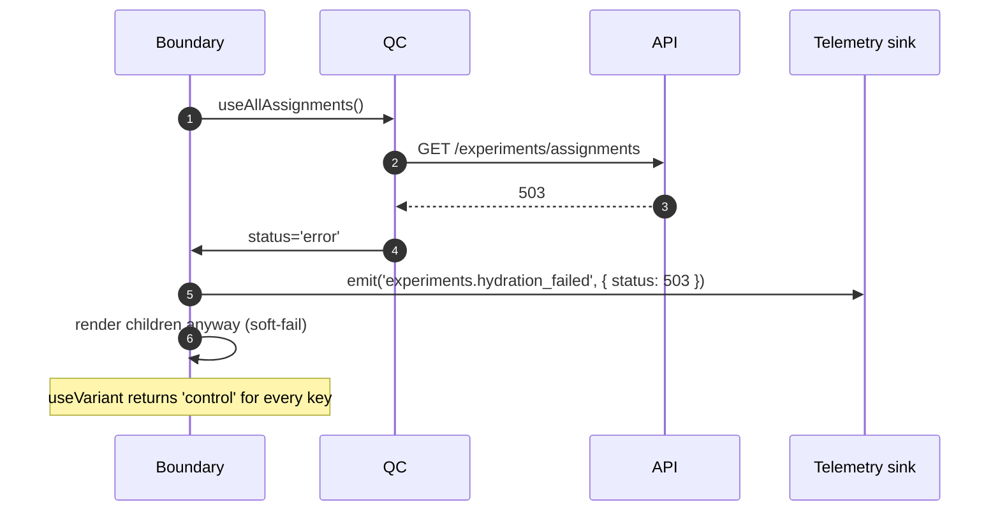
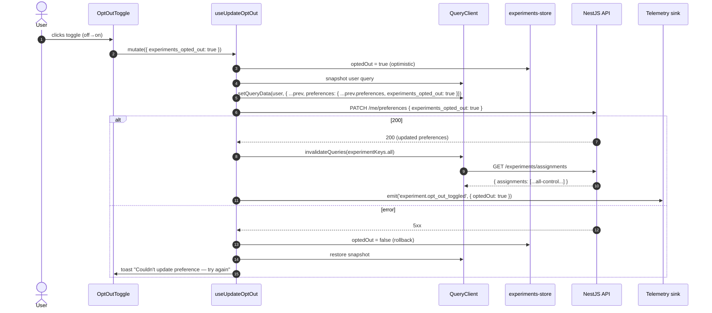
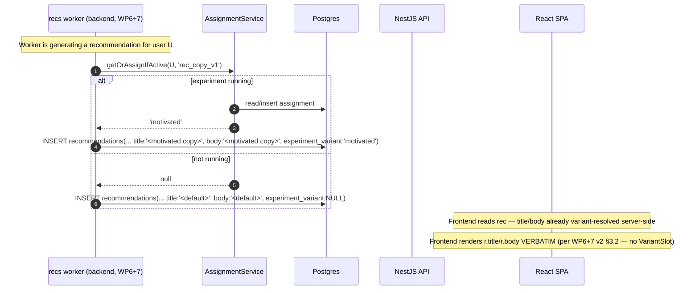

# WP8 — A/B Testing Subsystem (Frontend): Architectural Plan

**Status:** Draft v1
**Owner:** Frontend (Lead Architect: Claude)
**Backend status (per CLAUDE.md WP8):**
- Migration `1745500000000-ExperimentsSchema.ts` shipped (`experiment_status` ENUM + `experiments` + `experiment_assignments` tables).
- `ExperimentRepository` (plain `@Injectable()`, not user-scoped — the `experiments` table has no `user_id`).
- `AssignmentService.getOrAssign(userId, key)`: lazy SHA-256-bucketed assignment, persists on first read. Returns `'control'` (no DB write) for experiment-not-found / not-running / opted-out.
- `AssignmentService.getOrAssignIfActive(userId, key)`: returns `null` when not running — used by the recommendation worker so inactive experiments don't pollute `experiment_variant`.
- SHA-256 algorithm: `digest = sha256('${userId}:${experimentKey}')`, `bucket = readBigUInt64BE(0) % BigInt(sum(weights))`, walk cumulative weights.
- Exposure events: `GET /experiments/variant` emits fire-and-forget `experiment.exposure` per key. Payload `{ experimentKey, variantKey }`.
- Opt-out: `PATCH /me/preferences { experiments_opted_out: true }` (WP2 endpoint already exists).
- Backend CLI for experiment lifecycle (`experiment:create / start / pause / analyze`). No frontend tooling needed for ops.
- Analysis z-test (95% CI) is backend-side; the frontend never computes lift.

**Scope:** This slice defines the **frontend mechanics** by which an experiment's variant assignment reaches a rendered component, the **exposure event** is emitted truthfully (only when the variant is actually shown), and the **opt-out toggle** is wired into Settings. It also locks down the contract that earlier plans (especially WP6+7 v2) leaned on: `<VariantSlot>` is **chrome only**, never wraps server-authoritative recommendation text.

> Read this together with `CLAUDE.md` (WP8 implementation notes — assignment algorithm, exposure semantics, opt-out), `wp4-plan.md` (telemetry sink for exposure events), `wp6-7-plan.md` v2 (the §3.2 VariantSlot scope decision and §8 #7 backend confirmation), `auth-plan.md` (the existing `/me/preferences` endpoint), and `docs/HabitLab_AI_Analysis_Report.docx` §5.1.10 (experiments schema) and §6.5 (assignment algorithm).

---

## 1. Goals & Constraints

**Functional goals**

- Provide a **`<VariantSlot id="..." fallback={...}>`** primitive that renders the variant copy/component for a given slot id without leaking experiment internals into feature code.
- Provide a **`useVariant(experimentKey): VariantKey | 'control'`** hook for cases where the consumer needs to branch on variant in logic, not in JSX (e.g. different click handlers).
- Hydrate assignments **before the first paint** of any route that renders a slot — no FOUC (flicker of unstyled content) where the control briefly renders before swapping to the variant.
- Emit **`experiment.exposure`** events **only when the variant is rendered to the user**, deduped per `(experimentKey, session)`. Mount-time emission for off-screen slots is a lie; use the same Intersection Observer machinery that WP6+7 introduced for `recommendation.shown`.
- Wire the **opt-out toggle** into Settings. Opted-out users always get `variants[0].key` (the canonical control) — the backend honors this; the frontend just toggles the preference.
- Stay invisible when no experiment is running for a given key. Slot renders `fallback`, no network call, no telemetry.

**Hard constraints (from CLAUDE.md + earlier plans)**

- **`<VariantSlot>` is chrome only.** Per WP6+7 v2, the slot wraps copy/components the *frontend* authors (page headers, button labels, illustrative images). It **never** wraps server-authoritative data fields like `recommendation.title`/`body`, habit titles, dashboard metric strings, etc. A greppable lint rule enforces this.
- **Deterministic assignment is server-side.** The frontend does not run the SHA-256 algorithm. The frontend asks the backend for the user's variant for a key, then caches it. No bucketing logic in `features/experiments`.
- **No client-side experiment definitions.** Variant *content* (copy strings, component variants) lives in the frontend as a `slotRegistry`, but the *fact* that an experiment is running and its variant *keys* live in the backend. A slot id maps to an experiment key + a per-variant render function — the keys must match what the backend ships.
- **Exposure is the analysis unit, not assignment.** Backend analysis joins on `experiment.exposure` events (CLAUDE.md WP8). The frontend's job is to emit one exposure per `(experimentKey, session)` when the variant is actually rendered, not on assignment fetch.
- **No JWT, no token storage.** Assignments are user-scoped — the API uses the existing httpOnly cookie. No new auth surface.
- **NN-8:** all types come from generated OpenAPI. `Experiment`, `ExperimentVariant`, `ExperimentStatus`, `ExperimentAssignment`, `VariantResolution`, etc.
- **Opt-out preference field name:** `experiments_opted_out: boolean` on `users.preferences` JSONB (WP2 default `false`). The Settings UI flips this via the existing `PATCH /me/preferences`.

**Non-goals for this slice**

- Frontend-side experiment authoring or weight configuration. Backend CLI owns lifecycle.
- Frontend analysis dashboards (lift, CI, p-values). Backend-only via CLI / future admin tool.
- Multi-armed bandit, contextual bandits, or any non-uniform-weighted bucketing. SHA-256 + integer weights is the contract.
- Server-side rendering. The SPA fetches assignments at boot; SSR-style "render the right variant on first paint without a roundtrip" is out of scope.
- Cross-device assignment migration (the assignment is keyed on `user_id`, which is stable across devices once authenticated — but anonymous experiments are not supported).
- Holdouts / mutually-exclusive experiments / layering. One key, one assignment, independent of other keys.

---

## 2. Folder Structure

```
frontend/src/
├── features/
│   ├── experiments/                              NEW FEATURE in WP8
│   │   ├── api/
│   │   │   ├── use-variant.ts                    useQuery(['experiments','variant', key])  per-key fetch (rare; usually batched)
│   │   │   ├── use-all-assignments.ts            useQuery(['experiments','all'])  hydration at boot
│   │   │   ├── use-update-opt-out.ts             useMutation → PATCH /me/preferences
│   │   │   └── _client.ts                        thin wrappers; types from generated OpenAPI
│   │   ├── components/
│   │   │   ├── VariantSlot.tsx                   the public primitive — chrome only
│   │   │   ├── ExperimentsBoundary.tsx           hydration gate at the route level (suspends until assignments resolve)
│   │   │   └── OptOutToggle.tsx                  Settings UI control (consumed by features/settings)
│   │   ├── hooks/
│   │   │   ├── use-variant.ts                    public hook — useVariant(experimentKey)
│   │   │   ├── use-exposure.ts                   internal — emits experiment.exposure once per (key, session)
│   │   │   └── use-slot-impression.ts            wraps useImpressionTracking from features/recommendations? NO — see §3.5
│   │   ├── lib/
│   │   │   ├── slot-registry.ts                  map of slotId → { experimentKey, variants: { [variantKey]: () => ReactNode } }
│   │   │   ├── assignment-cache.ts               in-memory mirror of TanStack cache, keyed by experimentKey
│   │   │   └── exposure-dedup.ts                 page-scoped Set<string> of already-fired (key,session) tuples
│   │   ├── store/
│   │   │   └── experiments-store.ts              Zustand: hydration state ('idle'|'loading'|'ready'|'error'), opted-out flag mirror
│   │   ├── testing/
│   │   │   ├── fixtures.ts                       makeAssignment(key, variant)
│   │   │   └── VariantHarness.tsx                forces a specific variant for Storybook / unit tests
│   │   └── index.ts                              barrel — public: VariantSlot, useVariant, OptOutToggle, ExperimentsBoundary, types
│   │
│   ├── settings/                                 (WP2) — adds the OptOutToggle to the existing preferences page
│   ├── recommendations/                          (WP6+7) — references VariantSlot via the barrel only
│   └── auth/                                     (WP2) — preferences PATCH is reused
│
└── router/
    └── routes.tsx                                <ExperimentsBoundary> wraps the authenticated route tree
```

**Why a dedicated feature and not a `lib/` utility.** Experiments are a bounded context with their own API, mutations, telemetry, and Settings affordances. Treating it as a feature keeps the slot registry, the boundary component, and the opt-out flow co-located. `lib/` would not be a place for API hooks.

**Why `lib/slot-registry.ts` and not a React component map.** The slot registry is data, not JSX. Resolving a slot id to a variant component must work in `useVariant` (logic) and `<VariantSlot>` (JSX) without circular imports. A typed lookup object is the right shape.

---

## 3. Component Hierarchy

### 3.1 Where `<ExperimentsBoundary>` mounts

```
<QueryClientProvider>
  <AuthProvider>
    <ProtectedRoute>
      <ExperimentsBoundary>             {/* suspends until all assignments resolved (or error) */}
        <AppShell>
          <RouterOutlet />              {/* DashboardPage, CoachPage, HabitsPage, etc. */}
        </AppShell>
      </ExperimentsBoundary>
    </ProtectedRoute>
  </AuthProvider>
</QueryClientProvider>
```

The boundary lives **above the route outlet but below auth**. Rationale: assignments require an authenticated `user_id`. Below auth, the request would fail. Above the outlet, every authenticated route inherits hydration without each route fetching its own. Anonymous (logged-out) routes — `/login`, `/register` — never render `<VariantSlot>` and never mount the boundary.

### 3.2 Inside `<ExperimentsBoundary>`

```
function ExperimentsBoundary({ children }) {
  const { data, status } = useAllAssignments();   // GET /experiments/assignments
  if (status === 'pending') return <AppShellSkeleton />;
  if (status === 'error')   return <>{children}</>;   // soft-fail — see §7.1 #1
  return children;
}
```

**Soft-fail on error.** If the assignments endpoint 5xx's, the boundary still renders children. `useVariant` falls back to `'control'` for any key. No experiment is worth blocking the app for. Logged as `client.experiments.hydration_failed` telemetry.

### 3.3 `<VariantSlot id="..." fallback={...}>` API

```tsx
interface VariantSlotProps {
  /** Slot id maps to an experiment key via slotRegistry. */
  readonly id: SlotId;
  /** Rendered when (a) experiment not running, (b) opted out, (c) hydration error, (d) variant key not in registry. */
  readonly fallback: ReactNode | string;
  /** Optional override for testing/Storybook — bypasses the registry. */
  readonly forceVariant?: string;
}

// Usage
<VariantSlot
  id="coach.action.accept"
  fallback={acceptLabel(r.category)}
/>

// String shorthand for copy-only slots
<VariantSlot id="dashboard.greeting" fallback="Welcome back" />
```

Rendering rule:

1. Resolve `experimentKey = slotRegistry[id].experimentKey`.
2. Read variant via `useVariant(experimentKey)` (already hydrated by the boundary).
3. If variant is `'control'` OR not present in `slotRegistry[id].variants`, render `fallback`.
4. Otherwise, render `slotRegistry[id].variants[variantKey]()`.
5. Fire exposure via `useExposure(experimentKey)` — once per `(experimentKey, session)` when the slot actually renders the variant **and** is in the viewport for ≥200ms (§3.5).

### 3.4 `useVariant(experimentKey)` API

```ts
function useVariant(experimentKey: string): VariantKey | 'control';
```

- Reads from the TanStack cache populated by `useAllAssignments`. No fetch is triggered here — if the boundary hasn't hydrated, returns `'control'` and the slot renders fallback. Safe to call anywhere below the boundary.
- Returns a typed union when `experimentKey` is a known literal (see §5.2 `KnownExperimentKey`). Returns `string` for arbitrary keys (escape hatch — discouraged).
- Calling `useVariant` does **not** fire an exposure event by itself. Exposures fire when the variant *renders* (via `<VariantSlot>`) or when the consumer explicitly calls `useExposure(key)`. Rationale: a logic-only branch (`if (variant === 'motivated') emitTelemetry(...)`) doesn't necessarily mean the user *saw* the variant.

### 3.5 Exposure dispatch — `useExposure(key)` and `useSlotImpression(ref, key)`

Two flavors:

- **`useExposure(experimentKey)`** — fires immediately when called, deduped per `(key, session)`. Use when the variant has rendered and is *certain* to be visible (above the fold, modal that just opened, button label in a primary CTA).
- **`useSlotImpression(ref, experimentKey)`** — Intersection Observer-gated. Fires only after the slot's element is ≥50% visible for ≥200ms. Use for slots that may be off-screen on initial render (long pages, scroll containers).

`<VariantSlot>` picks between them based on the registry entry:

```ts
slotRegistry: Record<SlotId, {
  experimentKey: string;
  exposureMode: 'mount' | 'viewport';       // default 'viewport'
  variants: Record<string, () => ReactNode>;
}>
```

`mount` is for slots that are always-visible by construction (e.g. the accept-button label inside a card the user just opened a confirm dialog for). `viewport` is the safe default. Both go through the same dedup set.

**Critical:** `useSlotImpression` does **not** reuse `useImpressionTracking` from `features/recommendations` — that hook's options shape is recommendation-specific. Both hooks share a *primitive* (a future `useViewportTrigger`) that lives in `lib/viewport/` once we have a second consumer. Premature extraction is worse than the small duplication today.

### 3.6 `<OptOutToggle />`

Lives in `features/experiments/components/` but is *consumed* by `features/settings/pages/SettingsPage.tsx`. Single `<Switch>` bound to `user.preferences.experiments_opted_out`. Toggling fires `useUpdateOptOut`, which:

1. Optimistically flips the local mirror.
2. `PATCH /me/preferences { experiments_opted_out: true }` (existing endpoint).
3. On success, invalidates `experimentKeys.all()` so the cache refetches — backend now returns `'control'` for every key.
4. On error, rolls back the optimistic flip and toasts.

The toggle's helper copy explains the effect: "Show the standard experience for new features instead of trial versions. You can change this any time."

### 3.7 Composition rules

- `<VariantSlot>` and `useVariant` are the **only** public exports for consumers. `useExposure`, `useSlotImpression`, the assignment cache, the dedup set — all internal.
- A consumer **must** declare every slot id used in `slotRegistry`. TypeScript enforces this: `SlotId` is a literal union derived from the registry keys. A typo at the callsite is a compile error.
- The slot's `fallback` prop is required and must be a non-experiment-aware value. Don't pass `useVariant(...) === 'foo' ? a : b` as fallback — that defeats the boundary contract.

---

## 4. State Management Strategy

### 4.1 Query keys

```ts
export const experimentKeys = {
  all: ['experiments'] as const,
  assignments: () => [...experimentKeys.all, 'assignments'] as const,
  variant: (key: string) => [...experimentKeys.all, 'variant', key] as const,
};
```

Default path: one `assignments()` query at boot fetches all assignments for known keys. Per-key `variant(key)` queries exist for late-arriving experiments (e.g. a modal that mounts after boot and refers to a key the boot batch didn't include) — discouraged but supported.

### 4.2 Query configuration

| Query | staleTime | gcTime | refetchOnWindowFocus | Notes |
|---|---|---|---|---|
| `experimentKeys.assignments()` | 1 hour | 24 hours | no | Assignments are sticky — once bucketed, the same user gets the same variant for the experiment's lifetime. Refetch on opt-out toggle or 24h, whichever comes first. |
| `experimentKeys.variant(key)` | 1 hour | 24 hours | no | Same rationale. Used as a fallback path. |

**Why no refetchOnWindowFocus.** Assignments are essentially immutable per user per experiment. A page focus shouldn't trigger a refetch; that would just waste a request.

**Why 1 hour staleTime.** Long enough that normal navigation doesn't refetch. Short enough that if a backend admin pauses an experiment, the frontend converges within an hour (paused experiments return control). For faster propagation we could shorten to 5 min — proposed in §8 #6.

### 4.3 Cache invalidation

- **Opt-out toggle** → `qc.invalidateQueries({ queryKey: experimentKeys.all })`. Forces refetch of every assignment; backend will now return control.
- **Logout** → `qc.removeQueries({ queryKey: experimentKeys.all })`. Assignments are user-scoped; clear them on identity change. Handled in the WP2 logout flow's existing "clear all queries" pass.
- **Login (re-login as different user)** → same as above. Clearing all queries on auth state change is the safety net.

### 4.4 Hydration sequence

The `<ExperimentsBoundary>` triggers `useAllAssignments` on first mount. The query is configured to **never throw to a Suspense boundary** — failure renders a soft-fail (boundary returns children with empty assignments, `useVariant` returns control everywhere). React Query's default `useSuspenseQuery` is not used; instead, the boundary inspects `status` and decides explicitly.

Rationale: blocking the entire app for an experiment fetch is unacceptable risk. A 503 on assignments should degrade gracefully.

### 4.5 Exposure event flow

- `useExposure(key)` calls `emitClientEvent({ type: 'experiment.exposure', payload: { experimentKey: key, variantKey: <current> }})`.
- WP4 telemetry sink batches and flushes per its existing schedule (5s / 50 events / `pagehide` beacon).
- A page-scoped `Set<string>` in `lib/exposure-dedup.ts` ensures each `(experimentKey, session)` fires once. The set is cleared on `pagehide` (along with the sink's flush) — a new session = new exposures.

**Server vs client exposure.** Backend emits `experiment.exposure` on `GET /experiments/variant` (CLAUDE.md). The client-side `experiment.exposure` (sent through the telemetry sink) is **separate from** but **complementary to** the server exposure:

- Server exposure: "we computed a variant for this user." Useful but inflated (fetching ≠ seeing).
- Client exposure: "the user actually saw the variant." The truthful denominator for analysis.

The backend's analysis SQL (CLAUDE.md WP8) currently uses the server-side event. WP8 frontend introduces the client-side event as an *opt-in* signal for future analyses that need render-time truth — backend can choose which it joins on per experiment. Schema: keep both event types, namespace clearly. Listed as §8 #4.

### 4.6 What lives in Zustand (`experiments-store.ts`)

- `hydrationStatus: 'idle' | 'loading' | 'ready' | 'error'` — mirrors the boundary's view of `useAllAssignments`. Used by components that need to know whether hydration completed (e.g. a debug panel) without subscribing to the query directly.
- `optedOut: boolean` — mirror of `user.preferences.experiments_opted_out` for fast synchronous reads (the user object lives in another query). Updated by `useUpdateOptOut`.

Not persisted to localStorage.

### 4.7 What lives in URL

- `?force_variant=<experimentKey>:<variantKey>` — **dev-only**, gated behind `import.meta.env.DEV`. Allows QA to force a specific variant by URL. Production builds ignore the query param entirely (compiled away). Stored in `slotRegistry`'s override resolution.

---

## 5. Core TypeScript Types

### 5.1 Domain (re-exported from generated)

```ts
export type Experiment            = components['schemas']['Experiment'];
export type ExperimentVariant     = components['schemas']['ExperimentVariant'];
export type ExperimentStatus      = components['schemas']['ExperimentStatus'];  // 'draft' | 'running' | 'paused' | 'completed'
export type ExperimentAssignment  = components['schemas']['ExperimentAssignment'];
export type VariantResolution     = components['schemas']['VariantResolution']; // { experimentKey, variantKey }
export type AssignmentsResponse   = components['schemas']['AssignmentsResponse']; // { assignments: VariantResolution[] }
```

Expected `Experiment` shape (confirm against §5.1.10 of the analysis report):

```ts
interface ExperimentShape {
  id: string;
  key: string;                 // 'rec_copy_v1', 'notification_copy_v1', ...
  status: ExperimentStatus;
  variants: ReadonlyArray<{
    key: string;               // 'control', 'motivated', ...
    weight: number;            // positive integer
  }>;
  startedAt: string | null;
  pausedAt: string | null;
  completedAt: string | null;
}
```

### 5.2 Hand-written narrowed unions

```ts
// Known experiment keys — extend whenever a backend experiment is added.
// Acts as compile-time documentation of every experiment the frontend has slots for.
export type KnownExperimentKey =
  | 'rec_copy_v1'
  | 'notification_copy_v1'
  | 'coach_action_accept_v1'    // example chrome experiment
  | 'dashboard_greeting_v1';    // example chrome experiment

export type VariantKey = string;   // narrow per-experiment in slotRegistry, not globally — variants belong to keys

// Slot registry — the source of truth for slot id → experiment key + render map.
export interface SlotEntry<TVariant extends string = string> {
  readonly experimentKey: KnownExperimentKey;
  readonly exposureMode: 'mount' | 'viewport';   // default in helper, but registry is explicit
  readonly variants: Readonly<Record<TVariant, () => ReactNode>>;
}

export interface SlotRegistry {
  readonly 'coach.action.accept': SlotEntry<'control' | 'motivated'>;
  readonly 'coach.page.header': SlotEntry<'control' | 'insights_label'>;
  readonly 'dashboard.greeting': SlotEntry<'control' | 'time_aware'>;
  // ... one entry per running experiment with a chrome slot
}

export type SlotId = keyof SlotRegistry;

// VariantSlot prop contract.
export interface VariantSlotProps {
  readonly id: SlotId;
  readonly fallback: ReactNode;
  readonly forceVariant?: string;  // dev-only
}
```

**Why narrow `SlotId` to a registry-derived literal union.** A typo at the callsite (`<VariantSlot id="dashboard.greting">`) is a compile error. Adding a new slot requires updating the registry, which centralizes the change.

**Why `KnownExperimentKey` is a literal union and not the OpenAPI string.** The OpenAPI generated type for the experiment `key` field is `string` — any string. Narrowing locally to the experiments the frontend knows about gives autocomplete and prevents `useVariant('rec_copy_v1_typo')` from silently returning `'control'`.

### 5.3 Mutation context (opt-out)

```ts
export interface OptOutContext {
  readonly previous: boolean;   // previous preferences.experiments_opted_out
}
```

### 5.4 Telemetry event types (extends WP4)

```ts
// Add to ClientEvent discriminated union in lib/events/client-event.ts
| { type: 'experiment.exposure'; payload: { experimentKey: string; variantKey: string } }
| { type: 'experiment.opt_out_toggled'; payload: { optedOut: boolean } }
| { type: 'experiments.hydration_failed'; payload: { status: number | 'network' } };
```

`experiment.exposure` is namespaced to distinguish from the backend's `experiment.exposure` *domain* event (which lives in the `events` table, not the client telemetry stream). Same name, different transport, different consumers. Backend analytics can fold both together if it wants — see §8 #4.

---

## 6. Sequence Diagrams

### 6.1 Boot hydration

```mermaid
sequenceDiagram
  autonumber
  actor U as User
  participant FE as React SPA
  participant Boundary as ExperimentsBoundary
  participant QC as QueryClient
  participant API as NestJS API
  participant DB as Postgres

  U->>FE: Authenticated load (cookie present)
  FE->>Boundary: mount
  Boundary->>QC: useAllAssignments() — cache miss
  QC->>API: GET /experiments/assignments
  API->>DB: SELECT * FROM experiment_assignments WHERE user_id=$u
  Note over API,DB: Any active experiment with no assignment for this user gets lazy-bucketed now
  DB-->>API: rows
  API-->>QC: 200 { assignments: VariantResolution[] }
  QC->>Boundary: status='ready'
  Boundary->>FE: render <RouterOutlet />
  Note over FE,Boundary: From here, useVariant returns hydrated values; VariantSlot can render
```

If `GET /experiments/assignments` fails:



### 6.2 Slot render + exposure (viewport mode)

```mermaid
sequenceDiagram
  autonumber
  actor U as User
  participant Slot as VariantSlot
  participant Hook as useVariant
  participant QC as QueryClient
  participant IO as IntersectionObserver
  participant Dedup as exposure-dedup
  participant Sink as Telemetry sink

  Slot->>Hook: useVariant('rec_copy_v1')
  Hook->>QC: read assignments cache
  QC-->>Hook: 'motivated'
  Slot->>Slot: render slotRegistry['coach.page.header'].variants['motivated']()
  Slot->>IO: observe(ref)
  Note over Slot,IO: at this point NO exposure event has been sent
  U->>Slot: scrolls; slot crosses 50% visibility
  IO->>Slot: intersectionRatio ≥ 0.5
  Slot->>Slot: start 200ms timer
  alt timer elapses while still visible
    Slot->>Dedup: has('rec_copy_v1')?
    alt not yet exposed in this session
      Dedup-->>Slot: false
      Slot->>Dedup: add('rec_copy_v1')
      Slot->>Sink: emit('experiment.exposure', { experimentKey:'rec_copy_v1', variantKey:'motivated' })
    else already exposed
      Dedup-->>Slot: true
      Note over Slot: no-op
    end
  else slot scrolls out before 200ms
    Slot->>Slot: clear timer
    Note over Slot: no exposure fired
  end
```

### 6.3 Opt-out toggle



### 6.4 Recommendation worker integration (cross-WP touchpoint, not new frontend work)



This diagram is included to make explicit the boundary the frontend respects: the recommendation's `title`/`body` are already variant-resolved when they arrive. The frontend does not run a slot for them. The slot mechanism is *only* for content the frontend authors.

---

## 7. Edge Cases & Architectural Bottlenecks

### 7.1 Correctness / UX edge cases

1. **Assignments endpoint 5xx's on cold load.** Every slot would render its fallback (the "control" copy from the consumer's perspective). The user gets a usable app, no variant exposure events fire, telemetry records the hydration failure. **Mitigation:** soft-fail in `<ExperimentsBoundary>` (§3.2). The boundary never throws. `useVariant` returns `'control'` for any key when hydration is in `error` state.

2. **Slot id present in code but not in `slotRegistry`.** Compile error via the `SlotId` literal union. No runtime path. PR can't merge.

3. **Variant key returned by backend that's not in `slotRegistry[id].variants`.** Backend added a new variant; frontend hasn't shipped the render function yet. **Mitigation:** `<VariantSlot>` falls back to the `fallback` prop and emits `client.experiments.unknown_variant` telemetry with `{ experimentKey, variantKey }`. The user sees control; the team sees the discrepancy.

4. **User opts out mid-session, then opts back in.** Mid-session toggle invalidates `experimentKeys.all`; refetch resolves with new assignments. Slots re-render with the new variant. **Mitigation:** §4.3 + §6.3 cover this. Exposure dedup persists for the session — a slot the user has already seen in opted-out mode won't re-fire on opt-in. That's the right behavior (one exposure per session per key); the second view isn't a new exposure decision.

5. **`forceVariant` URL parameter in production.** A user copy-pastes a dev-only `?force_variant=...` URL into a production environment. **Mitigation:** the param is read only under `import.meta.env.DEV`. Production builds strip the read entirely (dead-code-elimination). Production logs ignore unknown query params.

6. **Slot rendered inside a modal that opens after boot.** Modal mounts mid-session; the assignment cache is already hydrated; the slot reads from cache instantly; if `exposureMode: 'mount'` (modals are guaranteed-visible) the exposure fires immediately. **Mitigation:** registry-controlled `exposureMode`. Modals declare `mount`; main-flow slots declare `viewport`.

7. **Same `experimentKey` referenced by multiple slot ids.** E.g. `coach.action.accept` and `coach.action.confirm` both wrap `coach_action_accept_v1`. **Mitigation:** dedup is keyed on `experimentKey`, not slot id — the *first* slot to satisfy the viewport rule fires the exposure; the second is a no-op. This matches the analytics intent: "the user was exposed to this experiment in this session," irrespective of which slot showed it.

8. **Logout while assignments are stale.** Logout clears auth cookie. Next render falls outside `<ExperimentsBoundary>` (logged-out routes don't mount it). On re-login as the same user, cache still has the assignments — sticky and correct. On re-login as a *different* user, the WP2 logout flow already calls `qc.removeQueries({ queryKey: ['user'] })`; WP8 extends that to also remove `experimentKeys.all`. Lint guard against forgetting this is in `features/auth/use-logout.ts` — list of query-key prefixes to clear is centralized.

9. **`<VariantSlot>` rendered above `<ExperimentsBoundary>`.** A slot inside `/login` or `/register` would crash because the assignments query isn't hydrated. **Mitigation:** the slot's hook reads the cache directly and returns `'control'` on miss (no fetch is triggered from inside the slot). Logged-out routes that *do* want a variant (e.g. a registration page experiment) need explicit hydration — out of scope for WP8. Document the limitation; defer "anonymous experiments" to a later WP.

10. **A slot in the middle of a virtualized list (1000 items).** Each visible row instantiates a `<VariantSlot>`, each starts a viewport observer. The observer is per-card today. **Mitigation:** for high-density lists, the dedup set means only the first visible row fires the exposure for that experiment. The observers themselves are cheap (1000 observers ≈ a few hundred KB of internal state). If profiling shows hot spots, the future `useViewportTrigger` primitive can share a single observer per page via context.

11. **Network goes offline after hydration.** Assignments are cached for 24h `gcTime`. The user's variants persist across reconnects. Opt-out toggle queues as a TanStack mutation retry (default `retry: 0` for mutations — needs explicit `retry: 1` here so a flaky network doesn't drop the preference change).

12. **The user changes browser timezone or locale.** Variants are *not* locale-aware at this layer. If a variant's copy needs locale variants, the slot's render function reads `useLocale()` itself. This is a deliberate decoupling: experiment ≠ translation.

13. **Recommendation worker writes `experiment_variant: 'motivated'` but the `rec_copy_v1` experiment is paused at read time.** The recommendation row carries the variant the backend chose at *write* time. The frontend renders the title/body as-is (per WP6+7 v2 §3.2). The recommendation's exposure is a server-side concern; the frontend does not re-emit. **Important consequence:** the *client* `experiment.exposure` stream only covers slots the frontend authored. Server-resolved variants (notifications, rec copy) emit their exposures via backend events.

### 7.2 Architectural bottlenecks (decoupling concerns)

1. **Feature code must not import `useAllAssignments`.** Features call `useVariant(key)` only. Direct cache reads or query hooks belong to `features/experiments/` internals. **Mitigation:** `features/experiments/index.ts` exports `VariantSlot`, `useVariant`, `OptOutToggle`, `ExperimentsBoundary`. Anything else is private. ESLint `no-restricted-imports` rule enforces.

2. **Slot registry is the only place experiment knowledge lives in feature code.** A feature that wants a chrome variant adds an entry to `slotRegistry`, not a `useVariant` call followed by a switch. **Mitigation:** the registry is in `features/experiments/lib/`, but consumers can declare slot id literals in their own feature folders and the registry imports them. This avoids a god file. PR review checks that new `useVariant` callsites are justified (most should be `<VariantSlot>`).

3. **Server-authoritative variant content (notification copy, rec copy) must not be re-resolved client-side.** Per WP6+7 v2 §3.2 and WP9 (notification scheduler chooses the variant). **Mitigation:** lint rule: no `<VariantSlot>` may wrap `{recommendation.title}` / `{recommendation.body}` / `{notification.*}`. Greppable AST check in CI.

4. **The "control variant" is conceptually two things.** (a) The backend's `variants[0].key` when an experiment is running. (b) The string `'control'` returned by `useVariant` when no experiment is running. Currently both are conflated; analysis would misattribute. **Mitigation:** the frontend's contract is `useVariant` returns `'control'` for **no-experiment, opted-out, or hydration-failed** states, and the **actual variant key** (which may or may not literally be `"control"`) when an experiment is running. The slot's fallback handles the former; the registry handles the latter. Backend analysis distinguishes via the existence of `experiment_assignments` rows. Documented; not enforced by types.

5. **`KnownExperimentKey` literal union drifts from backend.** Backend adds a new experiment; frontend doesn't ship a slot or registry entry yet. The literal union is missing the key. **Mitigation:** OpenAPI generation includes the *experiment* schema but not necessarily a literal of running keys. We don't want CI to break every time the backend pauses or starts an experiment. The literal union remains a *frontend opt-in*: the frontend knows about a key only when it ships a slot for it. Backend keys without a frontend slot are still usable via `useVariant(key as KnownExperimentKey)` — discouraged, but possible.

6. **Multiple `<ExperimentsBoundary>` instances.** A nested route accidentally double-wraps. **Mitigation:** the boundary checks the QueryClient cache; if `experimentKeys.assignments()` is already populated, it short-circuits and renders children immediately. Idempotent.

7. **Dev tooling — "what variant am I in?"** Engineers and PMs need to verify their bucket. **Mitigation:** a `<ExperimentsDebugPanel />` (gated by `import.meta.env.DEV` and a `?debug=experiments` query param) lists all assignments and lets the user force a variant via the URL param. Not part of the production bundle.

8. **Cross-feature dependency loop risk.** `features/recommendations` references `<VariantSlot>` (for chrome — accept button label). `features/experiments` references no other feature. **Mitigation:** dependency is one-way. ESLint `no-cycle` rule catches the reverse.

9. **OpenAPI drift on `Experiment` shape.** Adding `targetingRules` or `holdouts` to the backend without frontend updates would break type generation. **Mitigation:** WP4-style CI drift check (mentioned in CLAUDE.md WP10 — `pnpm generate:openapi` diffs against committed spec) catches this on every PR. Frontend regenerates types and lints clean before merge.

---

## 8. Open Questions for Backend / Spec

Confirm against §5.1.10 and §6.5 of the analysis report. None block scaffolding.

1. **`GET /experiments/assignments` endpoint exists?** CLAUDE.md describes `GET /experiments/variant` (per-key). The frontend's hydration model wants a single `assignments` batch endpoint to avoid N requests on boot. If it doesn't exist, this is a small backend deliverable — same `AssignmentService.getOrAssign` looped across known keys, or a list of all running experiments returning the user's variant for each. Without it, the frontend either falls back to N parallel requests or denormalizes to per-feature fetches.

2. **What does "known keys" mean to the backend's batch endpoint?** Option A: the backend returns assignments for *every running experiment*, even ones the frontend doesn't know about. Option B: the frontend posts a list of keys it wants. Recommend A (smaller frontend coupling, backend has the source of truth). The frontend ignores keys it has no slot for.

3. **Exposure event emission on the batch endpoint.** Per-key `GET /experiments/variant` emits server-side exposures (CLAUDE.md). Does a batch `GET /experiments/assignments` emit one server-side exposure per returned assignment? If yes, server exposures balloon at boot. Recommend: batch endpoint does **not** emit exposures. Exposures are emitted by the client when the variant renders (the analyst's truth) or by the per-key endpoint when explicitly called.

4. **Client vs server exposure event reconciliation.** Per §4.5, the frontend introduces a *client-side* `experiment.exposure` (through the WP4 telemetry sink). The backend already has a *server-side* `experiment.exposure` (through the outbox). Different transports, both end up in the `events` table eventually. Confirm naming: should the client variant be `experiment.client_exposure` for clarity? Or keep the same type and disambiguate via `source: 'client' | 'server'`? Affects analysis SQL.

5. **Opt-out: does the backend revoke existing assignments or just stop honoring them?** CLAUDE.md WP8 says "no new assignments written; opted-out users always get `variants[0].key`." Existing `experiment_assignments` rows for that user — are they deleted, soft-deleted, or just ignored? If preserved, an opt-out → opt-in cycle restores the *original* variant (sticky), which is the right UX. If deleted, opt-in re-buckets (could end up in a different variant). Recommend preserved.

6. **Staleness of cached assignments.** The frontend caches assignments for 1 hour. If an admin pauses an experiment via the CLI, opted-in users continue rendering the variant for up to an hour. Acceptable? If not, options: (a) shorter staleTime (5 min), (b) server-side cache busting via a header on the next mutation response, (c) WebSocket / SSE push (out of scope). Recommend (a) for v1 — a 5-minute window is tolerable and cheaper than (b).

7. **`AssignmentsResponse` shape.** Confirm the OpenAPI shape. Proposed: `{ assignments: VariantResolution[], optedOut: boolean }`. The `optedOut` echo is useful so the boundary doesn't need to read the user object separately.

8. **404 vs 200 with empty array for a key with no running experiment.** Per-key `GET /experiments/variant?key=foo` when `foo` is not a known experiment — does it 404 or 200 with `{ variantKey: 'control' }`? Affects frontend error handling. Recommend: 200 with `'control'`, no exposure emitted server-side. Treats "unknown" identically to "not running."

9. **Variant weights changing mid-experiment.** Backend CLI supports updating weights. Existing assignments are immutable (sticky). New users get bucketed against the new weights. Confirm — this is the expected behavior, but worth pinning so analysis tools can compute weighted-by-cohort lift correctly.

10. **`force_variant` for QA in staging.** Backend currently has no opt-in for "let an authenticated admin user override their assignment." Frontend's dev-only URL param is client-only and won't affect server-side variant resolution (e.g. the rec worker still buckets normally). For a fully consistent override, backend needs a session-scoped override mechanism. Not v1.

---

## 9. Acceptance Criteria for the WP8 Frontend Slice

The slice is "done" when:

- `<ExperimentsBoundary>` mounts above the authenticated route outlet and hydrates assignments via `GET /experiments/assignments` before rendering children.
- `<ExperimentsBoundary>` soft-fails on hydration error (renders children, emits `experiments.hydration_failed` telemetry, `useVariant` returns `'control'` everywhere).
- `<VariantSlot id="..." fallback={...}>` renders fallback when (a) experiment not running, (b) user opted out, (c) hydration error, (d) variant key not in `slotRegistry[id].variants`.
- `useVariant(key)` returns the hydrated variant from cache; does **not** trigger a fetch; does **not** emit exposure.
- Exposure is emitted exactly once per `(experimentKey, session)` when the slot renders the variant **and** the viewport rule (`exposureMode: 'viewport'`: ≥50% visibility for ≥200ms) or mount rule (`mount`: immediate) is satisfied.
- Opt-out toggle flips `user.preferences.experiments_opted_out` via `PATCH /me/preferences`, optimistically updates the UI, invalidates `experimentKeys.all`, and rolls back on error.
- Opt-out → all subsequent `useVariant` calls return `'control'`; all slots render fallback.
- `KnownExperimentKey` literal union catches typos in `useVariant` calls at compile time.
- `SlotId` literal union derived from `slotRegistry` catches typos in `<VariantSlot id="...">` at compile time.
- Logout removes `experimentKeys.all` from cache (extends WP2 logout flow's existing clear pass).
- `pnpm test` covers: hydration happy path, hydration soft-fail, slot render with assigned variant, slot render with no assignment (fallback), viewport-gated exposure dedup, mount-mode exposure on slot render, opt-out optimistic flip + rollback, `KnownExperimentKey` exhaustiveness, `forceVariant` dev-only behavior.
- Manual smoke: boot the app → DevTools shows one `GET /experiments/assignments` request → a slot with viewport mode does not fire exposure until scrolled into view → opt-out → assignments refetch → slot renders fallback → opt-in → assignments refetch → slot renders variant → no second exposure fires in the same session.
- Lint: `useAllAssignments` not referenced outside `features/experiments/`.
- Lint: no `<VariantSlot>` wraps `{recommendation.title}`, `{recommendation.body}`, or any notification body field. Greppable AST rule.
- Lint: no `useVariant` is followed by a switch/if that renders different JSX without going through `<VariantSlot>` (style preference, enforced by review checklist).

---

## 10. Sequencing & Dependencies

Sequencing within the slice:

1. **`useAllAssignments` + `<ExperimentsBoundary>` first.** Plumbing. Without these, no slot has data. Soft-fail behavior in place from day one.
2. **`useVariant` second.** Reads cache; no network. Easy to test with `<QueryClientProvider>` fixtures.
3. **`useExposure` + `useSlotImpression` + `exposure-dedup` third.** The telemetry contract — wire to the WP4 sink and verify dedup with a fake `IntersectionObserver`.
4. **`<VariantSlot>` fourth.** Composes the above three. Storybook-testable with `<VariantHarness forceVariant="...">`.
5. **`OptOutToggle` + `useUpdateOptOut` fifth.** Reuses WP2's `PATCH /me/preferences`; trivial once the boundary handles invalidation.
6. **`slotRegistry` + first real slot (e.g. `coach.action.accept`) sixth.** Integrates with `features/recommendations` per WP6+7 v2 §3.2.
7. **Dev tooling (debug panel, `?force_variant`) last.** Optional but recommended before any QA pass.

Dependencies on other WPs:

- **WP2:** `PATCH /me/preferences` endpoint is reused for opt-out. WP2's logout flow's query-clear pass extends to include `experimentKeys.all`.
- **WP4:** the telemetry sink carries `experiment.exposure`, `experiment.opt_out_toggled`, `experiments.hydration_failed`, and the unknown-variant warning. ClientEvent union extended in `lib/events/client-event.ts`.
- **WP6+7:** `features/recommendations` consumes `<VariantSlot>` for chrome only (accept button, source-badge tooltip, page header). Recommendation `title`/`body` remain server-authoritative — confirmed by WP6+7 v2 §3.2 and §8 #7 of that plan.
- **WP9 (forthcoming):** notification copy is *server-authoritative* per CLAUDE.md WP9 notes — the notification scheduler resolves the variant. Frontend's only WP8 touchpoint in WP9 is the Settings page (which already hosts the opt-out toggle).

Deferred to a later WP:

- Anonymous (logged-out) experiments — would require server-side hashing on a session id (cookie or fingerprint) and a public assignments endpoint. Out of scope.
- Server-side override for authenticated QA — see §8 #10.
- Multi-armed / contextual bandits — out of scope.
- Frontend admin UI for experiment lifecycle (currently backend CLI).

---

*End of plan. Implementation kickoff awaits sign-off and resolution of §8 #1 (batch endpoint shape) and §8 #4 (client-vs-server exposure naming). All other §8 items are non-blocking.*
