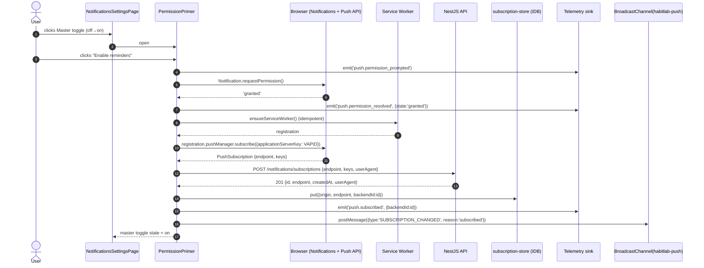
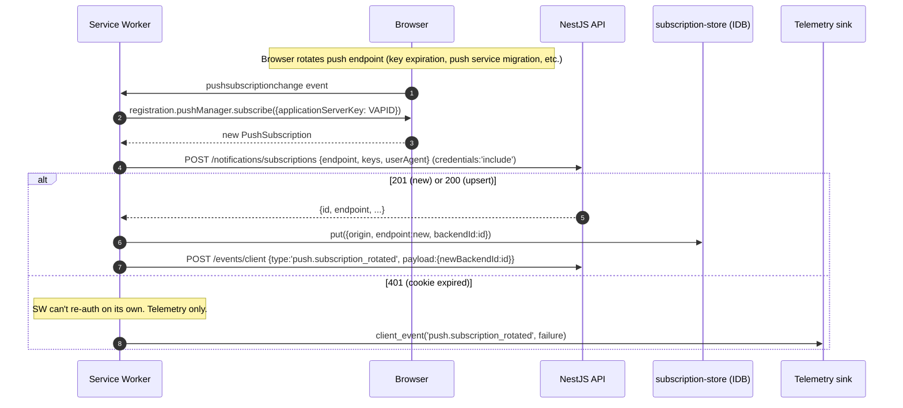
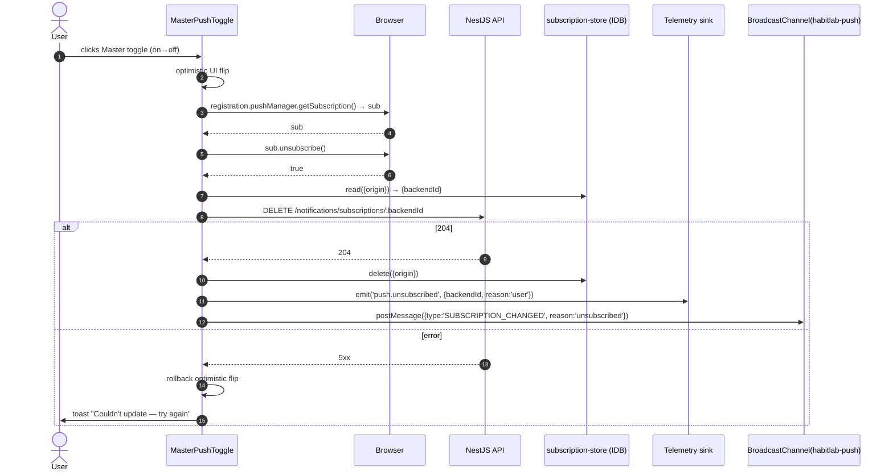
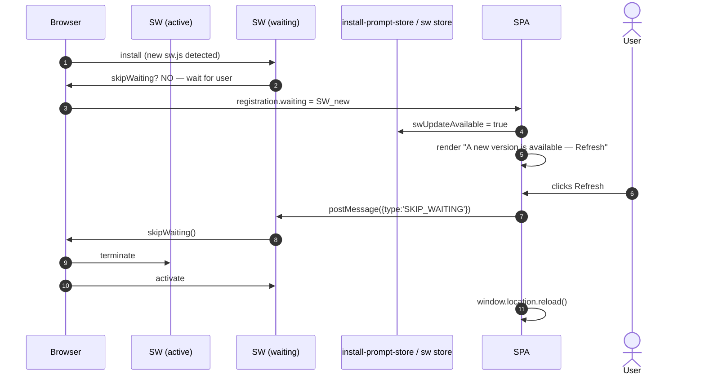

# WP9 — Web Push Notifications (Frontend): Architectural Plan

**Status:** Draft v1
**Owner:** Frontend (Lead Architect: Claude)
**Backend status (per CLAUDE.md WP9):**
- Migration `1745600000000-NotificationsSchema.ts` shipped — `push_subscriptions` + `notifications_sent` tables (§5.1.12).
- `WebPushService` wraps the `web-push` npm package. VAPID keys from `VAPID_PUBLIC_KEY` / `VAPID_PRIVATE_KEY` / `VAPID_SUBJECT`. `isEnabled()` true only when keys present and `NODE_ENV !== 'test'`. `send()` returns `'ok' | 'gone' | 'error'`; 410 Gone → caller deletes the subscription row.
- Endpoints: `POST /notifications/subscriptions` (FR-060, upsert on `endpoint` unique — 201 new / 200 existing); `DELETE /notifications/subscriptions/:id` (FR-061, user-scoped, 404 if not found).
- `NotificationSchedulerService`: 60s `setInterval`, polls habits with `preferred_time NOT NULL` and ≥1 subscription, ±1 min window in user timezone, checks quiet hours, dedups via `notifications_sent` for the user's calendar day. Calls `AssignmentService.getOrAssignIfActive('notification_copy_v1')` to pick the copy variant per user.
- Copy templates: `control` → `habit_reminder_v1` "Time to complete: {name}"; `motivated` → `habit_reminder_motivated_v1` "Keep the streak going — it's time for: {name}". Inactive experiment → control template.
- Quiet hours: parsed from `users.preferences.quiet_hours { start, end }` in the user's timezone. Overnight wraps handled (start > end ⇒ window crosses midnight). Default `{"start":"22:00","end":"07:00"}` since WP2.
- De-dup: one notification per habit per **user-local calendar day**.
- FR-063 (-30 min pre-fire offset) and analytics-adjusted offset are **deferred** — backend fires at `preferred_time` exactly (±1 min).

**Scope:** This slice defines the **frontend mechanics** for turning the SPA into a Progressive Web App that can receive push notifications — service worker registration & lifecycle, the Notifications API permission UX, VAPID-based push subscription, the `/settings/notifications` page (master toggle, quiet hours editor, per-device subscription management, test-notification affordance), and the in-SW handlers for `push` / `notificationclick` / `pushsubscriptionchange`. It also locks the contract that **notification copy is server-authoritative** — the frontend never composes the title/body string; it renders whatever the backend already chose (control vs motivated copy resolved by `AssignmentService.getOrAssignIfActive` in the scheduler).

> Read this together with `CLAUDE.md` (WP9 implementation notes), `auth-plan.md` (cookies + `PATCH /me/preferences`), `wp4-plan.md` (telemetry sink, BroadcastChannel cross-tab pattern), `wp8-plan.md` (notification copy is server-resolved — frontend does **not** wrap notification text in `<VariantSlot>`), and `docs/HabitLab_AI_Analysis_Report.docx` §5.1.12 (push_subscriptions / notifications_sent), §6.5 (notification scheduler), and §7.4 (notification sequence diagrams).

---

## 1. Goals & Constraints

**Functional goals**

- Register a versioned **service worker** at the SPA root, with a graceful update flow (new SW prompts to refresh; no silent breakage).
- Provide a **permission UX** that explains the value before triggering the native prompt — never call `Notification.requestPermission()` cold on page load.
- **Subscribe** the user's browser to push via the Push API + VAPID public key, then **POST** the subscription to `/notifications/subscriptions` (FR-060). Capture the `id` for later unsubscribe (FR-061).
- A **`/settings/notifications`** page with: master push toggle (per-device), quiet hours editor (start/end times in user's timezone), list of registered devices with revoke, "send me a test notification" button (dev/staging only — see §8 #5), and a clear explanation of what notifications are sent and when.
- **Service worker handlers**: `push` → `showNotification` with the title/body the backend chose; `notificationclick` → focus an existing client or open a new one and navigate to the relevant habit; `pushsubscriptionchange` → re-subscribe and PATCH backend with the new endpoint.
- **Cross-tab sync** of permission/subscription state via `BroadcastChannel('habitlab-push')` so toggling on one tab updates the others.
- A **PWA manifest** and minimum installability criteria so the app can be installed on desktop and mobile.
- **Offline shell**: precache the app shell (HTML, JS, CSS) and serve it from cache when the network is unavailable. This is a means to push registration (a SW is needed) — not the project's primary motivation.

**Hard constraints (from CLAUDE.md + earlier plans)**

- **No client-side rendering of notification copy.** The scheduler resolves the variant server-side via `AssignmentService.getOrAssignIfActive('notification_copy_v1')` and writes the final title/body into the push payload. Per WP8 §1 (chrome-only constraint) and §7.2 #3, the frontend **never** wraps notification text in `<VariantSlot>`. The SW's `push` handler reads `data.title` / `data.body` verbatim.
- **No JWT in service worker.** SW context has no cookies attached to fetches unless we explicitly include `credentials: 'include'`. Anything the SW posts back to the API (e.g. delivery telemetry) uses `credentials: 'include'`, which carries the httpOnly cookie. Cookies are still the only auth path. No token shipping, no localStorage.
- **No browser storage for auth.** Push subscription objects are *not* secrets — they're public endpoints — but they're not auth tokens either; backend keys subscriptions on `user_id` server-side. We store the **subscription `id`** (returned by the backend on POST) in IndexedDB **per origin** so unsubscribe works without an extra `GET`. Auth cookie is the *only* thing that proves the request belongs to the user.
- **Backend owns timing.** Frontend has no scheduler. Frontend does not "ask permission and then schedule the reminder." All scheduling is backend (CLAUDE.md WP9). Frontend's job is registration + rendering + settings UX.
- **Variant-aware copy is invisible to the frontend.** Whichever variant the backend chose, the SW receives a literal title/body string. No client logic branches on `notification_copy_v1`.
- **No SW shipping inside the JS bundle.** SW files must be served at a stable path (`/sw.js`) so the browser can scope it to the origin. Vite emits the SW as a separate top-level asset via `vite-plugin-pwa`.
- **OpenAPI-first types.** `PushSubscriptionDto`, `PushSubscriptionResponse`, `QuietHours`, etc. are generated from the spec.
- **Quiet hours field name** is `quiet_hours` on `users.preferences` JSONB (WP2 default `{"start":"22:00","end":"07:00"}`). UI flips this via the existing `PATCH /me/preferences`.

**Non-goals for this slice**

- **In-app notifications** (toasts, banners) for events that originate inside the SPA — those exist in WP3/WP6+7 already (toast on accept/dismiss). WP9 is exclusively *Web Push*: messages delivered when the app is closed or backgrounded.
- **Native mobile push** (FCM, APNs through a native shell). Web Push only. PWA install on iOS Safari currently has no push support; that's a known limitation, surfaced in the UI per §3.6.
- **Per-habit subscription preferences.** A toggle to silence reminders for habit X is out of scope — quiet hours and the master toggle are the only knobs in v1. Per-habit "do not notify" goes into the WP3 habit form as a `notify: false` field (deferred).
- **Pre-fire offset / analytics-adjusted timing** (FR-063, FR-064). Backend exact-time delivery only.
- **Snooze / "remind me in 10 min"**. `notificationclick` actions are deferred.
- **Rich notifications** (images, multi-action buttons beyond "Open"). v1 uses title + body + a single click target.
- **Email or SMS reminders** as alternatives. Web Push only.
- **Replacing the WP4 telemetry sink.** SW telemetry (delivery, click) flows back through the same `POST /events/client` (or its successor) — the SW does not invent a new event transport.

---

## 2. Folder Structure

```
frontend/
├── public/
│   ├── manifest.webmanifest                  PWA manifest (name, icons, theme, scope, start_url)
│   ├── icons/                                 192/512/maskable PNGs referenced by the manifest
│   └── (sw.js emitted here at build via vite-plugin-pwa, not committed)
│
├── src/
│   ├── features/
│   │   ├── notifications/                    NEW FEATURE in WP9
│   │   │   ├── api/
│   │   │   │   ├── use-subscribe.ts          POST /notifications/subscriptions
│   │   │   │   ├── use-unsubscribe.ts        DELETE /notifications/subscriptions/:id
│   │   │   │   ├── use-list-subscriptions.ts GET /notifications/subscriptions (own devices)
│   │   │   │   ├── use-update-quiet-hours.ts PATCH /me/preferences { quiet_hours }
│   │   │   │   ├── use-send-test.ts          POST /notifications/test (dev/staging — see §8 #5)
│   │   │   │   └── _client.ts                thin wrappers; types from generated OpenAPI
│   │   │   ├── components/
│   │   │   │   ├── PermissionPrimer.tsx      Pre-prompt explainer; the only thing that calls Notification.requestPermission
│   │   │   │   ├── MasterPushToggle.tsx      On/off for the current device; orchestrates subscribe + unsubscribe
│   │   │   │   ├── QuietHoursEditor.tsx      Two time inputs (start, end) with overnight-wrap helper text
│   │   │   │   ├── DeviceList.tsx            Lists this user's registered subscriptions across devices
│   │   │   │   ├── PermissionStateBanner.tsx Tri-state banner: 'default' | 'granted' | 'denied'
│   │   │   │   ├── UnsupportedBrowserNotice.tsx Shown when Push API or Notifications API is absent (iOS Safari pre-16.4)
│   │   │   │   └── PwaInstallPrompt.tsx      Captures beforeinstallprompt; shown contextually
│   │   │   ├── hooks/
│   │   │   │   ├── use-permission-state.ts   Mirrors Notification.permission via permissions API + storage event
│   │   │   │   ├── use-push-capability.ts    Synchronous feature detection
│   │   │   │   ├── use-current-subscription.ts Resolves the current device's local subscription id from IDB
│   │   │   │   └── use-sw-update.ts          Surfaces "new version available" from the SW lifecycle
│   │   │   ├── lib/
│   │   │   │   ├── sw-registration.ts        Idempotent navigator.serviceWorker.register
│   │   │   │   ├── vapid-key.ts              urlBase64ToUint8Array helper + key fetcher
│   │   │   │   ├── subscription-store.ts     IDB store: { endpoint, backendId } per origin
│   │   │   │   ├── permission-broadcast.ts   BroadcastChannel('habitlab-push') for cross-tab sync
│   │   │   │   └── time-format.ts            "HH:mm" parsing / formatting bound to user.timezone
│   │   │   ├── pages/
│   │   │   │   └── NotificationsSettingsPage.tsx   /settings/notifications route
│   │   │   ├── testing/
│   │   │   │   ├── fixtures.ts               makeSubscription(), makeQuietHours(), mock PushSubscription
│   │   │   │   └── ServiceWorkerHarness.ts   In-test SW shim
│   │   │   └── index.ts                      barrel — public: NotificationsSettingsPage, PwaInstallPrompt, useSwUpdate
│   │   ├── settings/                          (WP2) — adds the notifications sub-route
│   │   ├── auth/                              (WP2) — preferences PATCH reused; logout clears subscription IDB
│   │   └── experiments/                       (WP8) — Settings page hosts OptOutToggle; not touched by WP9
│   │
│   ├── service-worker/                        SW source — bundled separately by Vite
│   │   ├── sw.ts                              entry — registers handlers
│   │   ├── handlers/
│   │   │   ├── push.ts                        push event → showNotification(title, body)
│   │   │   ├── notification-click.ts          notificationclick → focus or open + deep-link
│   │   │   ├── subscription-change.ts         pushsubscriptionchange → re-subscribe + PATCH backend
│   │   │   └── install-activate.ts            install/activate lifecycle (skipWaiting + clients.claim opt-in)
│   │   ├── lib/
│   │   │   ├── deep-link.ts                   resolve "/habits/:id" from payload.url or payload.habitId
│   │   │   ├── payload-schema.ts              runtime check on incoming push payload shape (Zod-lite)
│   │   │   └── client-event.ts                lightweight fetch wrapper that posts telemetry from the SW
│   │   └── tsconfig.json                       SW context: WebWorker + ServiceWorker libs only (no DOM)
│   │
│   ├── pwa/
│   │   ├── manifest.ts                        Typed manifest used by vite-plugin-pwa
│   │   └── install-prompt-store.ts            Captures beforeinstallprompt for later .prompt()
│   │
│   └── router/
│       └── routes.tsx                          add /settings/notifications (lazy-loaded)
│
└── vite.config.ts                             vite-plugin-pwa configured with custom SW source path
```

**Why a separate `service-worker/` tree at `src/` root.** The SW runs in a different global context (no `window`, no DOM). Mixing SW files into `features/notifications/` would invite an accidental DOM-API import inside the SW bundle — a runtime crash on first `push` event. Separating the tree and giving the SW its own `tsconfig.json` (lib: `["ES2022", "WebWorker"]`, no `"DOM"`) makes the boundary mechanical.

**Why a `lib/subscription-store.ts` in IDB.** The browser's `PushSubscription` object can be re-fetched from the SW registration at any time, but the **backend's subscription `id`** (needed for DELETE) is not in that object — it's returned by the POST. We store the `{ endpoint → backendId }` mapping per origin so the user can revoke this device's subscription without a round-trip to list-and-match.

---

## 3. Component Hierarchy

### 3.1 Where the service worker is registered

```ts
// src/main.tsx
import { ensureServiceWorker } from '@/features/notifications/lib/sw-registration';

bootstrap().then(() => {
  // Register after first paint to avoid competing with the initial JS parse.
  if (import.meta.env.PROD || import.meta.env.VITE_SW_DEV === 'true') {
    void ensureServiceWorker();
  }
});
```

- **Idempotent.** `ensureServiceWorker()` checks `navigator.serviceWorker.controller` and a pending registration; calling it twice is a no-op.
- **Scoped to `/`.** No nested scope.
- **Gated by env.** In `import.meta.env.DEV`, default off (a hot-reloaded SW caches your old JS and ruins your day). Opt-in via `VITE_SW_DEV=true`.
- **No SW registration on logged-out routes.** Anonymous users have no push capability — there's no `user_id` to bind a subscription to. WP9's first call site that *invokes* registration is from within `<MasterPushToggle>` (authenticated). The bootstrap-time registration above is the "install the SW asset" step; permission/subscription is gated separately.

> Note: the WP9 SW handles push only. PWA shell caching (offline) is also part of the same SW per §1, but the precache list is a build-time artifact, not a runtime concern.

### 3.2 `/settings/notifications` page composition

```
<NotificationsSettingsPage>
  <UnsupportedBrowserNotice />         ← shown only if !supportsPush; short-circuits the rest
  <PermissionStateBanner />            ← "Notifications are off / blocked / on for this device"
  <MasterPushToggle />                 ← the primary control; subscribes / unsubscribes this device
  <QuietHoursEditor />                 ← start / end pickers; saves via PATCH /me/preferences
  <DeviceList />                       ← lists subscriptions from GET /notifications/subscriptions
  <TestNotificationButton />           ← dev/staging only; sends a self-push
  <PwaInstallPrompt />                 ← non-blocking; only shown if beforeinstallprompt fired & not installed
</NotificationsSettingsPage>
```

**Composition rules**

- `UnsupportedBrowserNotice` is the only component allowed to render before `<MasterPushToggle>`. If push is unsupported, none of the toggles render — we show a single banner explaining the limitation and link to "Use a supported browser."
- `<DeviceList>` is read-only state plus a per-row "Sign out this device" button. The current device is highlighted (matched by `endpoint`).
- `<QuietHoursEditor>` is independent of the master toggle — quiet hours apply even when push is on. A user can have push enabled with a 22:00–07:00 quiet window.

### 3.3 `<PermissionPrimer />` (pre-prompt)

A short modal/inline card the user sees **before** `Notification.requestPermission()` is called. The native prompt is one-shot: a deny is sticky and can only be reversed in browser settings. The primer reduces accidental denies.

```
<PermissionPrimer>
  "Get reminded at the times you set, with quiet hours respected.
   We'll never send marketing — just your habit reminders."
  [Enable reminders]   [Not now]
</PermissionPrimer>
```

- "Enable reminders" calls `Notification.requestPermission()` → on `'granted'`, immediately calls `subscribeToPush()` (next section).
- "Not now" dismisses the primer for 24h (stored in `sessionStorage` for the dismissal session, with the timestamp persisted in `users.preferences.push_primer_dismissed_at` — see §8 #2 for the backend side).
- If `Notification.permission === 'denied'`, the primer is not shown. Show `<PermissionStateBanner>` with instructions to unblock at the browser level.

### 3.4 `<MasterPushToggle />` — the orchestrator

```ts
function MasterPushToggle() {
  const cap = usePushCapability();             // { supported: boolean }
  const perm = usePermissionState();           // 'default' | 'granted' | 'denied'
  const sub = useCurrentSubscription();        // { backendId?: string, endpoint?: string }
  const subscribe = useSubscribe();
  const unsubscribe = useUnsubscribe();

  if (!cap.supported) return null;             // UnsupportedBrowserNotice covers this
  if (perm === 'denied') return <BlockedHelp />;

  const isOn = perm === 'granted' && Boolean(sub.backendId);

  return (
    <Switch
      checked={isOn}
      onChange={async (next) => {
        if (next) await turnOn();              // primer → permission → SW register → subscribe → POST
        else await turnOff();                  // unsubscribe locally + DELETE backend; SW stays
      }}
    />
  );
}
```

**Decision: turning the toggle off does not unregister the SW.** Unregistering would invalidate the precached app shell (offline). Unsubscribing from push is enough to stop reminders. The SW remains installed but receives no `push` events because the subscription is gone.

### 3.5 `<QuietHoursEditor />`

Two time inputs (`<input type="time">`) bound to a single `quiet_hours: { start: 'HH:mm', end: 'HH:mm' }` object. Defaults `22:00` / `07:00` (matches WP2 preferences default).

- **Validation:** both must parse as `HH:mm`. Empty/missing → "no quiet hours" (omits the field on PATCH, which the backend treats as "always allowed" — confirmed via §8 #3 once).
- **Overnight wrap helper:** when `start > end`, render "Quiet from 22:00 today to 07:00 tomorrow." When `start < end`, render "Quiet from 12:00 to 14:00 daily." When `start === end`, render "No quiet hours." The backend handles wrap arithmetic per CLAUDE.md WP9 — the editor just confirms intent.
- **Save:** debounced 600ms, then `PATCH /me/preferences { quiet_hours: { start, end } }`. On error, rolls back to previous server value via TanStack `useMutation`'s `onError`.
- **Time zone:** displayed in the user's timezone (`user.timezone`). The strings are wall-clock, not UTC offsets. CLAUDE.md scheduler interprets them in `user.timezone`; no offset conversion happens client-side.

### 3.6 `<UnsupportedBrowserNotice />`

Trigger conditions (any one):

- `'serviceWorker' in navigator` is false.
- `'PushManager' in window` is false.
- `'Notification' in window` is false.
- iOS Safari < 16.4 (UA sniff is fragile — prefer feature detection above; UA used only to provide better copy).

Copy: short, kind. "This browser doesn't support push notifications yet. You can still use HabitLab from this browser, and we'll save your settings for when you visit in a supported browser." No retry, no error tone.

### 3.7 `<PwaInstallPrompt />`

Captures the `beforeinstallprompt` event on the root, stashes the event in Zustand (see §4.6), and renders a contextual prompt — but only on `/settings/notifications` (where install is materially useful for push reliability on Android). Calling `event.prompt()` shows the install dialog. On `outcome: 'accepted'`, fires `client.pwa.installed` telemetry. On `'dismissed'`, fires `client.pwa.install_dismissed`. The captured event is one-shot; if dismissed, no second prompt for the session.

### 3.8 Composition rules

- **No feature outside `features/notifications/` may call `navigator.serviceWorker.*` directly.** All SW-related side effects go through `lib/sw-registration.ts`. Enforced by ESLint `no-restricted-globals` + `no-restricted-syntax`.
- **No feature outside `features/notifications/` may call `Notification.requestPermission()`.** Permission belongs to the primer. Enforced via the same ESLint rule.
- **Notification copy is server-authoritative.** The SW reads `payload.title` and `payload.body` verbatim. No string interpolation, no localization layer in the SW, no `<VariantSlot>` involvement. Per WP8 §1 / §7.2 #3 and WP6+7 v2 §3.2.

---

## 4. State Management Strategy

### 4.1 Query keys

```ts
export const notificationKeys = {
  all: ['notifications'] as const,
  subscriptions: () => [...notificationKeys.all, 'subscriptions'] as const,
  subscription: (id: string) => [...notificationKeys.all, 'subscriptions', id] as const,
};
```

`preferences` (which holds `quiet_hours`) reuses the WP2 `userKeys.me()` query — quiet hours are part of the user's preferences object, not a separate notifications query.

### 4.2 Query configuration

| Query | staleTime | gcTime | refetchOnWindowFocus | Notes |
|---|---|---|---|---|
| `notificationKeys.subscriptions()` | 5 min | 1 hour | yes | A user revoking a device on phone should reflect on desktop within a focus. |

`useCurrentSubscription` is **not** a network query — it reads `subscription-store.ts` (IDB) synchronously via a `useSyncExternalStore` adapter. The mapping is `endpoint → backendId` for the current origin; the endpoint comes from the browser's `PushSubscription`.

### 4.3 Cache invalidation

- **`useSubscribe` success** → invalidate `notificationKeys.subscriptions()`. The new row appears in `DeviceList`. Also writes to IDB (`endpoint → backendId`).
- **`useUnsubscribe` success** → invalidate `notificationKeys.subscriptions()`. Removes the IDB entry.
- **`useUpdateQuietHours` success** → invalidate `userKeys.me()` (WP2). The editor re-renders with the persisted values.
- **Logout** → `qc.removeQueries({ queryKey: notificationKeys.all })`, plus `subscriptionStore.clear()` (IDB). Extends WP2 logout's existing clear pass (a new entry in its centralized prefix list).
- **`pushsubscriptionchange` (SW)** → not a query; the SW calls back through `POST /notifications/subscriptions` (idempotent on `endpoint`). The next time the SPA invalidates `subscriptions()`, the new row appears.

### 4.4 Permission state — synchronous source of truth

`Notification.permission` is a synchronous global; there is no "wait for permissions to resolve" pattern. The `usePermissionState` hook reads it on every mount and subscribes to:

1. The **Permissions API** (`navigator.permissions.query({ name: 'notifications' })` → `.onchange`) when available.
2. A **BroadcastChannel** message (`habitlab-push`) so a sibling tab that just granted permission can notify others.
3. A `visibilitychange` listener as a coarse fallback for browsers without Permissions API change events.

Rationale: `Notification.permission` doesn't emit change events natively across all browsers. The composite source above covers the major paths without polling.

### 4.5 Optimistic UI for the master toggle

The toggle is *not* purely optimistic — the work involves the browser's native permission prompt, which is asynchronous and cancelable. Pattern:

1. User clicks toggle off→on.
2. Open `<PermissionPrimer>` (no permission change yet).
3. User clicks "Enable reminders" → call `Notification.requestPermission()`.
4. On `'granted'`, register SW (idempotent), call `pm.subscribe({ userVisibleOnly: true, applicationServerKey: <VAPID> })`, then POST to backend.
5. Only after the POST 2xx do we flip the toggle's persistent state.
6. On `'denied'` or `'default'` (user dismissed), do nothing — the toggle stays off, and we render `<PermissionStateBanner>` ("Notifications are blocked. Open browser settings to allow.").

The off→on path is **not optimistic**: there's no way to roll back a permission grant. The on→off path **is** optimistic: flip the UI immediately, fire `subscription.unsubscribe()` + DELETE backend in the background, roll back on error.

### 4.6 What lives in Zustand (`pwa/install-prompt-store.ts` + `features/notifications/store/`)

- **`installPromptEvent: BeforeInstallPromptEvent | null`** — one-shot captured event from `beforeinstallprompt`. Cleared after `event.prompt()` resolves.
- **`primerDismissedAt: number | null`** — local session timestamp; absent from the backend until the dismissal is confirmed via `PATCH /me/preferences` (see §8 #2).
- **`swUpdateAvailable: boolean`** — set when `registration.waiting` is non-null. Surfaces a "Refresh to update" banner.

Not persisted to localStorage (the install prompt event in particular is not serializable).

### 4.7 What lives in IndexedDB (`subscription-store.ts`)

- **`{ origin, endpoint, backendId, createdAt }`** — one row per origin (typically one). Allows synchronous resolution of the backend's subscription id from the browser's PushSubscription endpoint. Wiped on logout.

IndexedDB (not localStorage) because:

1. The SW can read it too (`pushsubscriptionchange` needs `backendId` to PATCH).
2. It's not a secret, but it's also not sized for localStorage's 5MB-ish footprint in the long run.
3. WP4's telemetry queue already uses IDB; the pattern is established.

### 4.8 What lives in URL

- `/settings/notifications` route. No query parameters in v1. A deep-link payload `?habitId=...` is handled by the *SPA*, not by WP9 directly — but the SW's `notificationclick` deep-links to `/habits/:id` so the WP3 habit detail page is the target.

### 4.9 Cross-tab sync

`BroadcastChannel('habitlab-push')` carries three message types:

```ts
type PushBroadcastMessage =
  | { type: 'PERMISSION_CHANGED'; value: NotificationPermission }
  | { type: 'SUBSCRIPTION_CHANGED'; reason: 'subscribed' | 'unsubscribed' | 'rotated' }
  | { type: 'QUIET_HOURS_CHANGED'; quietHours: QuietHours };
```

Tab A subscribes → broadcasts `SUBSCRIPTION_CHANGED { reason: 'subscribed' }`. Tab B receives it, invalidates `notificationKeys.subscriptions()`, and re-reads from IDB. This is the same pattern WP2 introduced with `BroadcastChannel('habitlab-auth')`; WP4's coach-owned `habitlab-coach` channel is a parallel example. Each channel has a single, named owner-feature.

---

## 5. Core TypeScript Types

### 5.1 Domain (re-exported from generated)

```ts
export type PushSubscriptionDto      = components['schemas']['PushSubscriptionDto'];
export type PushSubscriptionResponse = components['schemas']['PushSubscriptionResponse'];
export type ListSubscriptionsResponse = components['schemas']['ListSubscriptionsResponse'];
export type QuietHours               = components['schemas']['QuietHours']; // { start: string; end: string }
export type UserPreferences          = components['schemas']['UserPreferences']; // includes quiet_hours, push_primer_dismissed_at, experiments_opted_out
```

Expected `PushSubscriptionDto` shape (confirm against §5.1.12 + the generated spec — see §8 #6):

```ts
interface PushSubscriptionDtoShape {
  // Body of POST /notifications/subscriptions
  endpoint: string;
  expirationTime: number | null;
  keys: {
    p256dh: string;
    auth: string;
  };
  userAgent?: string;            // optional; backend may capture for the device list label
}

interface PushSubscriptionResponseShape {
  id: string;                    // backend's UUID — the DELETE :id target
  endpoint: string;
  createdAt: string;
  userAgent: string | null;
  // No keys returned — they're write-once.
}
```

### 5.2 Hand-written narrowed types

```ts
// Permission tri-state — Notification.permission narrowed for our usage.
export type PermissionStateTri = 'default' | 'granted' | 'denied';

// Push capability — explicit feature detection result.
export interface PushCapability {
  readonly serviceWorker: boolean;
  readonly pushManager: boolean;
  readonly notifications: boolean;
  readonly supported: boolean;   // all three above
  readonly reason?: 'no-sw' | 'no-pm' | 'no-notif' | 'private-mode' | 'unknown';
}

// Local IDB row.
export interface LocalSubscriptionRecord {
  readonly origin: string;
  readonly endpoint: string;
  readonly backendId: string;
  readonly createdAt: string;    // ISO timestamp
}

// Service worker push payload contract.
// MUST match what backend's WebPushService sends.
export interface PushPayloadV1 {
  readonly v: 1;
  readonly title: string;        // server-resolved (variant-aware)
  readonly body: string;         // server-resolved (variant-aware)
  readonly tag?: string;         // dedup tag at the OS level; backend sends habitId
  readonly url?: string;         // deep-link path, e.g. '/habits/<id>'
  readonly habitId?: string;     // optional structured field for richer client handling
  readonly icon?: string;        // optional override
}
```

The SW validates `payload.v === 1` via a lightweight schema check in `payload-schema.ts`. Unknown versions trigger a fallback notification ("Open HabitLab") instead of crashing.

### 5.3 Mutation contexts

```ts
export interface SubscribeContext {
  readonly previousPermission: PermissionStateTri;
}

export interface UnsubscribeContext {
  readonly previousBackendId: string;
  readonly previousEndpoint: string;
}

export interface QuietHoursContext {
  readonly previous: QuietHours | null;
}
```

### 5.4 Telemetry event types (extends WP4)

```ts
// Add to ClientEvent discriminated union in lib/events/client-event.ts
| { type: 'push.permission_prompted'; payload: Record<string, never> }
| { type: 'push.permission_resolved'; payload: { state: PermissionStateTri } }
| { type: 'push.subscribed';   payload: { backendId: string } }
| { type: 'push.unsubscribed'; payload: { backendId: string; reason: 'user' | 'pushsubscriptionchange' | 'logout' } }
| { type: 'push.quiet_hours_updated'; payload: { start: string; end: string } }
| { type: 'push.delivered';  payload: { tag: string | null } }        // emitted from SW on push event
| { type: 'push.opened';     payload: { tag: string | null; deepLink: string | null } } // notificationclick
| { type: 'push.dismissed';  payload: { tag: string | null } }        // notificationclose (may not fire on all browsers)
| { type: 'push.subscription_rotated'; payload: { newBackendId: string } }
| { type: 'pwa.installed'; payload: Record<string, never> }
| { type: 'pwa.install_dismissed'; payload: Record<string, never> }
| { type: 'sw.update_available'; payload: { version: string | null } }
| { type: 'sw.activated'; payload: { version: string | null } };
```

Telemetry from the SW posts directly to `POST /events/client` via `fetch(..., { credentials: 'include' })`. The WP4 telemetry sink lives in the document context; the SW has its own lightweight emitter that fires immediately (no batching) because the SW context may shut down at any time.

---

## 6. Sequence Diagrams

### 6.1 Permission grant + first subscription



If `Notification.requestPermission()` returns `'denied'` or `'default'`, the flow ends after step 6 (with `state:'denied'`). The toggle does not flip. `<PermissionStateBanner>` updates to `'denied'` if applicable.

### 6.2 Push delivery (app closed) + notificationclick

```mermaid
sequenceDiagram
  autonumber
  participant Sched as Scheduler (backend)
  participant Push as Browser Push Service (FCM/Apple/etc.)
  participant SW as Service Worker
  participant Browser as Browser
  participant App as SPA (if open)
  participant API as NestJS API

  Note over Sched: ticks at 60s interval; finds (habit, user) with preferred_time in ±1min and not yet sent today
  Sched->>Push: webpush.sendNotification(subscription, payload {v:1, title, body, tag, url})
  Push->>SW: push event with payload
  SW->>SW: validate payload v===1
  SW->>Browser: registration.showNotification(title, {body, tag, data:{url, habitId}})
  SW->>API: POST /events/client {type:'push.delivered', payload:{tag}}  (credentials:'include')
  Note over Browser: OS shows notification; app may be closed
  participant U as User
  U->>Browser: taps notification
  Browser->>SW: notificationclick event
  SW->>SW: resolve deepLink = data.url ?? `/habits/${data.habitId}` ?? '/'
  SW->>Browser: clients.matchAll({type:'window'})
  alt existing client found
    SW->>App: client.focus() + client.navigate(deepLink)
  else no client
    SW->>Browser: clients.openWindow(deepLink)
  end
  SW->>API: POST /events/client {type:'push.opened', payload:{tag, deepLink}}
  SW->>Browser: event.notification.close()
```

### 6.3 `pushsubscriptionchange` (subscription rotated by the browser)



If the user is offline during the rotation, the SW caches the new subscription in IDB and retries the POST on the next `online` event (or the next time the SPA loads and `<MasterPushToggle>` notices a mismatch between IDB endpoint and the browser's current endpoint).

### 6.4 Unsubscribe (user toggles off)



### 6.5 SW update flow



We do **not** `skipWaiting()` automatically. Forcing the user onto a new SW mid-session can break in-flight requests, swap caches under their feet, and produce confusing UI states. The "Refresh to update" banner is the contract.

---

## 7. Edge Cases & Architectural Bottlenecks

### 7.1 Correctness / UX edge cases

1. **User denies notification permission accidentally.** The browser's permission UI is one-shot per origin until the user resets it in browser settings. **Mitigation:** the `<PermissionPrimer>` is the only path to `Notification.requestPermission()`. After a deny, `<PermissionStateBanner>` renders with browser-specific instructions to unblock (Chrome: lock icon; Safari: Settings → Websites → Notifications; Firefox: address-bar shield). No auto-retry.

2. **User has push enabled but is offline when the toggle is flipped off.** `sub.unsubscribe()` is local — it succeeds offline. The `DELETE /notifications/subscriptions/:id` fails. **Mitigation:** mark the row "pending delete" in IDB (`{ pendingDelete: true }`). The next `online` event or app boot retries. Until then, the backend may try to send to the now-defunct subscription; it gets a 410 Gone and cleans the row up itself (CLAUDE.md WP9). Eventual consistency is acceptable.

3. **Multiple devices, opt-out of just one.** The DELETE removes one subscription row by `id`. The user remains subscribed on other devices. The `<DeviceList>` reflects this on the next focus. **Mitigation:** the device list query refetches on focus (5min staleTime). The current device is highlighted; revoking it = same flow as the master toggle.

4. **Same user logs in on a shared computer.** Two users have used the same browser. User A subscribed → user A's row exists. User A logs out (WP2 clears IDB subscription store per §4.3). User B logs in → no subscription. User B turns it on → fresh subscribe path. **Mitigation:** IDB clear on logout is the contract.

5. **Permission granted on Tab A while Tab B is open.** Tab B's permission state UI is stale. **Mitigation:** `BroadcastChannel('habitlab-push').postMessage({type:'PERMISSION_CHANGED', value:'granted'})` from the granting tab. Tab B's `usePermissionState` listens and updates. Permissions API change events as a backup.

6. **`pushsubscriptionchange` fires while the user is logged out.** The SW has no cookie → POST returns 401. **Mitigation:** SW logs the failure, stores the new subscription in IDB pending a re-auth. On next SPA boot (cookie present), the boot path detects "IDB endpoint != current subscription endpoint" and calls POST. WP9 boot check: `reconcileLocalSubscription()` runs after auth resolves.

7. **iOS Safari < 16.4 (no Web Push).** `<UnsupportedBrowserNotice>` renders. No primer, no toggle. The settings page still saves quiet hours so when the user moves to a supported browser they're not prompted to re-configure.

8. **Private browsing mode.** `Notification.permission` may always be `'denied'`, and `'serviceWorker' in navigator` may be false (Firefox private). **Mitigation:** capability detection short-circuits before any UI is enabled. Banner copy mentions private mode as a possible cause.

9. **`pm.subscribe()` rejects with `NotAllowedError`.** Some browsers reject if the user hasn't interacted with the page. **Mitigation:** subscription is gated behind the primer's "Enable reminders" button click — a user gesture. Direct SW registration without subscription is allowed.

10. **VAPID key mismatch.** Backend rotates VAPID. Existing subscriptions are now invalid. New subscriptions need the new key. **Mitigation:** the public key is fetched from `GET /notifications/vapid-public-key` (see §8 #1) on every subscribe call — not hardcoded. Existing subscriptions on the old key continue to work until they 410 (backend cleans up).

11. **Service worker cached an old SPA build but the API is now incompatible.** Classic Service Worker hazard. **Mitigation:** the SW only precaches versioned static assets (hashed JS/CSS). API requests are network-first, never cached. A new SW deploy replaces the precache list; the "Refresh to update" banner ensures the user reloads onto the new app. Combined: stale SPA can't accidentally talk to a newer API for long.

12. **Notification fires while the app is open in the foreground.** Browsers will still show the OS notification (the SW doesn't suppress it). **Mitigation:** v1 ships as-is — duplicate signal (in-app toast + OS notification) is mildly annoying but not incorrect. v2 may suppress OS notifications when `clients.matchAll({type:'window', includeUncontrolled:true})` returns visible clients. Documented in §8 #8.

13. **Quiet hours overlap with the scheduled time.** Backend handles this: scheduler checks quiet hours and skips the send. **Mitigation:** none needed frontend-side. The `<QuietHoursEditor>`'s helper text makes the consequence ("Reminders during these hours will be skipped, not delayed") explicit.

14. **`tag` collision.** Backend sends `tag = habitId`. A second push with the same tag replaces the first on the OS notification shade — desirable for habit-level dedup. **Mitigation:** if a user has the same habit fire two days in a row without dismissing the first, only the latest shows. Acceptable.

15. **`notificationclick` opens a new tab when there's already an open SPA tab.** Default browser behavior may open a duplicate. **Mitigation:** the SW's handler iterates `clients.matchAll({type:'window', includeUncontrolled:true})` and focuses the first match before calling `clients.openWindow`. Only opens a new tab if none exists. The deep-link is applied via `client.navigate()` on the focused client.

16. **Test notification button in production.** Could be abused. **Mitigation:** gated behind `import.meta.env.MODE !== 'production'` AND a backend env flag. Production builds dead-code-eliminate the button entirely. Backend's `POST /notifications/test` returns 404 in production. See §8 #5.

17. **PWA install prompt fires before the SPA is ready.** `beforeinstallprompt` may fire on `window` before our store mounts. **Mitigation:** the listener is attached in `main.tsx` before any React render. The event is `event.preventDefault()`'d and stashed; `<PwaInstallPrompt />` can call `event.prompt()` later.

18. **SW telemetry fails silently.** `fetch` from the SW with a network error has no UI to report to. **Mitigation:** SW telemetry is fire-and-forget. The SW writes to its own small IndexedDB queue (`sw-telemetry-queue`) on failure and retries on the next `push` event or `sync` event. Bounded at 100 entries; oldest dropped.

### 7.2 Architectural bottlenecks (decoupling concerns)

1. **No feature outside `features/notifications/` may call `navigator.serviceWorker.*` or `Notification.requestPermission()`.** ESLint `no-restricted-syntax` rule with custom message. The barrel `features/notifications/index.ts` exports `NotificationsSettingsPage`, `PwaInstallPrompt`, `useSwUpdate`, and `useNotificationsBootHook` (called from auth boot to run `reconcileLocalSubscription`).

2. **SW code cannot import from `src/` outside `service-worker/`.** A `tsconfig.json` paths rule in `src/service-worker/tsconfig.json` excludes the rest of `src/`. ESLint `no-restricted-imports` enforces. Prevents accidental DOM API leaks into the worker bundle.

3. **The push payload schema is a contract with the backend.** A change to backend's `WebPushService.send()` payload shape would break the SW silently (or load-bear "unknown version" fallbacks). **Mitigation:** the `PushPayloadV1` type is declared *both* in `service-worker/lib/payload-schema.ts` and consumed by backend tests via the shared `shared/` package. Versioned (`v: 1`) so additive changes can be made forward-compatible.

4. **Notification copy resolution lives only in the scheduler.** Per WP8 §1 / §7.2 #3, WP6+7 v2 §3.2, and CLAUDE.md WP9: the scheduler resolves the variant once via `AssignmentService.getOrAssignIfActive('notification_copy_v1')` and writes the literal copy into the push payload. **Mitigation:** the SW reads `payload.title` / `payload.body` verbatim. ESLint rule prevents any string interpolation in `service-worker/handlers/push.ts` that touches habit names directly. Greppable.

5. **Subscription state has three sources of truth: the browser (`pm.getSubscription()`), the backend (`GET /notifications/subscriptions`), and IDB (`subscription-store`).** They can drift. **Mitigation:** the reconciliation function `reconcileLocalSubscription()` runs:
    - on auth boot (after WP2's "you are logged in" promise resolves),
    - on `pushsubscriptionchange`,
    - on `focus` of the `/settings/notifications` page.
   It compares the browser's current `endpoint` to IDB and to backend, and either re-POSTs (if browser has a subscription but backend doesn't) or clears IDB (if backend doesn't recognize the endpoint).

6. **PWA install prompt is one-shot and can't be re-requested by the page.** **Mitigation:** capture once, store in Zustand, render the prompt in the contextual place (`<PwaInstallPrompt />` on `/settings/notifications`). If dismissed, do not re-prompt for the session.

7. **SW update timing.** A user with a long-open tab may not reload for days. **Mitigation:** the "Refresh to update" banner is non-modal but persistent. After 24h, we may upgrade to a modal — proposed in §8 #9.

8. **Cross-feature loop risk.** `features/notifications` imports nothing from `features/recommendations`, `features/experiments`, or other features. `features/settings` imports `NotificationsSettingsPage` from `features/notifications`. One-way. ESLint `no-cycle` catches the reverse.

9. **VAPID public key is environment-dependent.** Dev, staging, and prod all have different VAPID key pairs (dev keys must not match prod). **Mitigation:** key is fetched from the backend (`GET /notifications/vapid-public-key`), not hardcoded into the frontend bundle. Build-time env injection is rejected because it would couple frontend deploys to VAPID rotation.

10. **OpenAPI drift on `PushSubscriptionResponse`.** Backend adds a field (`lastDeliveredAt`?) without frontend updates. **Mitigation:** WP4/WP10 CI drift check catches this. Frontend regenerates types and lints clean before merge.

---

## 8. Open Questions for Backend / Spec

Confirm against §5.1.12 and §6.5 of the analysis report. Items marked **(blocker)** must be resolved before scaffolding starts.

1. **`GET /notifications/vapid-public-key` endpoint exists?** **(blocker)** The frontend needs the VAPID public key at subscribe time. Hardcoding it in the build would couple frontend deploys to VAPID rotation. CLAUDE.md lists VAPID env vars on the backend but doesn't specify an exposure endpoint. If absent, this is a small backend deliverable: return `{ publicKey: <base64-urlsafe> }`. Safe to expose publicly (it's a public key).

2. **`push_primer_dismissed_at` field in `users.preferences`?** Per §3.3, the primer's "Not now" dismissal is meant to persist across sessions to avoid nagging. Currently `users.preferences` has `quiet_hours` and `experiments_opted_out`. Proposed: add `push_primer_dismissed_at: string | null` (ISO timestamp). Settings page does not surface this; only the primer uses it. Confirm or use sessionStorage only.

3. **Quiet hours "no quiet hours" representation.** When the user clears both fields, what does the backend expect? Options: (a) omit `quiet_hours` from the JSONB entirely; (b) `{ start: null, end: null }`; (c) `{ start: '00:00', end: '00:00' }` (which the scheduler interprets as zero-width window). Recommend (a) — omit. Confirm.

4. **`POST /notifications/subscriptions` upsert response semantics.** CLAUDE.md says "201 for new row, 200 for update, detected via PostgreSQL `xmax = 0`." Frontend treats both as success and reads `id` either way. Confirm the response *body* is identical for 200 and 201 (same `PushSubscriptionResponse` shape).

5. **`POST /notifications/test` for self-push.** Useful for verification in dev/staging. Does this endpoint exist? Recommend: backend exposes it gated by `NODE_ENV !== 'production'`. Returns 404 in production. Frontend's test button is gated symmetrically.

6. **`PushSubscriptionDto` exact field names.** The Web Push API's `PushSubscription.toJSON()` returns `{ endpoint, expirationTime, keys: { p256dh, auth } }`. Confirm backend expects this exact shape (snake_case vs camelCase question — NestJS DTOs typically use camelCase, but the JSONB column might persist as-is). Without this, the frontend types may be wrong on day one.

7. **`userAgent` in subscription metadata.** Useful for the `<DeviceList>` to render "Chrome on macOS" instead of an endpoint URL. Does backend capture `User-Agent` and parse it, or expect the frontend to send a parsed label? Recommend: backend captures the raw `User-Agent` request header server-side; frontend's `<DeviceList>` parses for display only. No PII concerns beyond what the request already carried.

8. **In-foreground notification suppression.** Should the SW *suppress* `showNotification` when at least one client window is visible (and instead post a message to that client to show an in-app toast)? Trade-off: less duplicate noise vs. inconsistent behavior. Recommend deferring to v2; v1 lets the OS show all notifications.

9. **SW update aggressiveness.** Should we force a reload after N hours of an available update? Recommend: not in v1. Document the policy and revisit if we ship a breaking SW change.

10. **Notification analytics — server vs client delivery counts.** Backend's `notifications_sent` row is the *attempt* count. Frontend's `push.delivered` telemetry from the SW is the *render* count (subject to OS dropping it for power-save reasons, etc.). Should backend join on the SW telemetry to compute true delivery rate? Recommend yes, eventually, but not blocking WP9 frontend.

11. **Logout behavior — server-side subscription cleanup.** When a user logs out, should the backend automatically delete that device's subscription? Current behavior (CLAUDE.md): subscription persists; cookie auth gating means push still works because `web-push` doesn't need cookies. But if the user logs out specifically because they're handing the device over, push will keep reaching them. Recommend: WP2 logout calls `DELETE /notifications/subscriptions/:id` for the current device's IDB-tracked row before clearing the cookie. Confirm.

12. **Telemetry endpoint for SW**. CLAUDE.md mentions `POST /api/v1/events/client` is not yet live. SW telemetry will share the same endpoint. Confirm route name and that it accepts SW-origin requests (Origin header, credentials).

---

## 9. Acceptance Criteria for the WP9 Frontend Slice

The slice is "done" when:

- Service worker registers at `/sw.js` on every prod / staging boot (and on dev when `VITE_SW_DEV=true`).
- `<PermissionPrimer>` is the only call site of `Notification.requestPermission()`. ESLint enforces.
- `<MasterPushToggle>` correctly orchestrates: primer → permission → SW registration → push subscribe → POST `/notifications/subscriptions` → IDB write → cross-tab broadcast.
- Toggling off: `sub.unsubscribe()` + `DELETE /notifications/subscriptions/:id` + IDB delete + cross-tab broadcast. Optimistic with rollback.
- `<QuietHoursEditor>` saves `quiet_hours` to `users.preferences` via `PATCH /me/preferences`, debounced and with optimistic rollback.
- `<DeviceList>` lists the user's subscriptions and allows per-device revoke. Current device highlighted.
- `<UnsupportedBrowserNotice>` renders when push capability is missing; nothing else on the page renders.
- SW `push` handler validates `payload.v === 1` and calls `showNotification(title, { body, tag, data })` with the **literal** title/body the backend sent — no string interpolation, no localization, no variant resolution.
- SW `notificationclick` handler focuses an existing client or opens a new one, deep-links to `data.url` (or constructs `/habits/<habitId>`), and emits `push.opened` telemetry.
- SW `pushsubscriptionchange` handler re-subscribes and POSTs the new endpoint. IDB is updated. Telemetry fires.
- `reconcileLocalSubscription()` runs on auth boot and on `/settings/notifications` focus; resolves drift between browser, IDB, and backend.
- BroadcastChannel `habitlab-push` carries `PERMISSION_CHANGED`, `SUBSCRIPTION_CHANGED`, `QUIET_HOURS_CHANGED` between tabs.
- PWA manifest is valid (`name`, `short_name`, `start_url: /`, `display: standalone`, icons 192/512 + maskable). Installability passes Lighthouse PWA audit.
- `<PwaInstallPrompt />` captures `beforeinstallprompt`, renders contextually on `/settings/notifications`, fires telemetry on accept/dismiss.
- `<UseSwUpdate>` hook surfaces a "Refresh to update" banner when a new SW is waiting. Clicking refresh sends `SKIP_WAITING` and reloads.
- Logout (WP2) clears IDB subscription store and removes `notificationKeys.all` from cache.
- All push-related types come from generated OpenAPI (`PushSubscriptionDto`, `PushSubscriptionResponse`, `QuietHours`).
- `pnpm test` covers: permission grant happy path, denied path, subscribe → POST, unsubscribe → DELETE, quiet hours save + rollback, SW push handler payload validation, SW deep-link resolution, `pushsubscriptionchange` POST, cross-tab broadcast on permission change, capability detection short-circuit, IDB reconciliation.
- Manual smoke: install the PWA on Android Chrome → grant permission → schedule a habit for 1 minute hence → close the app → notification arrives at the scheduled time → tap → app opens to `/habits/:id` → revoke → next-minute scheduler tick produces no further notifications.
- Lint: no `navigator.serviceWorker.*` calls outside `features/notifications/lib/sw-registration.ts`.
- Lint: no `Notification.requestPermission()` outside `<PermissionPrimer>`.
- Lint: no string interpolation against habit names inside `src/service-worker/handlers/push.ts`. Greppable AST rule.

---

## 10. Sequencing & Dependencies

Sequencing within the slice:

1. **PWA manifest + `vite-plugin-pwa` config first.** Get the build pipeline emitting `sw.js` and `manifest.webmanifest`. Verify Lighthouse PWA audit before writing any UI.
2. **`ensureServiceWorker` + capability detection second.** Plumbing. Make sure the SW registers in prod and is skippable in dev.
3. **SW handlers (`push`, `notificationclick`, `pushsubscriptionchange`) third.** Wire them with a fake payload first (no backend dependency); validate `payload.v === 1` schema; verify deep-link resolution.
4. **`/settings/notifications` page shell + `<UnsupportedBrowserNotice>` + `<PermissionStateBanner>` fourth.** Make the page reachable; verify capability gating.
5. **`<PermissionPrimer>` + `<MasterPushToggle>` fifth.** The orchestrator. Test against a mocked `pm.subscribe()` and the real backend `POST /notifications/subscriptions`.
6. **`<QuietHoursEditor>` sixth.** Reuses WP2's `PATCH /me/preferences`. Trivial once the page exists.
7. **`<DeviceList>` seventh.** Read-only; reuses the same endpoints.
8. **BroadcastChannel cross-tab sync eighth.** Once subscribe/unsubscribe are working, wire the channel.
9. **`reconcileLocalSubscription` boot hook ninth.** Audit drift; close the IDB/browser/backend gap.
10. **`<PwaInstallPrompt />` + `useSwUpdate` last.** Polish.

Dependencies on other WPs:

- **WP2:** `PATCH /me/preferences` for quiet hours; logout's query-clear pass extends to `notificationKeys.all` and `subscriptionStore.clear()`. Auth-aware boot for `reconcileLocalSubscription`.
- **WP3:** the `<DeviceList>` and `<MasterPushToggle>` link to `/settings/notifications` from any page that surfaces "Reminders" copy on a habit. WP3's habit form may eventually grow a "Don't notify for this habit" checkbox — deferred.
- **WP4:** the telemetry sink (document-context) is extended with the push event types in §5.4. The SW posts directly to `POST /events/client` with `credentials: 'include'` (no batching). The SW has its own small IDB queue for retries.
- **WP6+7:** no direct dependency. Recommendation acceptance does not currently fire a notification.
- **WP8:** notification copy is server-resolved by the scheduler via `AssignmentService.getOrAssignIfActive('notification_copy_v1')`. Frontend's only WP8 touchpoint on `/settings/notifications` is the (already-built) `<OptOutToggle>` from `features/experiments`. WP9 does not wrap notification text in `<VariantSlot>`.
- **WP10 (forthcoming):** observability touchpoints — SW telemetry should carry a `request_id` header for traceability, Web Vitals from the SPA should report `INP`/`LCP` deltas after SW install. Defer the integration to WP10's plan.

Deferred to a later WP:

- **FR-063 / FR-064**: pre-fire offset and analytics-adjusted timing — backend deferral; frontend will surface a "Send X minutes before preferred time" control when backend supports it.
- **Per-habit notify toggle** — small habit form addition; deferred to a WP3 follow-up.
- **In-foreground notification suppression** — see §8 #8.
- **Snooze / multi-action `notificationclick`** — see §1 non-goals.
- **Native push (FCM/APNs through a native shell)** — out of scope; PWA only.
- **Locale-aware notification copy** — backend currently sends English by default; localization is a cross-cutting concern beyond WP9.
- **Server-side join of `notifications_sent` × SW `push.delivered` telemetry** for true delivery-rate analytics — backend follow-up.

---

*End of plan. Implementation kickoff awaits sign-off and resolution of §8 #1 (VAPID public key endpoint). All other §8 items are non-blocking but should be confirmed before the corresponding flow is wired (e.g. §8 #6 before `<MasterPushToggle>`, §8 #5 before the test button ships).*
